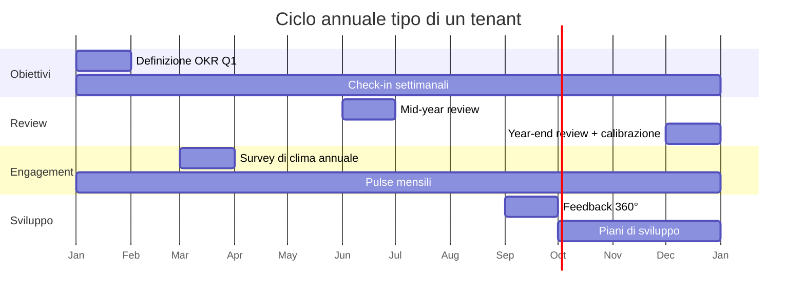

# 02 — Specifiche funzionali: indice e principi trasversali

Questo documento è l'ingresso alle specifiche funzionali. Definisce ruoli, principi comuni a tutti i moduli e rimanda alle specifiche di dettaglio in `docs/specifiche/`.

## Moduli

| Codice | Modulo | Specifica | Priorità MVP |
|--------|--------|-----------|--------------|
| CORE | Core & Amministrazione (tenant, utenti, org, ruoli, impostazioni) | [specifiche/core.md](specifiche/core.md) | P0 |
| OKR | Obiettivi & OKR | [specifiche/obiettivi-okr.md](specifiche/obiettivi-okr.md) | P0 |
| REV | Performance Review | [specifiche/performance-review.md](specifiche/performance-review.md) | P0 |
| F360 | Feedback 360° | [specifiche/feedback-360.md](specifiche/feedback-360.md) | P1 |
| ONE | 1:1 & Check-in | [specifiche/one-to-one.md](specifiche/one-to-one.md) | P0 |
| FBK | Feedback continuo & Riconoscimenti | [specifiche/feedback-riconoscimenti.md](specifiche/feedback-riconoscimenti.md) | P0 |
| ENG | Engagement & Survey | [specifiche/engagement-survey.md](specifiche/engagement-survey.md) | P1 |
| DEV | Sviluppo & Carriera | [specifiche/sviluppo-carriera.md](specifiche/sviluppo-carriera.md) | P1 |
| ONB | Onboarding | [specifiche/onboarding.md](specifiche/onboarding.md) | P1 |
| APP | App Studio (form & workflow no-code) | [specifiche/app-studio.md](specifiche/app-studio.md) | P1 |
| WEL | Welfare aziendale (piani, budget, catalogo, rimborsi, payroll) — *aggiunta nostra* | [specifiche/welfare.md](specifiche/welfare.md) | P1 |
| ANA | Analytics & Reporting (motore di reportistica) | [specifiche/analytics.md](specifiche/analytics.md) | P0/P1 |
| INT | Integrazioni & Notifiche | [specifiche/integrazioni-notifiche.md](specifiche/integrazioni-notifiche.md) | P0/P1 |
| AVV | Avviamento guidato & manuale operativo (wizard per profilo, regole HR applicate) — *aggiunta nostra* | [specifiche/avviamento-guidato.md](specifiche/avviamento-guidato.md) | P0 |

## Ruoli

I ruoli sono per tenant. Un utente può avere più ruoli (es. Manager + HR Admin).

| Ruolo | Descrizione | Ambito |
|-------|-------------|--------|
| **Super Admin** (piattaforma) | Gestisce tenant e configurazioni globali | Tutta la piattaforma |
| **Tenant Admin** | Impostazioni azienda, integrazioni, fatturazione, ruoli | Tenant |
| **HR Admin** | Configura e lancia processi, vede tutti i dati HR, gestisce org | Tenant |
| **HR Business Partner** | Come HR Admin ma limitato a uno o più perimetri (business unit, sede) | Perimetro |
| **Manager** | Gestisce il proprio team (diretti e, se abilitato, indiretti) | Team |
| **Collaboratore** | Utente base: propri obiettivi, review, feedback, 1:1, survey | Sé stesso |
| **Osservatore / Leadership** | Sola lettura su dashboard aggregate | Tenant o perimetro |
| **Analista** | Sola lettura ampia su dati aggregati e report builder (People Analytics, controllo di gestione) | Tenant o perimetro |
| **Welfare Admin / Approvatore / Payroll** | Ruoli del modulo Welfare: configurazione piani, verifica richieste, flussi paghe | Tenant o perimetro |
| **Esterno** | Valutatore 360° esterno, accesso limitato tramite link | Singola richiesta |

Il dettaglio dei permessi è in `specifiche/core.md` (matrice RBAC).

## Principi trasversali

### P1. Tutto è configurabile dall'HR, con default sensati
Ogni processo (review, survey, onboarding…) parte da un template funzionante. L'HR può modificare form, fasi, scadenze, naming e permessi senza sviluppatori.

### P2. Naming personalizzabile
Il tenant può rinominare i concetti principali (es. "OKR" → "Priorità", "Review" → "Conversazione di sviluppo"). L'interfaccia usa i nomi del tenant; il modello dati resta invariato.

### P3. Il collaboratore vede tutto ciò che lo riguarda in un unico posto
Profilo persona con obiettivi, review, feedback ricevuti, riconoscimenti, 1:1, piano di sviluppo, survey compilate. Questo è il "fascicolo" di crescita.

### P3-bis. Ogni dato è una metrica
Ogni modulo definisce le proprie metriche nel catalogo del semantic layer (ANA). Una funzionalità non è "fatta" se i suoi dati non sono interrogabili nel report builder con permessi e soglie corretti.

### P4. Trasparenza e privacy esplicite
Ogni contenuto ha una visibilità dichiarata (privato, condiviso con manager, team, azienda). L'anonimato nelle survey e nel 360° è garantito da soglie minime configurabili e mai aggirabile dall'export.

### P5. Processi con stato, scadenze e solleciti
Ogni processo ha fasi con stato (bozza, in corso, in attesa, completato, chiuso), scadenze e promemoria automatici. L'HR vede in tempo reale il completamento e può sollecitare.

### P6. Dati collegati
Obiettivi entrano nelle review; feedback e riconoscimenti sono visibili nella review; i risultati 360° alimentano il piano di sviluppo; i piani di sviluppo compaiono nei 1:1. Nessun modulo è un silo.

### P7. Multi-tenant e sicuro by design
Isolamento dati per tenant, RBAC granulare, audit log su ogni azione rilevante, GDPR (diritto all'accesso, cancellazione, portabilità). Vedi `docs/06`.

### P8. Mobile-friendly e accessibile
Tutte le azioni del collaboratore e del manager devono essere completabili da smartphone (web responsive). Accessibilità WCAG 2.1 AA come obiettivo.

### P9. Notifiche utili, non rumore
Digest configurabili, canali (email, in-app, Slack/Teams), possibilità di silenziare per tipo. Ogni notifica porta a un'azione.

### P10. Localizzazione
Italiano e inglese al lancio; struttura pronta per altre lingue. Date, numeri e valute secondo la locale dell'utente.

## Convenzioni delle specifiche

- **ID requisito**: `<CODICE>-<NNN>` (es. `OKR-001`). Stabile nel tempo.
- **Priorità**: P0 (MVP), P1 (release completa), P2 (successivo).
- **Stato**: Proposto → Approvato → Implementato → Deprecato.
- **User story**: *Come `<ruolo>` voglio `<azione>` così da `<beneficio>`*.
- **Criteri di accettazione**: verificabili, elencati sotto ogni requisito o gruppo.
- Ogni specifica termina con "Assunzioni / Domande aperte" e "Modifiche rispetto a PeopleGoal".

## Flusso tipico dell'anno (esempio)

