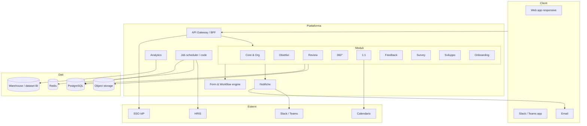

# 03 — Architettura (proposta)

> **Stato: proposta da validare.** Le scelte tecnologiche sono formalizzate in `docs/adr/0002-stack-tecnologico.md` e `docs/adr/0003-multi-tenancy.md`. Fino alla validazione, questo documento descrive l'architettura logica e una proposta di stack.

## Architettura logica



## Principi architetturali

1. **Monolite modulare** all'inizio: un solo deployable con confini di modulo netti (package per modulo, API interne esplicite). Si estrae in servizi solo se emergono esigenze reali di scala o team.
2. **Form & workflow engine come nucleo condiviso**: review, survey, 360°, onboarding sono "app" sul motore (vedi `specifiche/app-studio.md`).
3. **Multi-tenant a database condiviso** con `tenant_id` su ogni riga e Row-Level Security in PostgreSQL come seconda barriera (ADR-0003). Opzione database dedicato per clienti enterprise in futuro.
4. **Eventi di dominio** interni (outbox pattern) per notifiche, analytics, webhook e audit, così da disaccoppiare i moduli.
5. **Job asincroni** per promemoria, scadenze, sync HRIS, generazione report, export.
6. **API-first**: la web app usa le stesse API esposte pubblicamente (con scope diversi).
7. **Privacy by design**: anonimato survey/360° garantito a livello di schema (separazione inviti/risposte), non solo di UI.
8. **Osservabilità** fin dall'inizio: log strutturati con tenant e correlation id, metriche, tracing.

## Stack proposto (sintesi, dettaglio in ADR-0002)

| Livello | Proposta | Alternative considerate |
|---|---|---|
| Linguaggio | TypeScript end-to-end | Python (Django) per il backend |
| Frontend | Next.js (React) + design system proprio | Remix, SvelteKit |
| Backend | Node.js con NestJS (monolite modulare) | Next.js route handlers, Fastify puro |
| Database | PostgreSQL 16 con RLS | MySQL |
| ORM / migrazioni | Prisma o Drizzle | TypeORM |
| Cache / code | Redis + BullMQ | RabbitMQ |
| Auth | OIDC/SAML tramite libreria (es. Auth.js / Keycloak come broker) | Auth0, Clerk |
| Storage | S3-compatibile | — |
| Email | Provider transazionale (Postmark/SES) | — |
| Infra | Docker; deploy iniziale su PaaS o Kubernetes gestito in UE | — |
| Monorepo | pnpm workspaces + Turborepo | Nx |

## Struttura del monorepo (proposta)

```
apps/
  web/            # Next.js
  api/            # NestJS
  workers/        # job asincroni
packages/
  core/           # tenant, org, auth, rbac
  okr/ reviews/ feedback360/ one-on-one/ feedback/ surveys/ development/ onboarding/
  forms/          # form & workflow engine
  notifications/
  analytics/
  ui/             # design system
  shared/         # tipi, utilità, eventi di dominio
docs/
```

## Ambienti e deployment

- `dev` (locale con Docker Compose), `staging`, `production` in regione UE.
- CI: lint, typecheck, test, build, migrazioni verificate su DB effimero.
- CD: deploy automatico su staging al merge; produzione con approvazione.
- Backup giornalieri, PITR, test di restore trimestrali.

## Non-funzionali

| Requisito | Target iniziale |
|---|---|
| Disponibilità | 99,9 % mensile |
| Latenza p95 pagine principali | < 500 ms lato server |
| Utenti per tenant | fino a 5.000 (target 50–1.000) |
| Residenza dati | UE |
| RPO / RTO | 1 h / 4 h |
| Accessibilità | WCAG 2.1 AA |
| Browser | ultime 2 versioni evergreen; mobile web |
