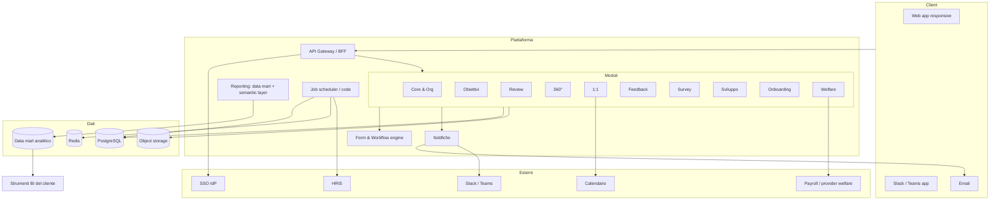

# 03 — Architettura (proposta)

> **Stato: accettata** il 2026-09-13. Le scelte tecnologiche sono formalizzate nelle ADR 0002 (stack), 0003 (multi-tenancy), 0004 (reportistica) e 0005 (strategia API).

## Architettura logica



## Principi architetturali

1. **Monolite modulare** all'inizio: un solo deployable con confini di modulo netti (package per modulo, API interne esplicite). Si estrae in servizi solo se emergono esigenze reali di scala o team.
2. **Form & workflow engine come nucleo condiviso**: review, survey, 360°, onboarding sono "app" sul motore (vedi `specifiche/app-studio.md`).
3. **Multi-tenant a database condiviso** con `tenant_id` su ogni riga e Row-Level Security in PostgreSQL come seconda barriera (ADR-0003). Opzione database dedicato per clienti enterprise in futuro.
4. **Eventi di dominio** interni (outbox pattern) per notifiche, analytics, webhook e audit, così da disaccoppiare i moduli.
5. **Job asincroni** per promemoria, scadenze, sync HRIS, generazione report, export.
6. **API-first**: la web app usa le stesse API esposte pubblicamente (con scope diversi).
7. **Privacy by design**: anonimato survey/360° garantito a livello di schema (separazione inviti/risposte), non solo di UI.
8. **Osservabilità** fin dall'inizio: log strutturati con tenant e correlation id, metriche, tracing.
9. **Metadata-driven**: form, workflow, entità custom, permessi, naming e viste sono dati interpretati da motori generici; è ciò che rende possibile il low-code a livelli (`specifiche/app-studio.md` §4.4).
10. **Reporting come sottosistema separato**: DB operativo e data mart analitico sono distinti; il semantic layer è l'unico punto in cui vivono le definizioni delle metriche e le regole di privacy (ADR-0004).
11. **Un'unica API pubblica** (REST + OpenAPI) per web, mobile app e connettori, con scope diversi per client; client tipizzati generati dallo schema.

## Stack (sintesi, dettaglio in ADR-0002)

| Livello | Proposta | Alternative considerate |
|---|---|---|
| Linguaggio | TypeScript end-to-end | Python (Django) per il backend |
| Frontend | Next.js (React) + design system proprio | Remix, SvelteKit |
| Backend | Node.js con NestJS (monolite modulare) | Next.js route handlers, Fastify puro |
| Database | PostgreSQL 16 con RLS | MySQL |
| ORM / migrazioni | Drizzle ORM + drizzle-kit; PGlite per i test | Prisma, TypeORM |
| Cache / code | Redis + BullMQ | RabbitMQ |
| Auth | Keycloak come broker OIDC/SAML; PKCE per mobile; token con scope per connettori | Auth0, Clerk, WorkOS |
| Storage | S3-compatibile | — |
| Email | Provider transazionale (Postmark/SES) | — |
| Infra | Docker; deploy iniziale su PaaS o Kubernetes gestito in UE | — |
| Monorepo | pnpm workspaces + Turborepo | Nx |

## Struttura del monorepo (proposta)

```
apps/
  web/            # Next.js
  mobile/         # React Native (Expo)
  api/            # NestJS
  workers/        # job asincroni, pipeline analitica
packages/
  core/           # tenant, org, auth, rbac
  okr/ reviews/ feedback360/ one-on-one/ feedback/ surveys/ development/ onboarding/ welfare/
  forms/          # form & workflow engine
  notifications/
  analytics/       # semantic layer, query engine, pipeline verso il data mart
  metadata/        # motore entità custom e automazioni (L3-L4)
  ui/             # design system
  shared/         # tipi, utilità, eventi di dominio
docs/
```

## Ambienti e deployment

- `dev` (locale con Docker Compose), `staging`, `production` in regione UE.
- CI: lint, typecheck, test, build, migrazioni verificate su DB effimero.
- CD: deploy automatico su staging al merge; produzione con approvazione.
- Backup giornalieri, PITR, test di restore trimestrali.

## Non-funzionali

| Requisito | Target iniziale |
|---|---|
| Disponibilità | 99,9 % mensile |
| Latenza p95 pagine principali | < 500 ms lato server |
| Utenti per tenant | fino a 5.000 (target 50–1.000) |
| Residenza dati | UE |
| RPO / RTO | 1 h / 4 h |
| Accessibilità | WCAG 2.1 AA |
| Browser | ultime 2 versioni evergreen; mobile web |
