# 04 — Modello dati (alto livello)

Tutte le tabelle hanno `id` (UUID), `tenant_id`, `created_at`, `updated_at`, `created_by`. Le entità soggette a storico hanno `valid_from` / `valid_to`. I nomi sono in inglese (snake_case nel DB).

> Lo stato reale dello schema (tutte le tabelle e colonne, generato dal codice) è in [04-modello-dati-inventario.md](04-modello-dati-inventario.md); questo documento descrive il modello concettuale e le scelte di design.

## Diagramma ER (entità principali)

```mermaid
erDiagram
    TENANT ||--o{ ORG_UNIT : has
    TENANT ||--o{ PERSON : employs
    PERSON ||--o| USER : "logs in as"
    ORG_UNIT ||--o{ PERSON : "primary unit"
    PERSON ||--o{ PERSON : "manages (history)"
    PERSON }o--o{ ROLE_ASSIGNMENT : has
    ROLE_ASSIGNMENT }o--|| ROLE : of
    ROLE_ASSIGNMENT }o--o| SCOPE : within

    CYCLE ||--o{ OBJECTIVE : contains
    PERSON ||--o{ OBJECTIVE : owns
    OBJECTIVE ||--o{ KEY_RESULT : has
    OBJECTIVE }o--o| OBJECTIVE : "contributes to"
    KEY_RESULT ||--o{ CHECK_IN : has

    APP_DEFINITION ||--o{ APP_VERSION : versions
    APP_VERSION ||--|| FORM_DEFINITION : uses
    APP_VERSION ||--o{ WORKFLOW_STAGE : defines
    APP_VERSION ||--o{ PROCESS_RUN : "launched as"
    PROCESS_RUN ||--o{ PROCESS_INSTANCE : "per subject"
    PROCESS_INSTANCE }o--|| PERSON : subject
    PROCESS_INSTANCE ||--o{ STAGE_INSTANCE : has
    STAGE_INSTANCE }o--o| PERSON : actor
    STAGE_INSTANCE ||--o| FORM_RESPONSE : produces

    REVIEW_CYCLE ||--|| PROCESS_RUN : is
    REVIEW ||--|| PROCESS_INSTANCE : is
    REVIEW ||--o{ RATING : has
    CALIBRATION_SESSION }o--o{ REVIEW : calibrates

    FEEDBACK_360_CAMPAIGN ||--|| PROCESS_RUN : is
    FEEDBACK_360_SUBJECT }o--|| PERSON : about
    FEEDBACK_360_SUBJECT ||--o{ RATER_NOMINATION : has
    RATER_NOMINATION ||--o| FORM_RESPONSE : answers

    ONE_ON_ONE_RELATION ||--o{ MEETING : has
    MEETING ||--o{ TALKING_POINT : has
    MEETING ||--o{ NOTE : has
    MEETING ||--o{ ACTION_ITEM : has

    PERSON ||--o{ FEEDBACK : receives
    PERSON ||--o{ RECOGNITION : receives
    RECOGNITION }o--o{ COMPANY_VALUE : tagged

    SURVEY ||--|| PROCESS_RUN : is
    SURVEY ||--o{ SURVEY_INVITE : sends
    SURVEY ||--o{ SURVEY_RESPONSE : collects
    SURVEY_RESPONSE }o--o| SEGMENT_SNAPSHOT : "anonymous segment"

    COMPETENCY_FRAMEWORK ||--o{ COMPETENCY : contains
    JOB_PROFILE }o--o{ COMPETENCY : expects
    PERSON ||--o{ COMPETENCY_ASSESSMENT : has
    PERSON ||--o| DEVELOPMENT_PLAN : has
    DEVELOPMENT_PLAN ||--o{ DEVELOPMENT_ACTION : has

    ONBOARDING_TEMPLATE ||--o{ ONBOARDING_TASK_TEMPLATE : has
    ONBOARDING_JOURNEY }o--|| PERSON : for
    ONBOARDING_JOURNEY ||--o{ ONBOARDING_TASK : has

    WELFARE_PLAN ||--o{ BUDGET_SOURCE : funds
    WELFARE_PLAN ||--o{ WELFARE_ACCOUNT : "per person"
    WELFARE_ACCOUNT }o--|| PERSON : of
    WELFARE_ACCOUNT ||--o{ WELFARE_TRANSACTION : has
    WELFARE_ACCOUNT ||--o{ WELFARE_REQUEST : makes
    WELFARE_REQUEST }o--|| FISCAL_CATEGORY : under
    WELFARE_REQUEST }o--o| CATALOG_ITEM : for
    CATALOG_ITEM }o--o| PROVIDER : from
    WELFARE_REQUEST ||--o{ ATTACHMENT : "receipts"
    PAYROLL_BATCH ||--o{ WELFARE_REQUEST : includes

    CUSTOM_ENTITY_DEF ||--o{ CUSTOM_FIELD_DEF : has
    CUSTOM_ENTITY_DEF ||--o{ CUSTOM_RECORD : instances
    AUTOMATION_RULE ||--o{ AUTOMATION_RUN : executes

    TENANT ||--o{ AUDIT_LOG : records
    TENANT ||--o{ NOTIFICATION : sends
```

## Note per area

### Core
- `person` è separata da `user`: consente persone senza account e cambi di identità.
- `person_manager_history` e `person_org_history` conservano lo storico con validità temporale (CORE-017).
- `role_assignment(person_id, role_id, scope_type, scope_id)`: scope = tenant | org_unit | person_list.
- `custom_field_definition` / `custom_field_value` per attributi custom.
- `naming_override(tenant_id, concept, locale, singular, plural)` per CORE-003.

### Obiettivi
- `objective(level, owner_type, owner_id, cycle_id, parent_id, visibility, status, weight, progress, progress_mode)`.
- `key_result(type, start_value, target_value, current_value, unit, direction, owner_id)`.
- `check_in(key_result_id, value, confidence, comment, author_id)`.

### Motore form & workflow
- `form_definition` in JSON versionato (schema campi, logica, calcoli); `form_response` con `answers` JSONB + tabella `answer` normalizzata per le domande a scala/competenza (per analytics).
- `workflow_stage(order, actor_rule, form_section_ids, due_rule, visibility_rule, type)`.
- `process_run` (lancio) → `process_instance` (soggetto) → `stage_instance` (fase per soggetto, con `actor_id`, `status`, `due_at`, `submitted_at`).
- Le app native (review, survey, 360°, onboarding) aggiungono tabelle proprie collegate 1:1 alle istanze.

### Survey e anonimato
- `survey_invite(person_id, token_hash, status)` e `survey_response(segment_snapshot_id, answers)` **non** hanno chiave tra loro. Il `segment_snapshot` congela gli attributi di segmentazione (unità, sede, job…) al momento della risposta, senza `person_id`. Le soglie si applicano in query.

### Feedback 360°

- `f360_campaigns` porta il template inline (competenze del framework, scala, domande aperte, categorie con min/max/anonimato), le regole di nomina e rilascio e la soglia di anonimato; `f360_subjects` la persona valutata con stato delle nomine, snapshot del report (JSON) e date di rilascio/debrief; `f360_requests` chi deve rispondere (persona interna oppure email + hash del token per gli esterni) con bozza e stato; `f360_responses` il contenuto. Nelle categorie anonime `request_id` è nullo: nel database non esiste il legame tra valutatore e risposta.

### Onboarding

- `onboarding_templates` (fasi, task per ruolo con scadenza relativa e regole di assegnazione in JSON), `onboarding_journeys` (istanza per persona con data di riferimento, manager/buddy/HR/IT, snapshot delle fasi), `onboarding_tasks` (assegnatario risolto, scadenza assoluta, stato, nota di presa visione; i task `form` puntano a una compilazione del form engine), `onboarding_survey_responses` (mini-survey nominali con punteggio e flag di alert).

### App Studio (processi custom)

- `apps` (definizione JSON versionata con fasi, attori, permessi e naming; stati bozza/pubblicata/archiviata), `app_instances` (snapshot della definizione, attori risolti, fasi correnti, esito), `app_stage_runs` (un tentativo per riapertura con assegnatario, scadenza, esito, commento, risposte e compilazione del form engine), `app_instance_events` (log append-only per istanza).

### 1:1
- `note(meeting_id, author_id, visibility)`: le note private sono cifrate a livello applicativo con chiave per tenant e non indicizzate.

### Welfare
- `welfare_plan(period, population_filter, regulation_doc_id, rollover_rule)`; `budget_source(type, amount_rule, credit_date, expiry_date)`.
- `welfare_account(person_id, plan_id)` con saldo derivato da `welfare_transaction(type: credit|debit|reversal|expiry, amount, ref_type, ref_id)`; il saldo non è mai un campo modificabile a mano.
- `fiscal_category(regime, annual_threshold_rule, allowed_beneficiaries, required_docs)`; `fiscal_threshold(category_id, fiscal_year, condition, amount)`.
- `welfare_request(status, category_id, amount, beneficiary, expense_date, item_id, approver_id, payroll_batch_id)`; gli allegati (giustificativi) sono cifrati e con retention dedicata.
- `payroll_batch(period, status, file_ref)`.

### Entità custom e automazioni (L3–L4)
- `custom_entity_def(name, anchor: person|org_unit|process, permissions)`, `custom_field_def(type, validation, relation_target)`, `custom_record(entity_id, anchor_id, data JSONB)` con indici GIN e limiti per tenant.
- `automation_rules(name, enabled, trigger { event, days?, appKey? }, conditions[], actions[], runs_count, last_run_at)` e `automation_runs(rule_id, event, subject_person_id, dedupe_key, results[], ok)` (sprint 28, ADR-0015).

### Data mart (schema separato `mart_*`, vedi ADR-0004)
- Dimensioni a validità temporale: `dim_person`, `dim_org_unit`, `dim_manager`, `dim_job`, `dim_date`, `dim_cycle`.
- Fatti: `fact_objective_snapshot` (giornaliero), `fact_review_rating`, `fact_feedback_event`, `fact_survey_answer` (solo `segment_snapshot`, mai `person_id`), `fact_meeting`, `fact_onboarding_task`, `fact_welfare_transaction`, `fact_competency_assessment`.
- `metric_definition` (catalogo standard versionato nel repo + custom in tabella) e `saved_report`, `report_schedule`.

### Audit
- `audit_log(actor_id, action, entity_type, entity_id, before, after, ip, user_agent, at)` append-only (nessun UPDATE/DELETE via ruolo applicativo).

## Convenzioni

- Soft delete solo dove serve per la UX (`archived_at`); le cancellazioni GDPR sono hard delete o anonimizzazione con job dedicato.
- Ogni tabella con dati personali è censita nel registro trattamenti (`docs/06`).
- Indici sempre con `tenant_id` come prima colonna.
