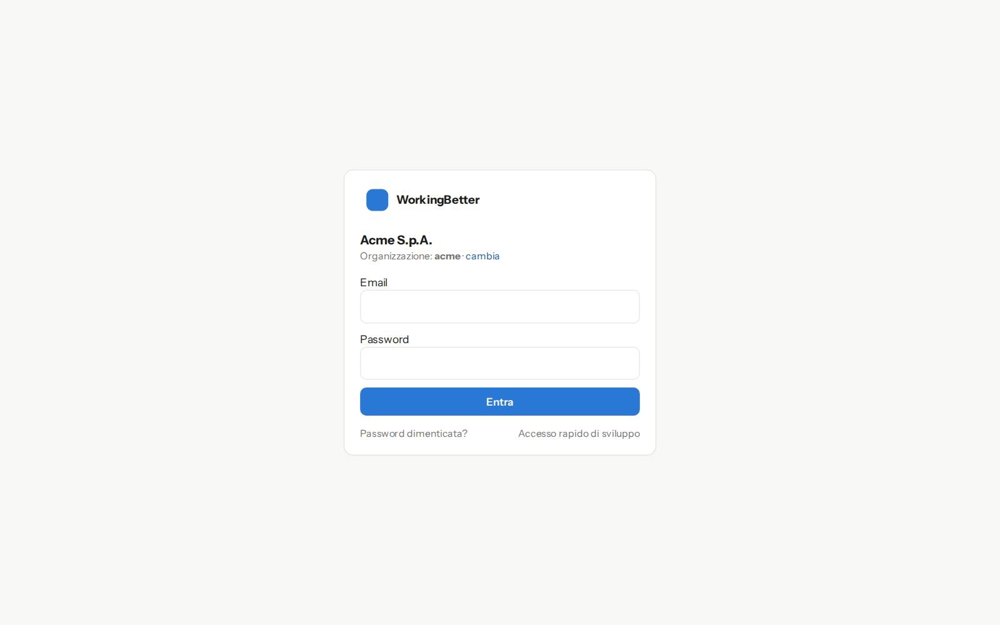
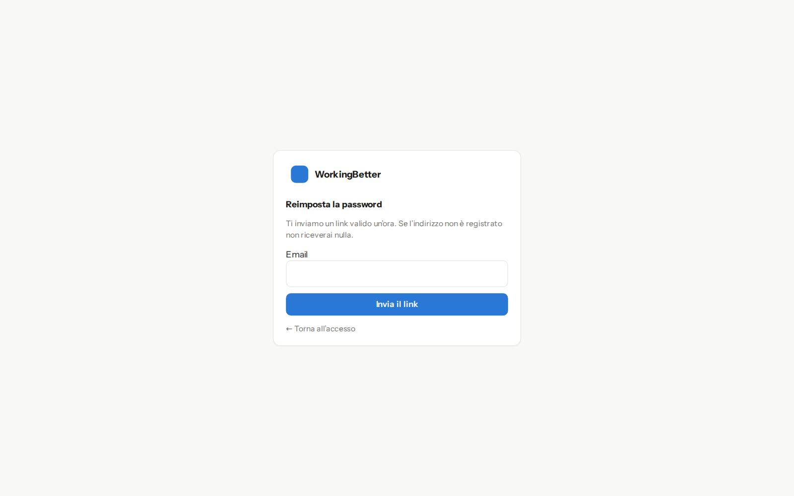
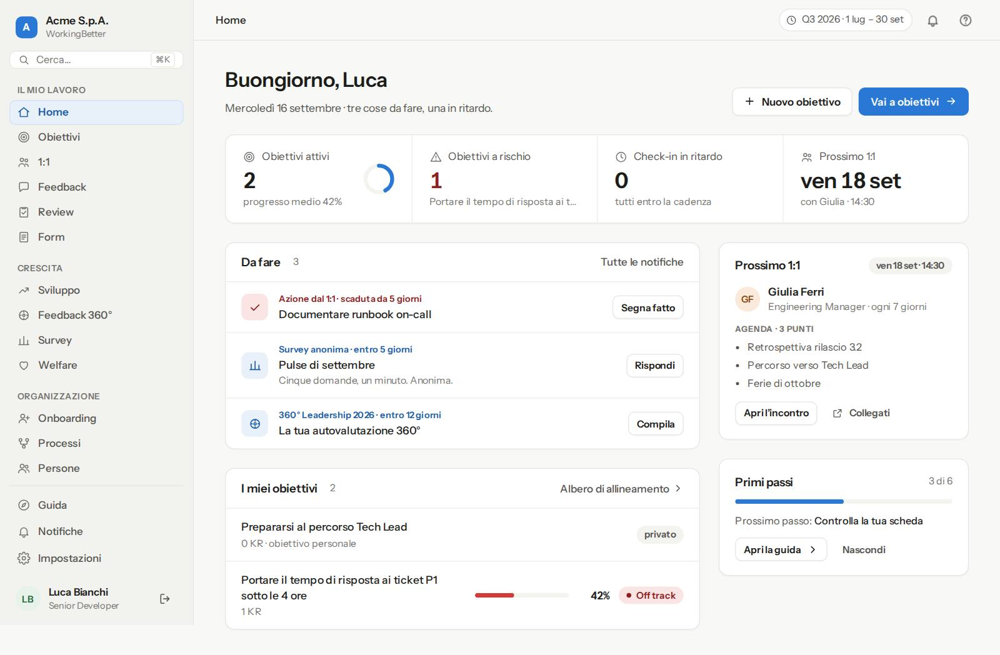
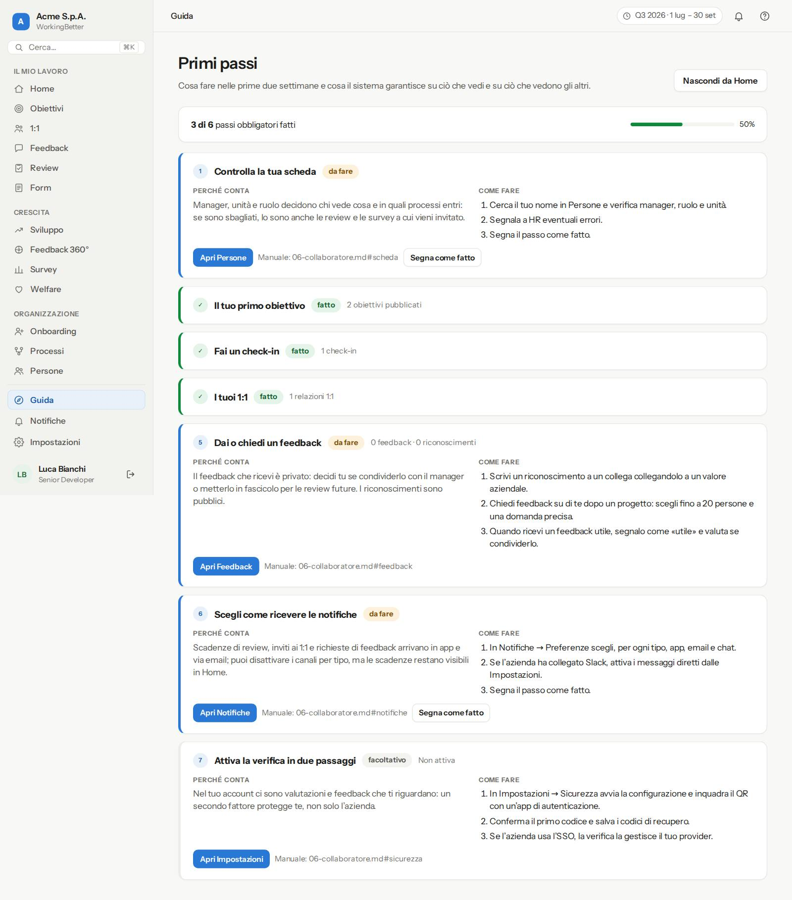
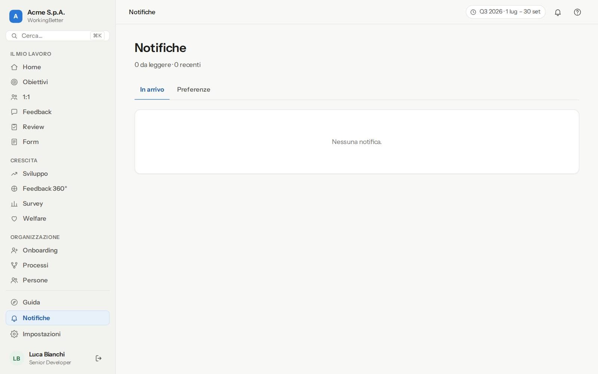
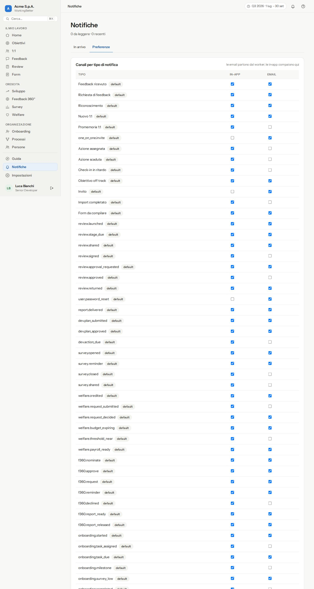
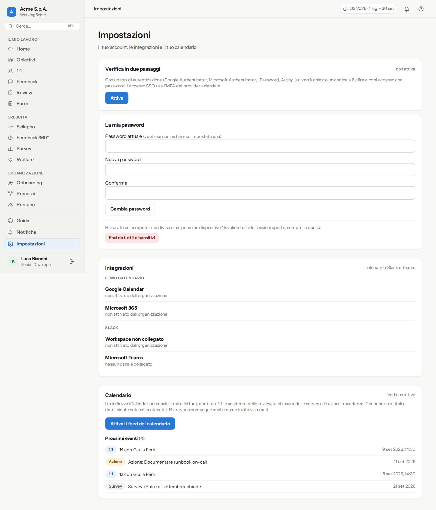
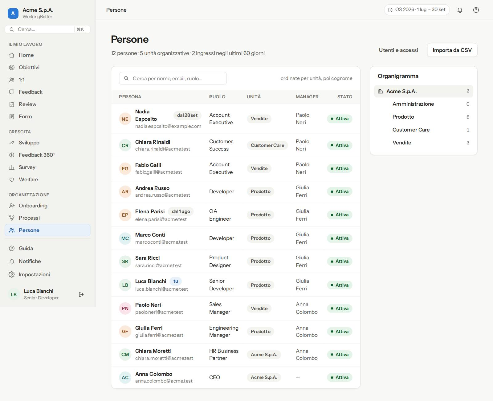
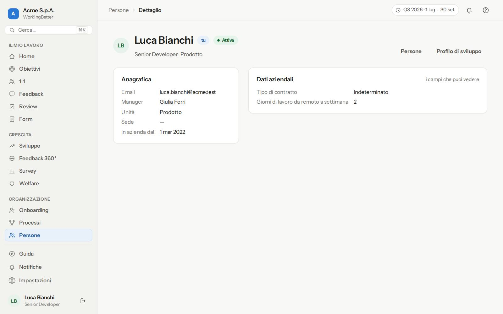

# 1 · Primi passi

## 1.1 Accedere {#accesso}

L'indirizzo dell'app te lo comunica l'azienda (di solito `https://app.<azienda>.it`). La pagina di accesso chiede **Email** e **Password**; il pulsante **Entra** ti porta in Home.

**Primo accesso con invito.** Ricevi un'email con un link personale valido **7 giorni**. Il link apre una pagina in cui scegli la password (almeno 10 caratteri, diversa dall'email) e conferma l'account. Se il link è scaduto, chiedi a HR o all'amministratore di reinviarlo: il vecchio smette di valere.

**Accesso aziendale (SSO).** Se l'azienda ha attivato l'accesso con l'identità aziendale (Microsoft, Google, Okta…), nella pagina compare il pulsante dedicato: usa quello, senza password locale. In alcune aziende la password locale è disattivata del tutto.

**Password dimenticata.** Dal link nella pagina di accesso inserisci l'email: se l'account esiste ricevi un messaggio con un link valido **60 minuti**.

> **Buono a sapersi.** Dopo **5 tentativi errati** l'accesso è sospeso per **15 minuti**: non è un guasto, aspetta e riprova o usa il recupero password.

## 1.2 Orientarsi {#menu}

- **Menu a sinistra**, in tre sezioni: **Il mio lavoro** (Home, Obiettivi, 1:1, Feedback, Review, Form), **Crescita** (Sviluppo, Feedback 360°, Survey, Welfare) e **Organizzazione** (Onboarding, Processi, Report, Persone). Vedi solo le voci che il tuo ruolo prevede e i moduli che la tua azienda ha attivato; se l'azienda ha scelto nomi propri (per esempio «Priorità» al posto di «Obiettivi»), il menu e i titoli li usano. **Guida**, **Notifiche** e **Impostazioni** sono in fondo per tutti. Sotto trovi il tuo nome e l'icona per **uscire**.
- **Cerca…** (o `Ctrl+K` / `⌘K` da qualsiasi pagina): apre una pagina scrivendone il nome o trova una persona per nome ed email.
- **Barra in alto**: la pagina in cui ti trovi, il periodo obiettivi attivo, la campanella con il numero di notifiche da leggere e l'aiuto.
- **Home**: saluto, la frase che riassume cosa hai in sospeso, quattro indicatori (obiettivi attivi con anello di progresso, a rischio, check-in in ritardo, prossimo 1:1 oppure riporti diretti se hai un team), l'elenco **Da fare**, i tuoi obiettivi e, se hai un team, la tabella del team. A destra la scheda del **prossimo 1:1** con l'agenda e, finché non hai finito l'avviamento, i **Primi passi** con **Apri la guida** e **Nascondi**.
- **Da fare** raccoglie in un solo posto ciò che ti aspetta nei vari moduli, in ordine di urgenza: azioni dei 1:1 scadute o in scadenza, check-in dei risultati chiave oltre la cadenza, review e approvazioni assegnate a te, passi di onboarding e richieste dei processi, survey aperte non ancora compilate, feedback 360° da dare. Ogni riga ha il pulsante che porta all'azione; quando la completi, la riga sparisce.

## 1.3 La Guida {#guida}

**Guida** (menu) apre il percorso di avviamento del tuo profilo: un elenco ordinato di passi, ciascuno con «Perché conta», «Come fare» e il pulsante che porta alla schermata giusta.

- I passi con controllo automatico si spuntano da soli quando il sistema rileva l'azione (per esempio dopo il primo check-in). Accanto allo stato leggi il dettaglio («2 relazioni 1:1»).
- I passi manuali (per esempio «Controlla la tua scheda») si segnano con **Segna come fatto** e si riaprono con **Riapri**.
- **Nascondi da Home** toglie il promemoria; **Mostra di nuovo in Home** lo riattiva.
- Chi ha ruoli superiori vede le schede degli altri profili per accompagnare le proprie persone.

## 1.4 Notifiche {#notifiche}

**Notifiche → In arrivo** elenca ciò che ti riguarda: scadenze, inviti, richieste di feedback, review condivise. Ogni riga porta alla schermata dove agire.

**Notifiche → Preferenze**: per ogni tipo scegli **In-app** ed **Email** (e **Chat** se l'azienda ha collegato Slack). Premi **Salva preferenze**. Le notifiche di sicurezza e gli inviti arrivano sempre.

## 1.5 Il tuo account {#account}

**Impostazioni** raccoglie ciò che riguarda te.

| Sezione | Cosa fai |
|---|---|
| **Verifica in due passaggi** | **Attiva**: inquadri il codice QR con un'app di autenticazione (Google Authenticator, Microsoft Authenticator, 1Password…), confermi il primo codice e **salvi gli 8 codici di recupero**: si vedono una volta sola. |
| **La mia password** | Password attuale (vuota se sei entrato solo con invito o SSO), nuova password, conferma, **Cambia password**. **Esci da tutti i dispositivi** chiude ogni sessione aperta altrove. |
| **Integrazioni** | Colleghi il **tuo** calendario Google o Microsoft 365 (gli inviti dei 1:1 finiscono direttamente lì) e, se attivo, Slack. Nessuno può farlo al posto tuo. |
| **Calendario** | **Attiva il feed del calendario**: un indirizzo segreto da aggiungere a Outlook, Google Calendar o Apple Calendar con i tuoi 1:1, le scadenze delle review, le chiusure delle survey e le azioni. Puoi rigenerarlo o disattivarlo in qualsiasi momento. Sotto vedi i **Prossimi eventi**. |

## 1.6 Le persone e l'organigramma {#persone}

**Persone** mostra l'elenco con ruolo, unità, manager e stato, e l'**Organigramma** delle unità con il numero di persone. È la fonte di verità per chi vede cosa: controlla che il tuo manager e la tua unità siano corretti e, se no, segnalalo a HR.

Cliccando un nome si apre la **scheda persona**: anagrafica, manager, unità e i **Dati aziendali** che l'azienda ha deciso di mostrare (per esempio il tipo di contratto). I campi riservati a HR o al manager non compaiono.

