# 2 · Collaboratore

Tutto ciò che descrive questo capitolo vale per chiunque abbia un account: anche manager, HR e amministratori hanno i propri obiettivi, i propri 1:1 e la propria review.

## 2.1 La Home e la Guida {#home}

La Home (vedi [1.2](01-primi-passi.md#menu)) riassume la tua situazione nel periodo corrente. I quattro riquadri contano i tuoi obiettivi attivi con il progresso medio, quelli a rischio, i check-in in ritardo e, se sei manager, i riporti diretti. Sotto, «I miei obiettivi» elenca gli obiettivi con numero di risultati chiave, percentuale e stato di confidenza. **Vai agli obiettivi** apre il modulo.

La **Guida** ti accompagna nelle prime due settimane con sette passi; i primi tre (scheda, obiettivo, check-in) sono quelli che rendono utile tutto il resto.

## 2.2 Obiettivi {#obiettivi}

### Cosa vedi

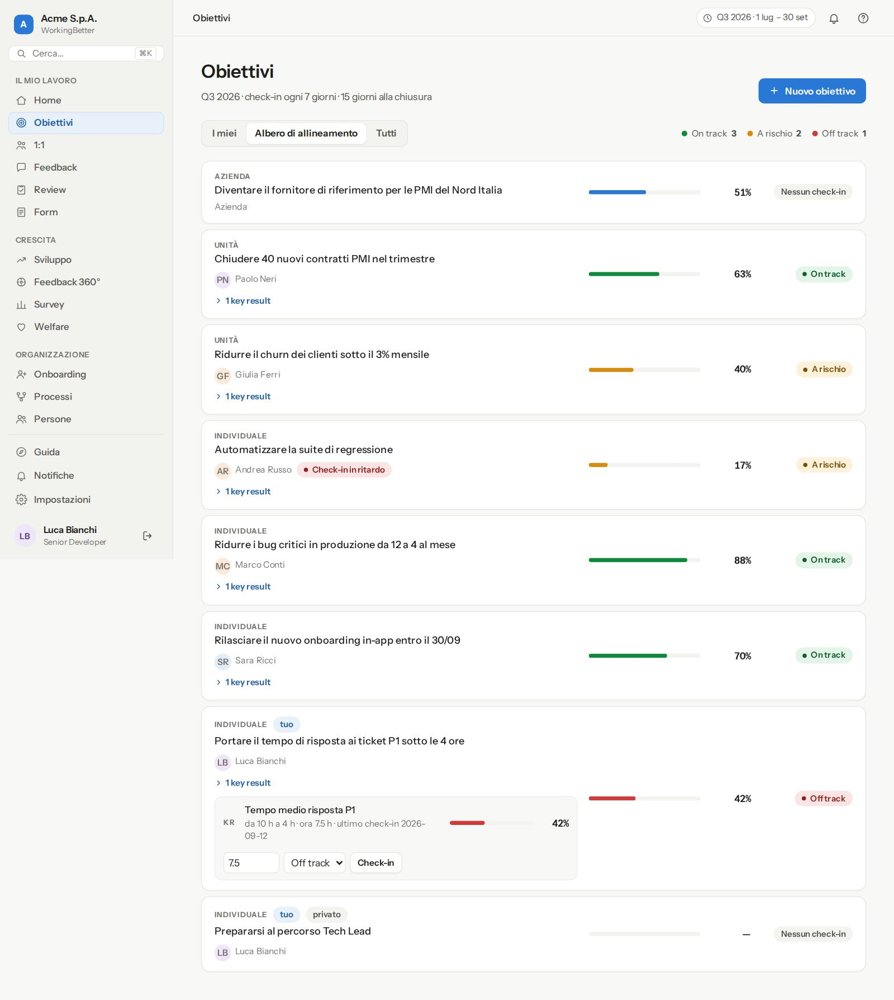

- L'intestazione mostra il **periodo** corrente e la **cadenza dei check-in** (nell'esempio ogni 7 giorni).
- Le schede: **I miei**, **Albero di allineamento**, **Tutti** (gli obiettivi pubblici dell'azienda).
- Ogni obiettivo è una scheda con titolo, owner, percentuale, barra di progresso e un'etichetta di stato: **On track**, **A rischio**, **Off track**, **Nessun check-in**, **Check-in in ritardo**; **Privato** se la visibilità è ristretta.
- L'**Albero di allineamento** mostra la catena azienda → unità → team → persona: utile per capire a cosa contribuisce il tuo lavoro. **I miei** mostra solo i tuoi, con i risultati chiave apribili.

### Creare un obiettivo

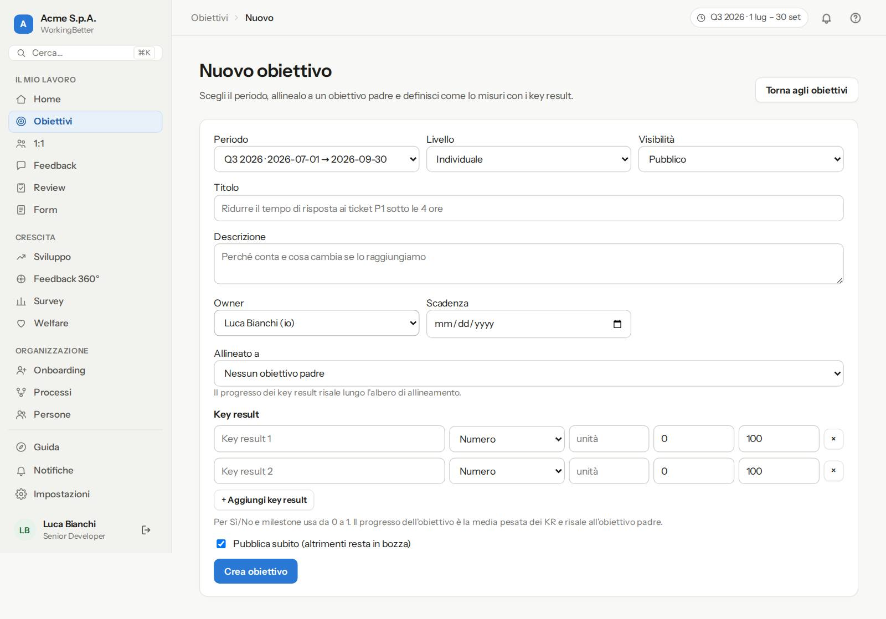

1. **Obiettivi → Nuovo obiettivo.**
2. Controlla il **Periodo** (proposto quello corrente) e il **Livello** (per te: Individuale).
3. Scegli la **Visibilità**: **Pubblico** (consigliato), **Solo team**, **Privato (io e il mio manager)**.
4. Scrivi **Titolo** e, se serve, **Descrizione** e **Scadenza**.
5. In **Allineato a** scegli l'obiettivo padre (del team o dell'azienda) a cui contribuisci.
6. Premi **+ Aggiungi key result** per ogni risultato misurabile: titolo, tipo (numero, percentuale, valuta, sì/no, tappe), valore iniziale, valore obiettivo, unità, eventuale peso.
7. Spunta **Pubblica subito** e premi **Crea obiettivo**. Senza la spunta resta una bozza visibile solo a te.

> **Buono a sapersi.** Il progresso dell'obiettivo è la media dei risultati chiave (pesata se hai dato dei pesi). La confidenza dell'obiettivo è la peggiore tra i risultati chiave. Le bozze si possono eliminare; gli obiettivi pubblicati si chiudono con un esito.

### Fare un check-in

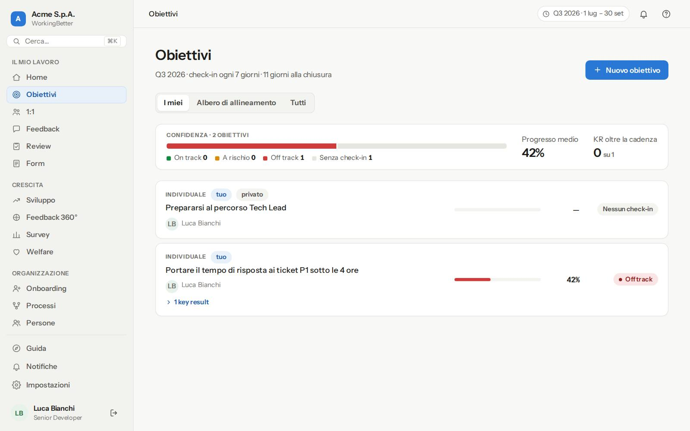

1. Nella scheda dell'obiettivo premi la riga **N key result** per aprire l'elenco.
2. Su ogni risultato chiave: aggiorna il **valore** attuale, scegli la confidenza (**On track**, **A rischio**, **Off track**) e premi **Check-in**.
3. Il progresso e lo stato si ricalcolano subito, anche sugli obiettivi padre.

> **Buono a sapersi.** Se non fai check-in oltre la cadenza del periodo, l'obiettivo compare come **Check-in in ritardo** nella tua Home e in quella del manager. Un check-in **Off track** invia una notifica al manager: è il momento giusto per chiedere una mano.

### Chiudere un obiettivo

A fine periodo l'obiettivo si chiude con un esito (raggiunto, parzialmente, non raggiunto, annullato) e un punteggio finale. L'esito compare nel pannello di contesto della tua review.

## 2.3 1:1 {#uno-a-uno}

### Cosa vedi

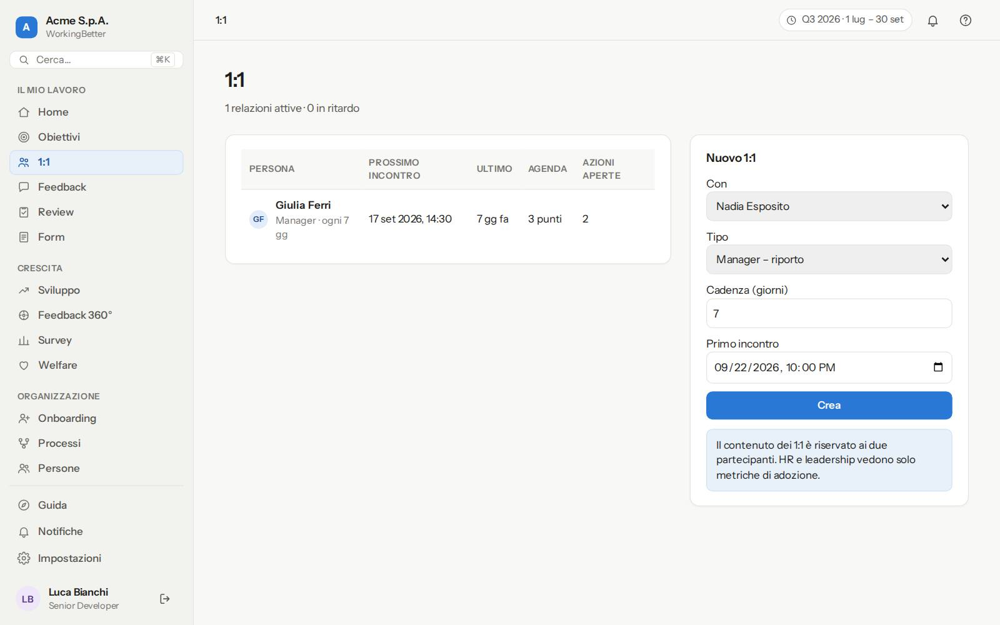

- L'elenco delle **relazioni** con prossimo incontro, ultimo incontro, punti in agenda e azioni aperte; un'etichetta segnala i ritardi.
- **Nuovo 1:1**: scegli la persona, il **Tipo** (Manager – riporto, Mentoring, Skip-level, Pari), la **Cadenza** in giorni e il **Primo incontro**, poi **Crea**. La relazione con il tuo manager di solito la crea lui; tu puoi creare quelle di mentoring e tra pari.

### L'incontro

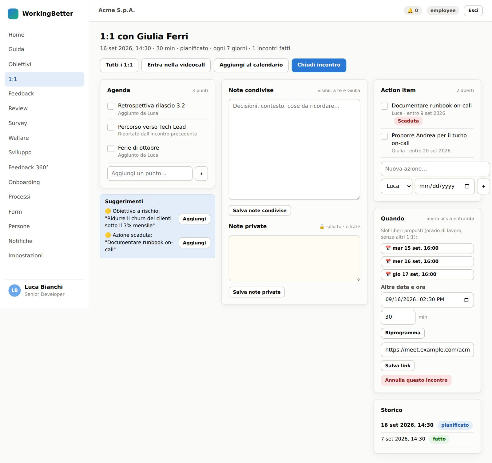

| Riquadro | Cosa fai |
|---|---|
| **Agenda** | Aggiungi punti con **＋** prima dell'incontro. I **Suggerimenti** propongono obiettivi a rischio, check-in mancanti, azioni scadute: premi **Aggiungi** per portarli in agenda. Durante l'incontro spunta i punti discussi. |
| **Note condivise** | Visibili a entrambi. **Salva note condivise**. |
| **Note private** | **Solo tu · cifrate**: nessun altro può leggerle, nemmeno HR. **Salva note private**. |
| **Action item** | Impegni con owner (uno dei due) e scadenza: **Aggiungi**. Quando scadono arrivano come notifica. |
| **Quando** | Tre proposte di orario, oppure **Altra data e ora** → **Riprogramma**; **Entra nella videocall** se c'è un link; **Aggiungi al calendario** scarica l'invito; **Salva link** imposta la videochiamata. |
| **Chiudi incontro** | Conclude e crea il successivo secondo la cadenza; i punti non discussi vengono riportati. **Annulla questo incontro** lo cancella. |
| **Storico** | Gli incontri precedenti. |

> **Buono a sapersi.** L'invito calendario arriva via email a entrambi a ogni creazione, riprogrammazione o annullamento. Se hai collegato Google o Microsoft 365 in Impostazioni, l'evento appare direttamente nel tuo calendario.

## 2.4 Feedback e riconoscimenti {#feedback}

### Cosa vedi

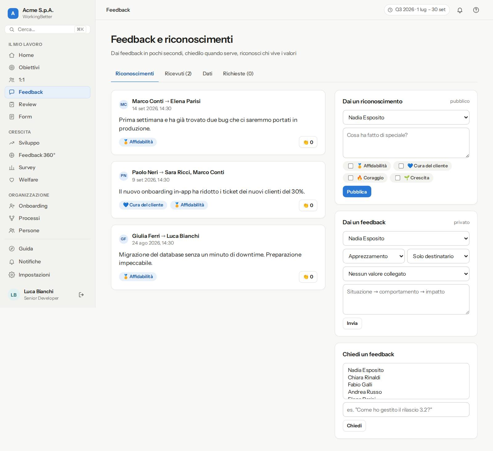

- Schede **Riconoscimenti** (il feed pubblico), **Ricevuti**, **Dati**, **Richieste**.
- A destra tre moduli: **Dai un riconoscimento (pubblico)**, **Dai un feedback (privato)**, **Chiedi un feedback**.

### Dare un riconoscimento

1. Scegli la persona (o più persone) e scrivi cosa ha fatto di speciale.
2. Seleziona uno o più **valori aziendali** (nell'esempio Affidabilità, Cura del cliente, Coraggio, Crescita).
3. **Pubblica**. Compare nel feed di tutta l'azienda, dove i colleghi possono reagire con 👏.

### Dare un feedback privato

1. Scegli il destinatario e il tipo: **Apprezzamento**, **Suggerimento**, **Osservazione**.
2. Scegli la visibilità: **Solo destinatario** oppure **Anche al suo manager**.
3. Collega, se vuoi, un valore aziendale; scrivi il testo seguendo lo schema *situazione → comportamento → impatto* e premi **Invia**.

### Chiedere un feedback

1. Seleziona fino a 20 persone e scrivi una domanda precisa (es. «Come ho gestito il rilascio 3.2?»).
2. **Chiedi**. Chi riceve la richiesta la trova in **Richieste** e può rispondere o declinare con un motivo. Le risposte arrivano a te.

### Cosa fare con i feedback ricevuti

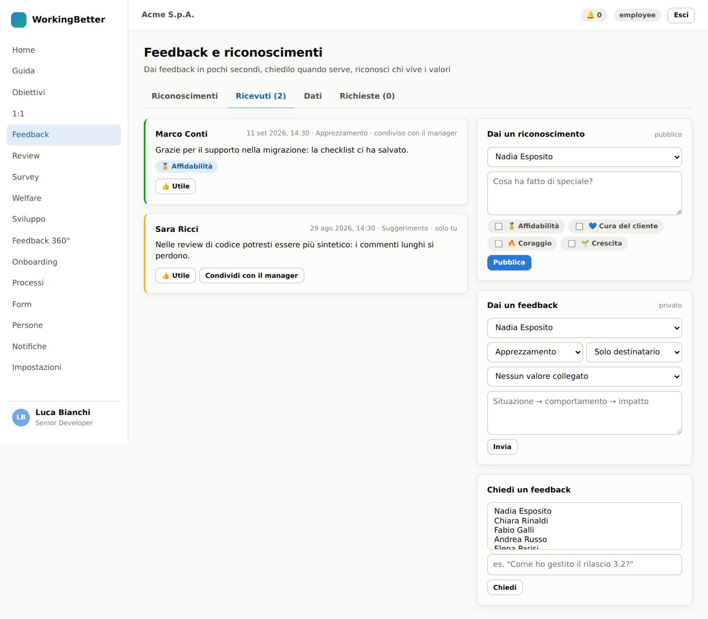

Nella scheda **Ricevuti** ogni feedback ha **👍 Utile** (per ringraziare e segnalare che ti è servito) e **Condividi con il manager**. Se il feedback è arrivato «solo a te», il manager lo vede soltanto se lo condividi tu; puoi anche metterlo in fascicolo perché resti visibile nelle review future.

> **Buono a sapersi.** Il feedback non è mai anonimo. I feedback condivisi e i riconoscimenti compaiono nel pannello di contesto della tua review.

## 2.5 Review {#review}

### Cosa vedi

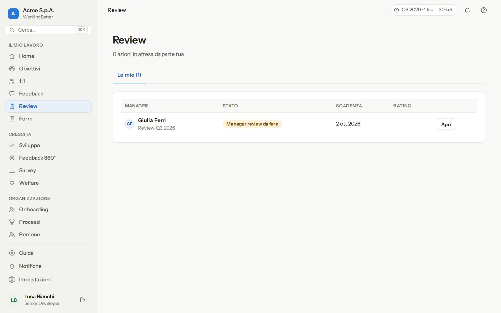

**Review → Le mie** elenca le tue review con manager, stato, scadenza e, quando c'è, il rating. Il pulsante dice cosa devi fare: **Compila self-review**, **Leggi e firma**, **Apri**.

### La self-review

1. Al lancio del ciclo ricevi una notifica; apri la review e compila il questionario della self-review (le domande le decide HR).
2. **Salva bozza** quando vuoi, **Invia** entro la scadenza indicata.
3. La pagina dice quando il manager vedrà la tua self-review: di norma **solo dopo aver inviato la sua**.

### Leggere e firmare

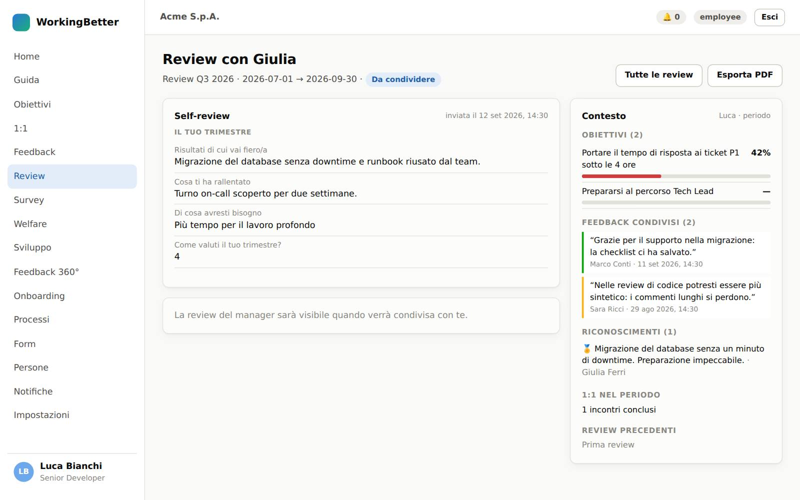

- Finché il manager non **condivide**, vedi solo la tua self-review e il messaggio «La review del manager sarà visibile quando verrà condivisa con te». Non vedi il rating né eventuali passaggi interni (approvazioni, calibrazione).
- Dopo la condivisione leggi la manager review e il rating con la sua etichetta; fate il colloquio.
- Se il template lo prevede, firmi con **Presa visione**: puoi aggiungere un commento e spuntare **Non concordo con la valutazione**. La firma attesta la lettura, non l'accordo; il dissenso resta agli atti e il manager ne è informato.
- **Esporta PDF** produce il documento con ciò che vedi tu.

Il pannello **Contesto** a destra mostra i tuoi obiettivi del periodo, i feedback condivisi, i riconoscimenti, il numero di 1:1 conclusi e le review precedenti: lo stesso che vede il manager mentre scrive.

## 2.6 Survey {#survey}

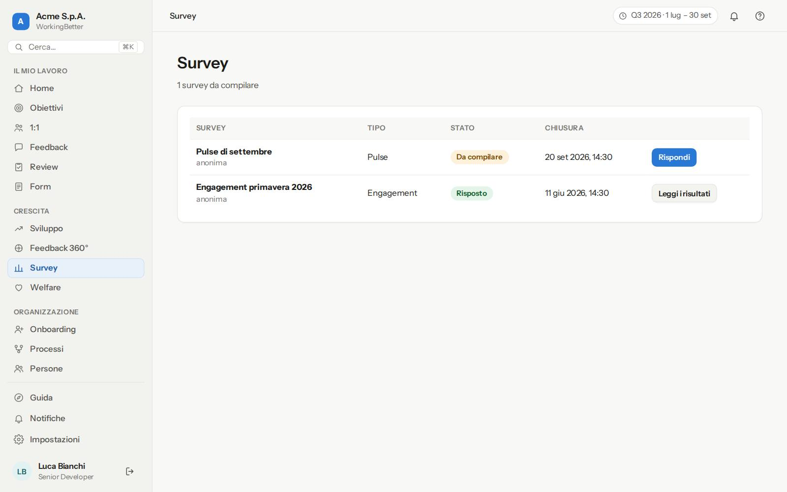

**Survey** elenca le survey a cui sei invitato con tipo, stato e chiusura. **Rispondi** apre il questionario; **Leggi i risultati** compare quando HR ha condiviso la sintesi.

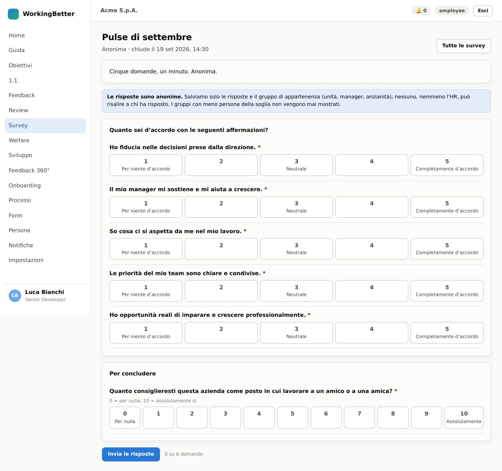

1. Rispondi a ogni affermazione sulla scala **1 Per niente d'accordo … 5 Completamente d'accordo**.
2. La domanda finale da 0 a 10 è l'eNPS («consiglieresti l'azienda come posto di lavoro?»).
3. **Invia le risposte**. Non si può modificare dopo l'invio.

> **Buono a sapersi.** Il riquadro azzurro lo ricorda: le risposte sono anonime per costruzione, si salva solo il gruppo di appartenenza e i risultati compaiono solo per gruppi sopra la soglia (di norma 5 persone). Le survey di **onboarding** invece sono nominali, e la pagina lo dice esplicitamente.

## 2.7 Feedback 360° {#360}

### Rispondere a una richiesta

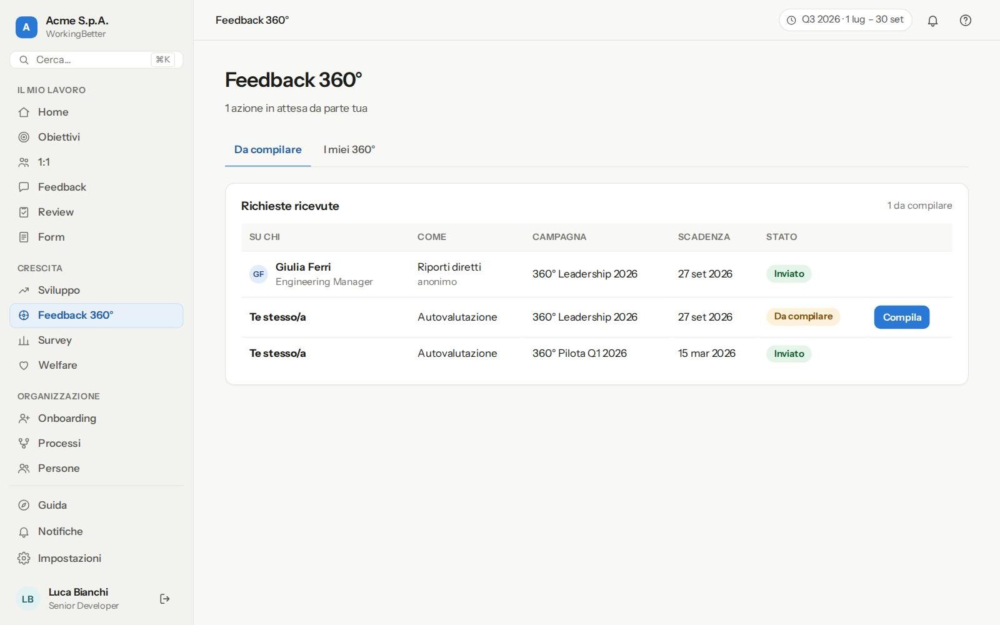

**Feedback 360° → Da compilare** elenca le richieste ricevute: su chi, in quale ruolo (autovalutazione, pari, riporto…), campagna, scadenza.

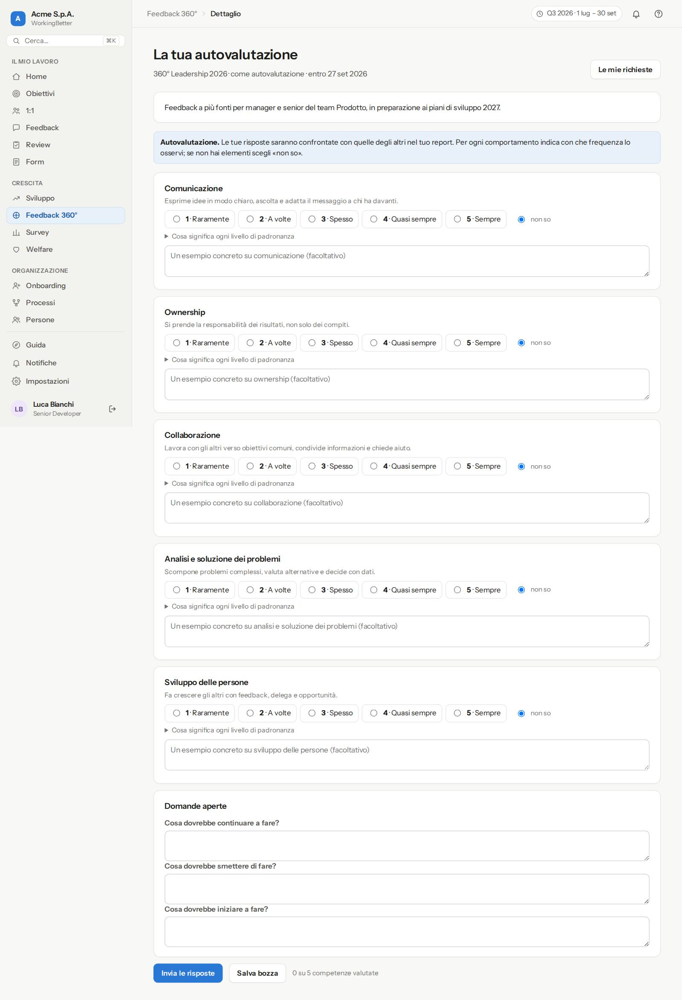

1. **Compila**: per ogni comportamento indica la frequenza (**1 Raramente … 5 Sempre**) oppure **non so**.
2. Rispondi alle domande aperte (continuare / smettere / iniziare).
3. **Salva bozza** o **Invia le risposte**.

### Quando sei tu la persona valutata

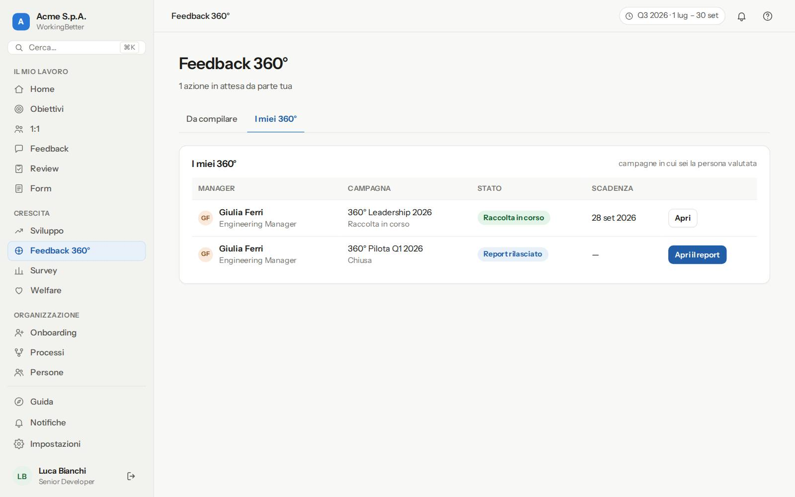

**I miei 360°** elenca le campagne in cui sei il soggetto. **Apri** mostra i valutatori per categoria e lo stato della raccolta; se la campagna prevede che nomini tu i valutatori, li scegli qui entro i limiti per categoria e li invii all'approvazione del manager.

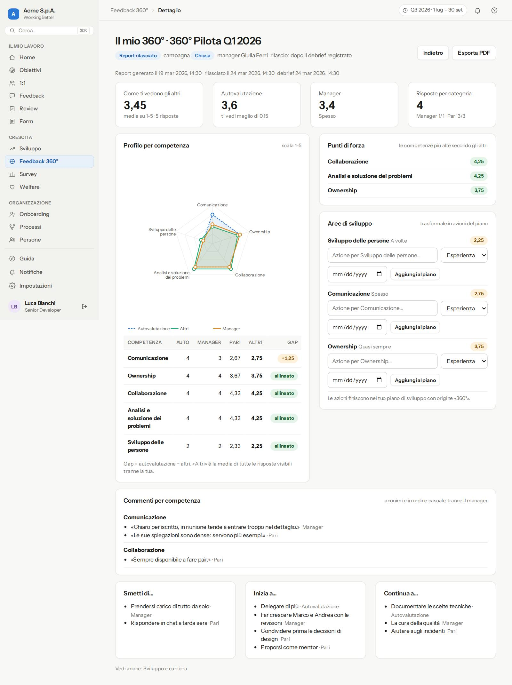

Quando il report è rilasciato compare **Apri il report**: medie per categoria, confronto con la tua autovalutazione, punti di forza e aree di sviluppo, commenti. Nelle categorie anonime non vedi mai chi ha risposto cosa.

## 2.8 Sviluppo e carriera {#sviluppo}

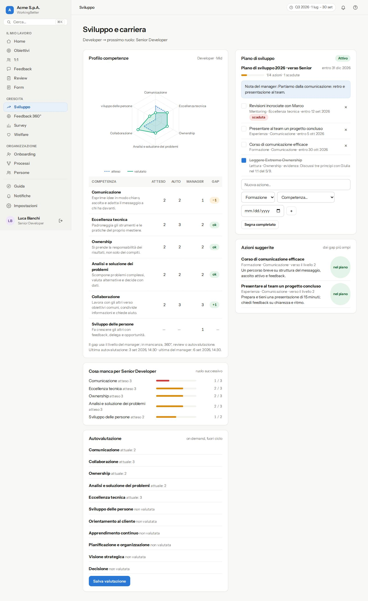

| Riquadro | Cosa contiene |
|---|---|
| **Profilo competenze** | Per ogni competenza: livello **Atteso** dal tuo job profile, **Auto** (la tua valutazione), **Manager**, **Gap** (−1 = sotto, ok, +1 = sopra). |
| **Cosa manca per …** | I livelli attesi dal ruolo successivo nel percorso di carriera. |
| **Autovalutazione** | Scegli il livello per ogni competenza leggendo il descrittore (1 In apprendimento … 4 Modello) oppure **non valuto**, poi **Salva valutazione**. Si può rifare in qualsiasi momento. |
| **Piano di sviluppo** | Azioni (formazione, mentoring, esperienza, lettura) con scadenza; **Segna completato** quando le concludi; la nota del manager spiega le priorità. |
| **Azioni suggerite** | Proposte automatiche sui gap più ampi: **＋** le aggiunge al piano. |

> **Buono a sapersi.** Il piano lo approva il manager o HR. Il potenziale e la 9-box non sono mostrati alla persona.

## 2.9 Welfare {#welfare}

### Il tuo welfare

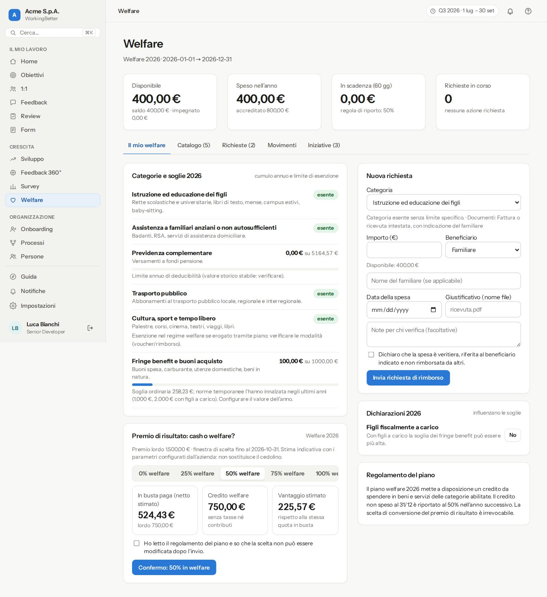

- **Il mio welfare**: saldo, disponibile e impegnato; **Categorie e soglie** dell'anno con il cumulo e l'avviso quando ti avvicini al limite di esenzione; **Premio di risultato: cash o welfare?** con il simulatore e la scelta (è unica: spunta la presa visione del regolamento e conferma); **Nuova richiesta** di rimborso; **Dichiarazioni** (es. figli a carico) che influenzano le soglie; **Regolamento del piano**.

### Chiedere un rimborso

1. In **Nuova richiesta** scegli la **Categoria**, l'**Importo**, il **Beneficiario** (te o un familiare), la **Data della spesa** e il **Giustificativo**.
2. Spunta la dichiarazione di veridicità e premi **Invia richiesta di rimborso**.
3. Il budget viene **prenotato** subito; HR verifica (può chiederti documenti), approva o rifiuta; a pagamento avvenuto la richiesta risulta liquidata.

### Catalogo, richieste, movimenti

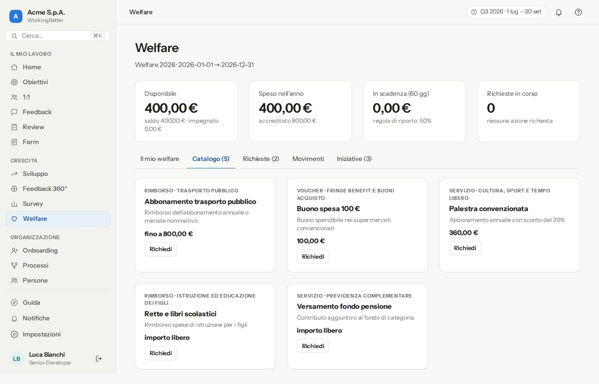

- **Catalogo**: voci interne (abbonamento trasporto, buono spesa, palestra, rette scolastiche, fondo pensione…) con **Richiedi …** e i campi già impostati.
- **Richieste**: lo stato di ciascuna (Inviata, In verifica, Approvata, Evasa, Liquidata, Rifiutata) con l'esito.
- **Movimenti**: il registro del conto (Accredito, Prenotazione, Rilascio, Spesa) con scadenze del budget.
- **Iniziative**: convenzioni, programmi ed eventi a cui aderire.

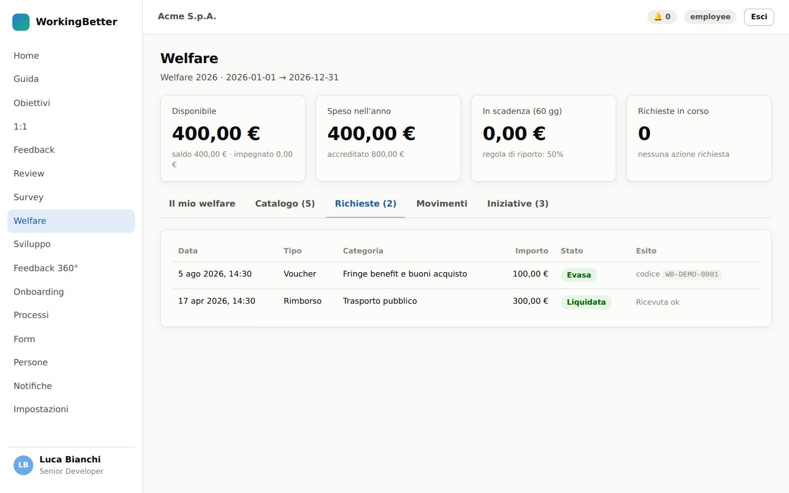

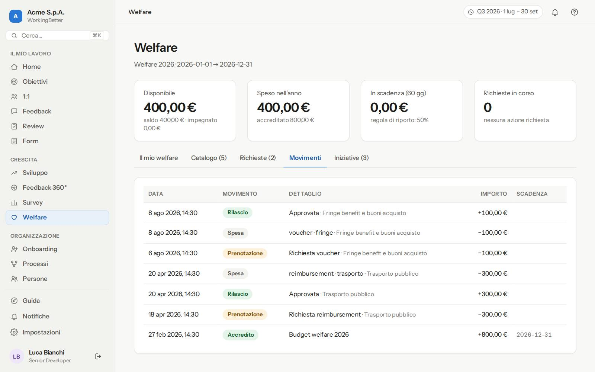

## 2.10 Onboarding {#onboarding}

Se sei un nuovo ingresso (o cambi ruolo), **Onboarding** mostra il tuo percorso.

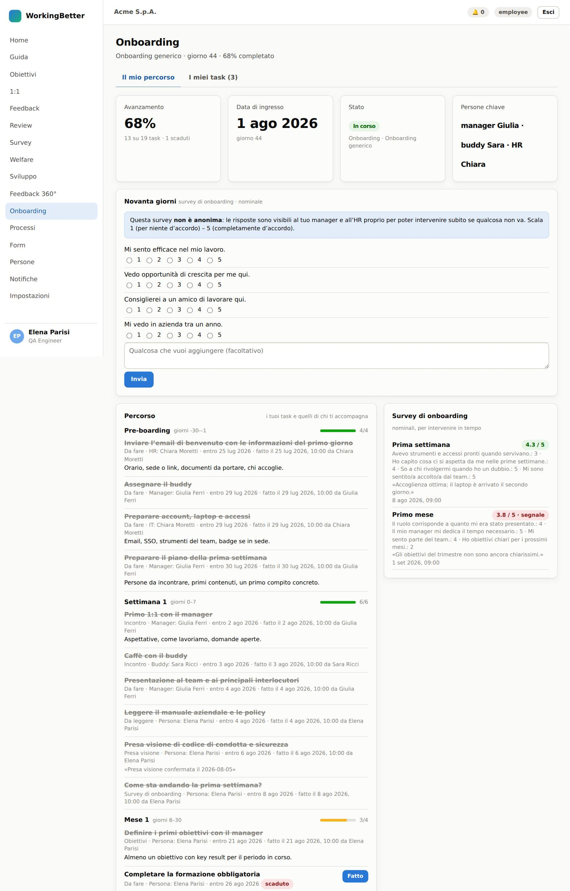

- L'intestazione riporta percorso, giorno e percentuale completata.
- **Il mio percorso** elenca le fasi (Pre-boarding, Settimana 1, Mese 1, 60 giorni, 90 giorni) con tutti i task, anche quelli di manager, buddy, HR e IT, così sai chi fa cosa.
- **I miei task** elenca solo i tuoi: **Fatto**, **Apri** (per un link o un form), **Salta** se non applicabile, **Vai ai 1:1** per gli incontri.
- Le **survey di onboarding** (7, 30, 90 giorni) si compilano qui con **Rispondi**: sono nominali, e servono a manager e HR per intervenire in tempo.

Prima dell'ingresso, se non hai ancora un account, ricevi via email un **link personale** con i soli compiti di pre-boarding (contratto, documenti, welcome pack).

## 2.11 Processi e richieste {#processi}

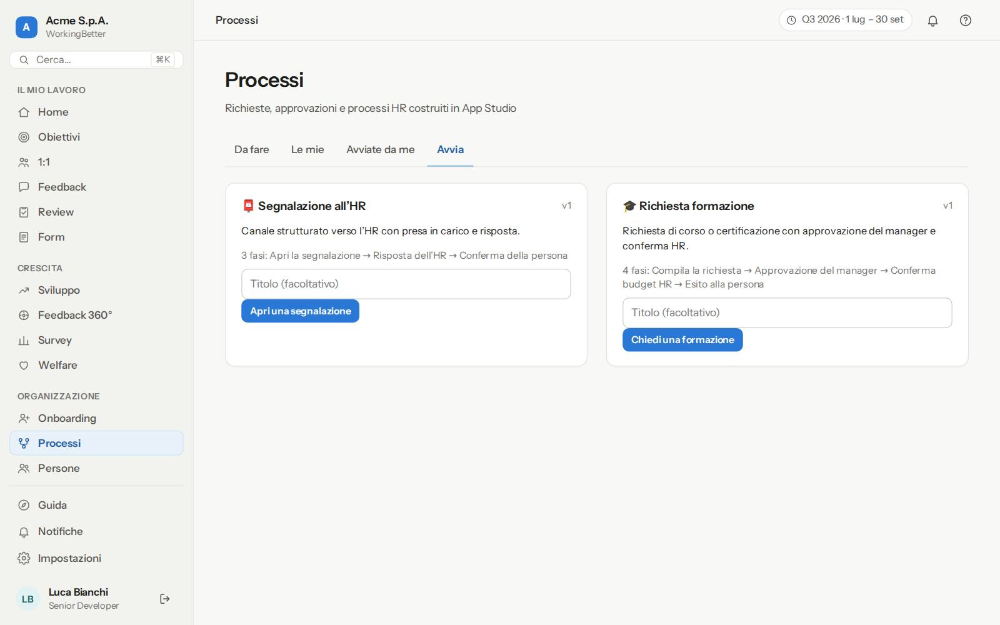

- **Avvia**: i processi che puoi avviare per te (es. **Chiedi una formazione**, **Apri una segnalazione**). Compili il form e il processo parte verso le approvazioni previste.
- **Da fare**: le fasi assegnate a te (compilare un form, prendere visione), con scadenza.
- **Le mie**: i processi che ti riguardano, con la fase attiva e l'avanzamento; **Avviate da me** quelli che hai avviato per altri.

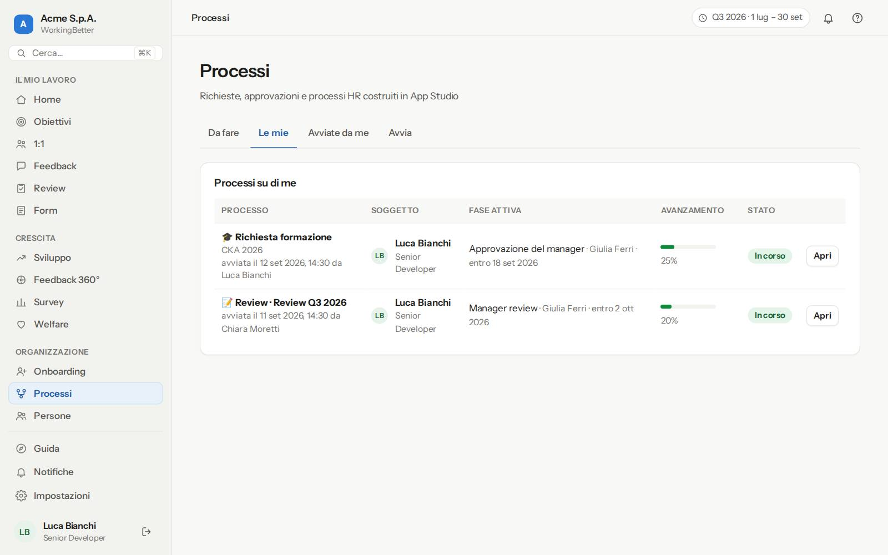

Aprendo un'istanza vedi le fasi in ordine, chi deve agire, le risposte date e il log «chi ha fatto cosa».

## 2.12 Form {#form}

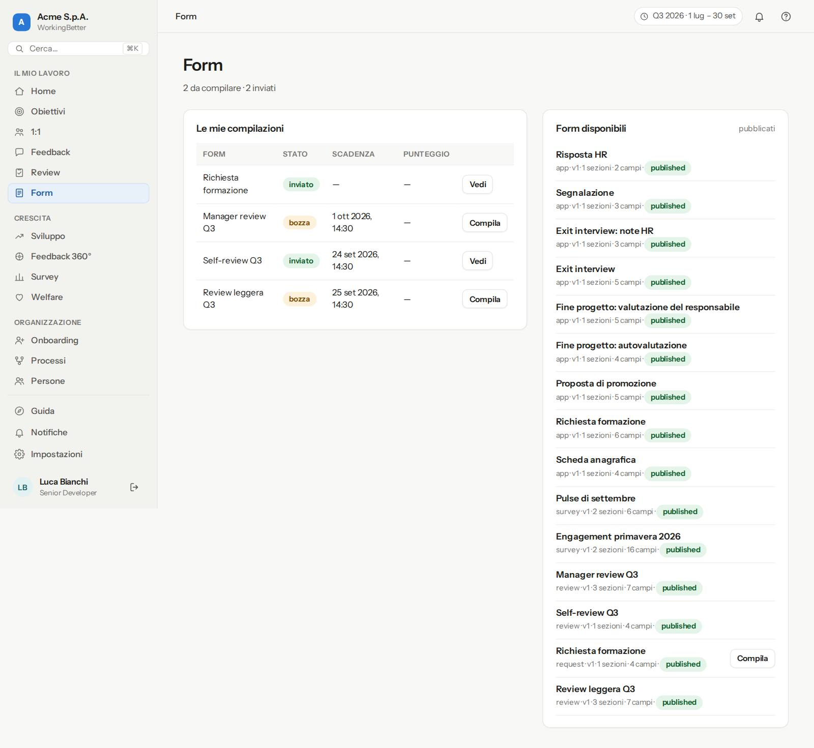

**Form** raccoglie tutte le compilazioni che ti riguardano, anche quelle avviate da altri moduli (review, processi): stato **bozza** o **inviato**, scadenza, punteggio se previsto. **Compila** apre un form pubblicato disponibile a tutti; **Vedi** mostra una compilazione inviata.

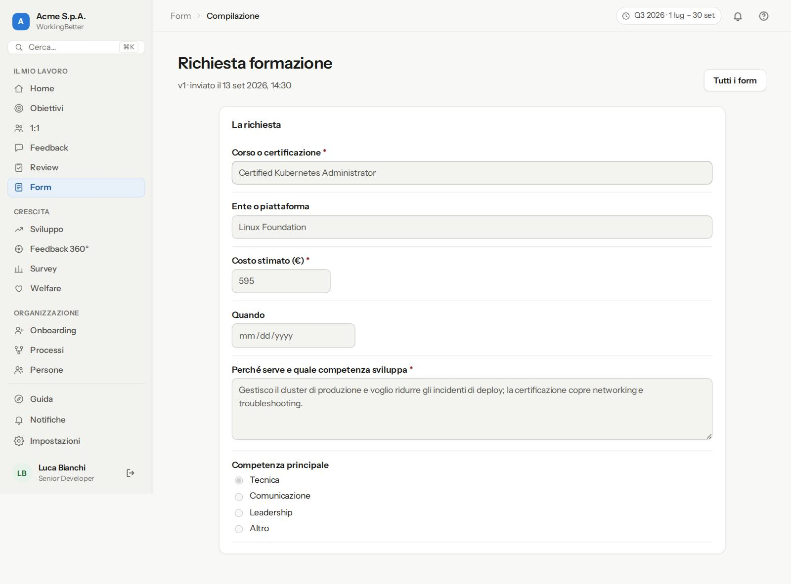
