# 3 · Manager

Un manager fa tutto ciò che fa un collaboratore (capitolo 2) e in più vede e gestisce i **riporti diretti**. Se nella Home mancano persone del tuo team o ne compaiono altre, chiedi a HR di correggere il campo manager nella loro scheda.

## 3.1 Home del manager {#home}

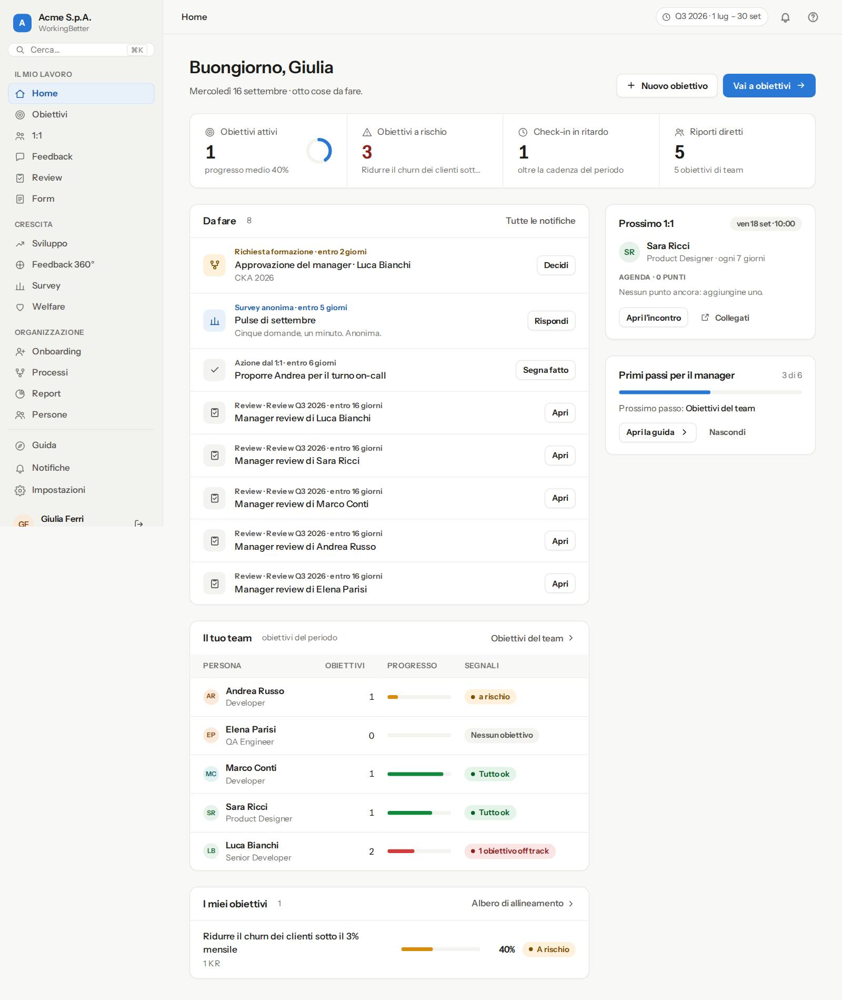

La tabella **Il tuo team** mostra, per ogni riporto, il numero di obiettivi, la barra del progresso e i **segnali**: «1 obiettivo off track», «a rischio», «N KR senza check-in», «Tutto ok», «Nessun obiettivo». È il posto da cui partire ogni settimana.

La **Guida** del manager ha sette passi: team, obiettivi, relazioni 1:1, primo incontro, primo feedback, review del ciclo, preparazione alla calibrazione.

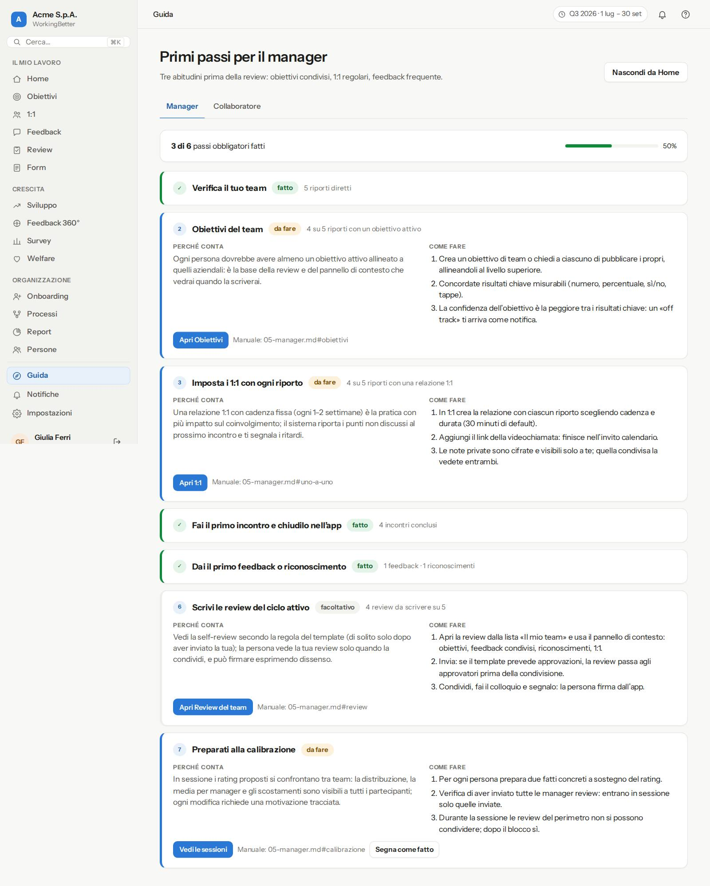

## 3.2 Obiettivi del team {#obiettivi}

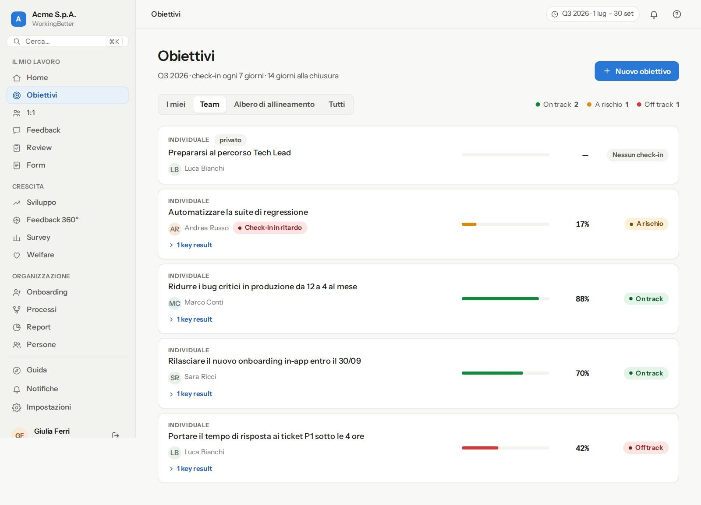

- La scheda **Team** elenca gli obiettivi dei riporti diretti con gli stessi stati della vista personale; l'**Albero di allineamento** mostra come si collegano a quelli aziendali.
- Puoi creare obiettivi di livello **Team** (indicando l'unità) o individuali per un riporto (scegliendo l'**Owner**); i riporti possono creare i propri e allinearli ai tuoi.
- Ricevi una notifica quando un obiettivo del team passa **Off track**; i check-in in ritardo li vedi in Home.

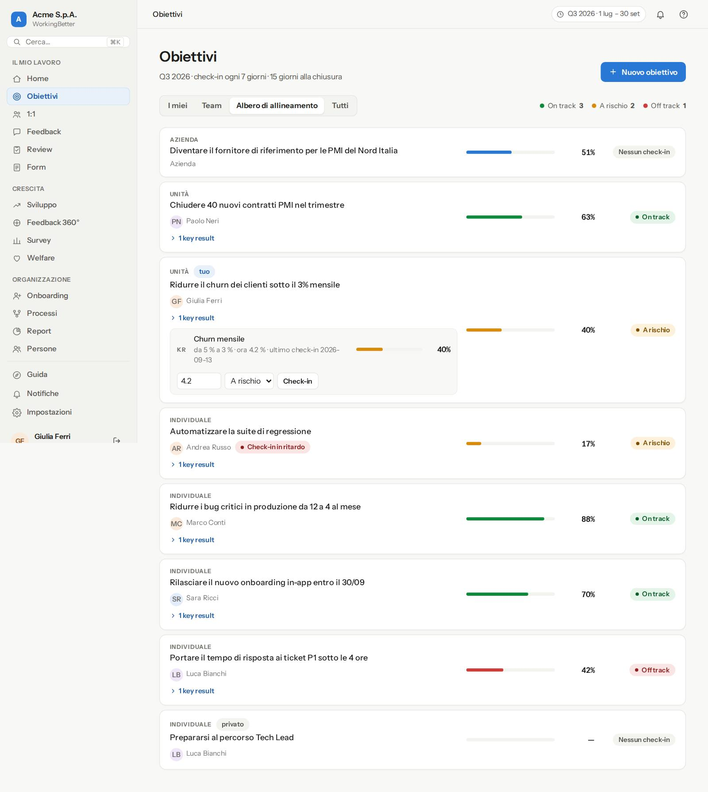

## 3.3 1:1 con il team {#uno-a-uno}

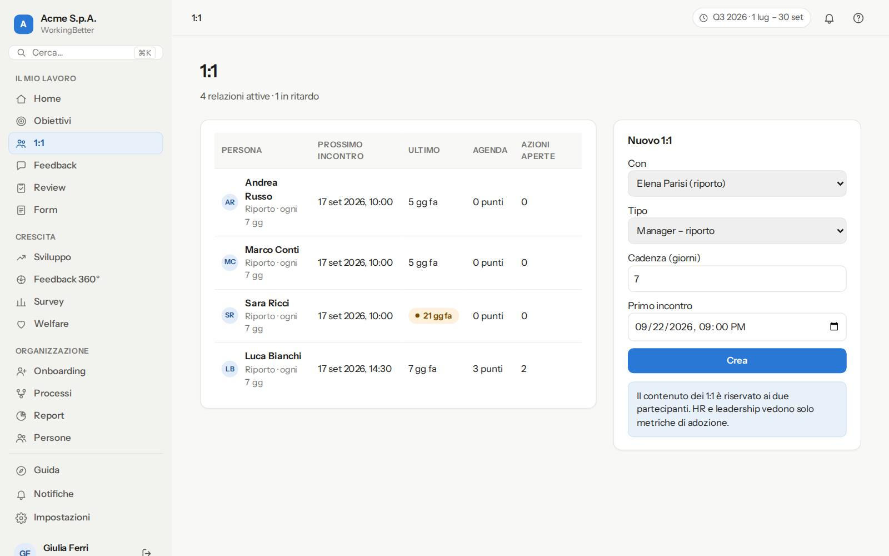

1. Per ogni riporto crea la relazione: **Con** la persona (i riporti sono contrassegnati), **Tipo** Manager – riporto, **Cadenza** (7 o 14 giorni), **Primo incontro**, poi **Crea**.
2. Nell'elenco tieni d'occhio la colonna **Ultimo**: un'etichetta come «21 gg fa» segnala un incontro in ritardo rispetto alla cadenza.
3. Prima dell'incontro apri la pagina e guarda i **Suggerimenti**: obiettivi a rischio, «Nessun check-in da N giorni», azioni scadute, feedback ricevuti di recente, azioni di sviluppo in scadenza. **Aggiungi** li porta in agenda.
4. Durante: spunta i punti, scrivi la **nota condivisa**, assegna **action item** con owner e scadenza. Le tue **note private** restano cifrate e visibili solo a te.
5. Alla fine premi **Chiudi incontro**: il successivo viene creato secondo la cadenza e i punti non discussi riportati.

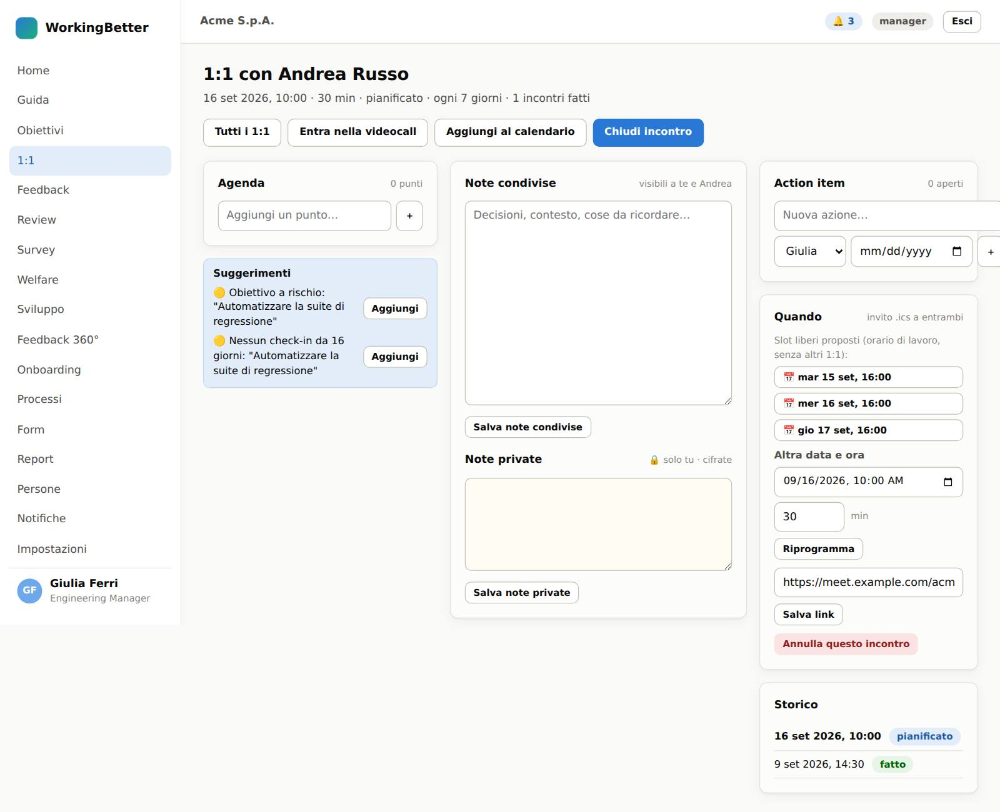

> **Buono a sapersi.** HR vede della tua attività 1:1 solo la copertura aggregata (chi ha avuto almeno un incontro negli ultimi 30 giorni), mai agenda o note.

## 3.4 Feedback sul team {#feedback}

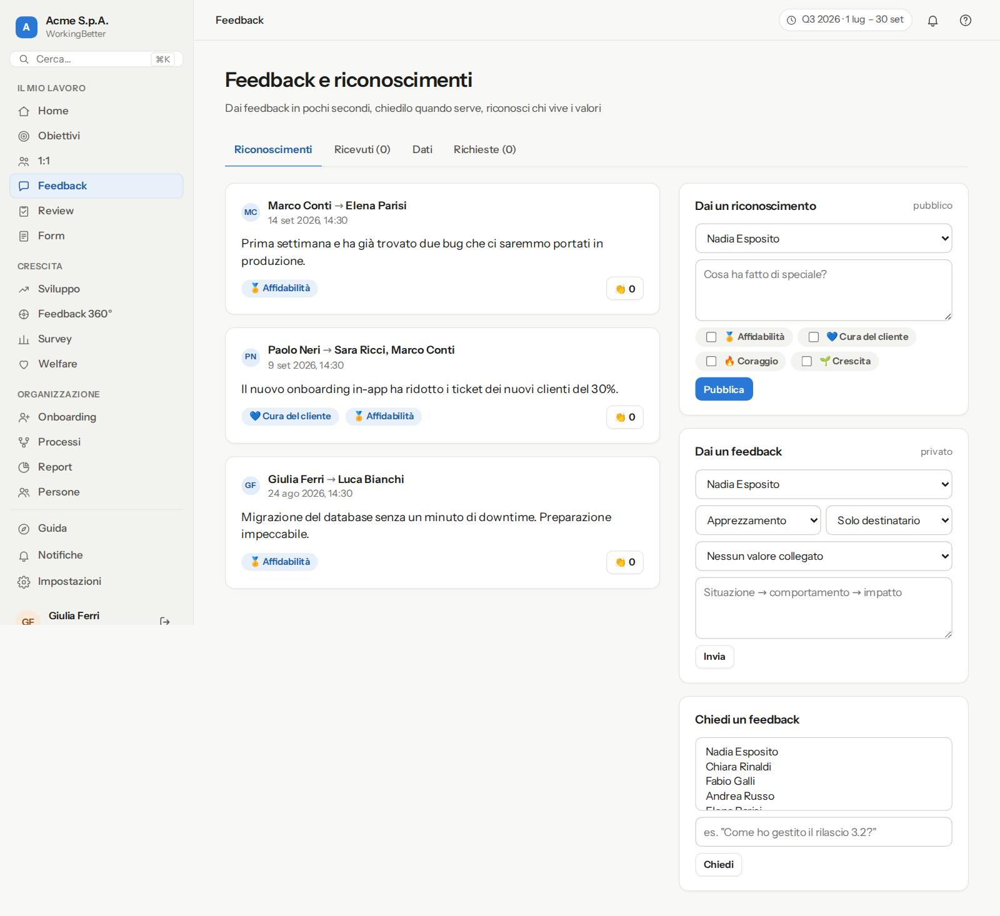

- **Dai un riconoscimento** pubblico e collegato ai valori: è il gesto con più effetto sul team.
- **Dai un feedback privato** a un riporto: lo vede la persona; scegli «Anche al suo manager» solo se il destinatario non è un tuo riporto e vuoi che il suo manager lo veda.
- **Chiedi un feedback** su un riporto a colleghi con cui lavora, prima della review: le risposte a una **tua** richiesta arrivano a te.
- I feedback che gli altri scrivono ai tuoi riporti li vedi **solo se la persona li condivide** o li mette in fascicolo.

## 3.5 Review del team {#review}

### L'elenco

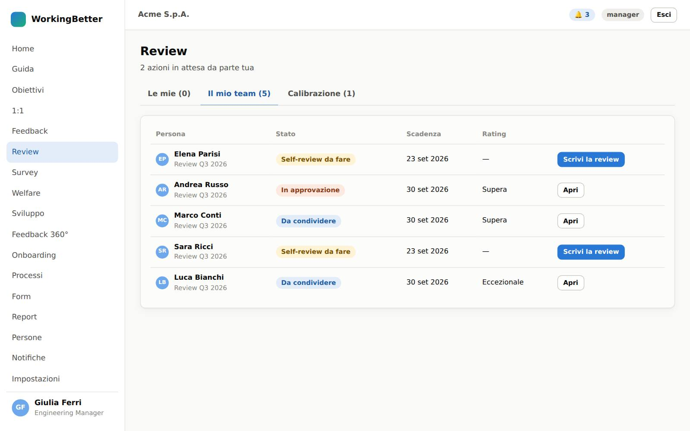

**Review → Il mio team** elenca le review dei riporti nel ciclo attivo. Il pulsante indica l'azione: **Scrivi la review**, **Condividi**, **Apri**. L'intestazione conta le azioni in attesa da parte tua. La scheda **Calibrazione** compare quando partecipi a una sessione; **Da approvare** quando sei approvatore.

### Scrivere la manager review

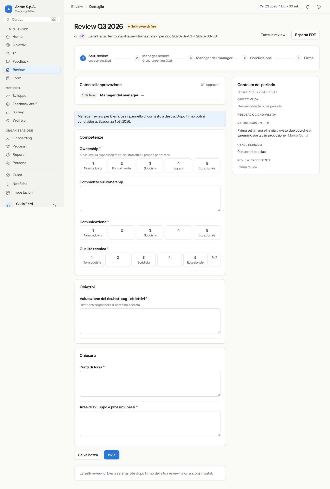

1. Apri la review dalla lista. A destra il pannello **Contesto**: obiettivi del periodo con progresso, feedback condivisi, riconoscimenti, 1:1 conclusi, review precedenti.
2. Compila il questionario (nell'esempio: competenze su scala 1–5 con etichette, valutazione degli obiettivi, punti di forza, aree di sviluppo). **Salva bozza** quando vuoi.
3. La **self-review** della persona compare secondo la regola del template: di norma **dopo che hai inviato la tua**; il riquadro in alto te lo ricorda.
4. **Invia**. Il rating viene derivato dal punteggio del questionario (o dal campo scelto da HR).
5. Se il template prevede una **catena di approvazione**, la review passa in **In approvazione**: il riquadro **Catena di approvazione** mostra i passi e lo stato. Se un approvatore **rimanda**, ricevi una notifica con il suo commento, la review torna in bozza con le tue risposte e puoi correggere e reinviare.

### Condividere, colloquio, firma

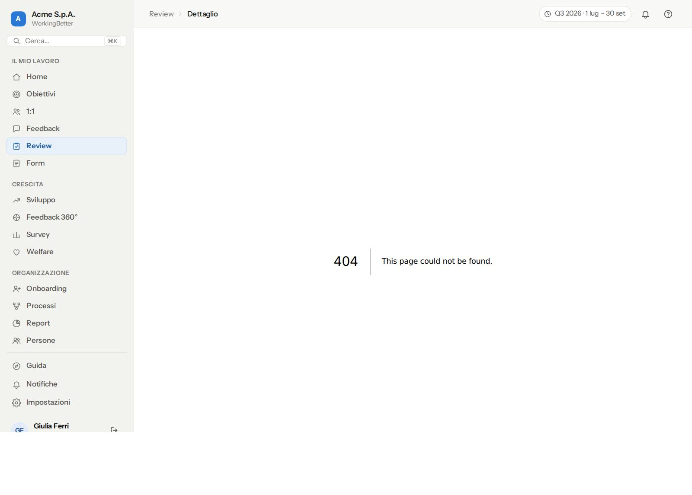

- Quando la review è **Da condividere**, compare **Condividi con <nome>**. Da quel momento la persona legge testo e rating.
- Se la review è in una **sessione di calibrazione aperta**, la condivisione è sospesa: il riquadro azzurro lo segnala; dopo il **blocco** della sessione il pulsante ricompare. Lo **Storico del rating** mostra ogni modifica (da chi, quando, perché): la persona non lo vede.
- Dopo il colloquio premi **Colloquio fatto**. La persona **firma**, eventualmente con dissenso: ricevi una notifica.
- **Esporta PDF** in ogni momento; **Processo** (per HR) apre l'istanza sul motore dei workflow.

## 3.6 Approvare le review dei team dei tuoi riporti {#approvazioni}

Se sei **manager del manager** in un template con catena di approvazione, quando un tuo riporto invia una review del suo team la trovi in **Review → Da approvare**.

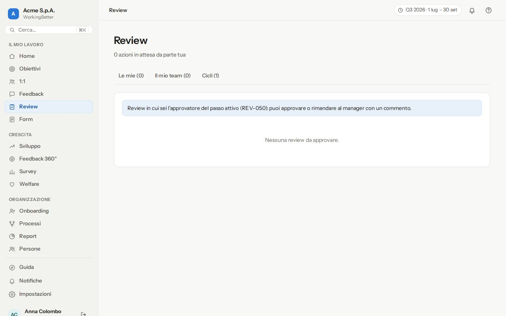

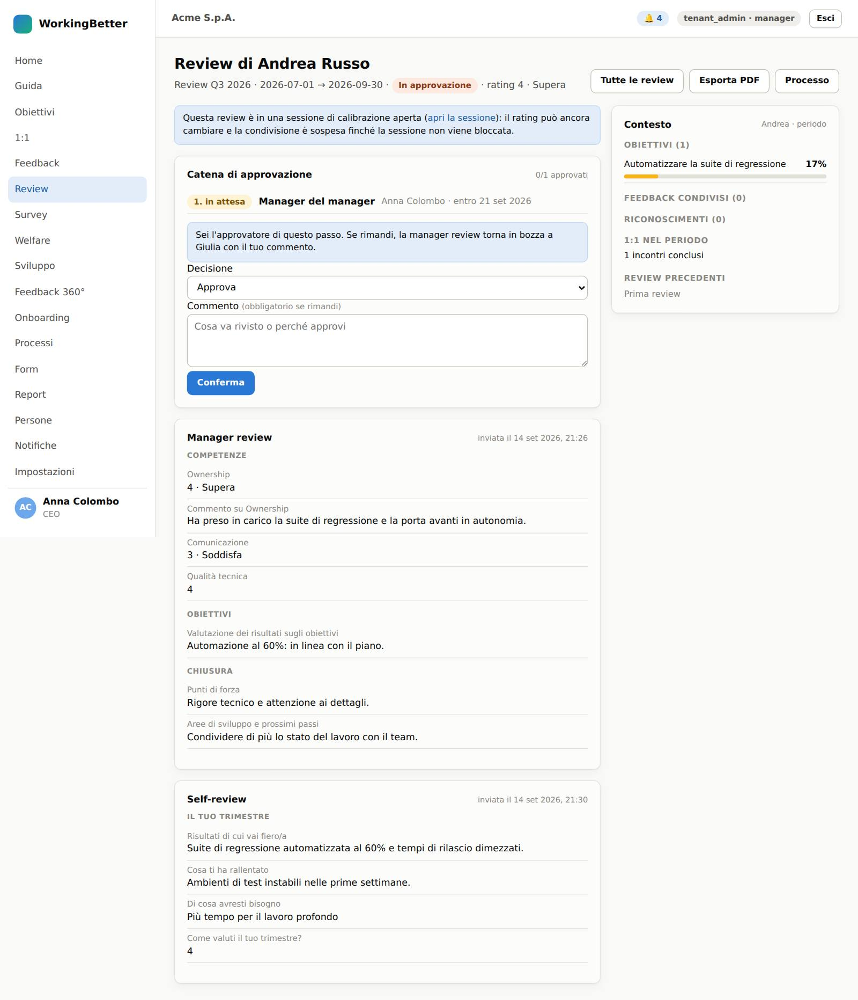

1. Apri la review: vedi la manager review, la self-review se inviata e il contesto.
2. Nel riquadro **Catena di approvazione** scegli **Decisione**: **Approva** oppure **Rimanda al manager**.
3. Scrivi il **Commento** (obbligatorio se rimandi: dice al manager cosa rivedere) e premi **Conferma**.
4. Approvando, la review passa al passo successivo o a **Da condividere**; rimandando, torna in bozza al manager con il tuo commento.

## 3.7 Calibrazione {#calibrazione}

Quando HR ti include come partecipante, la scheda **Review → Calibrazione** elenca le sessioni.

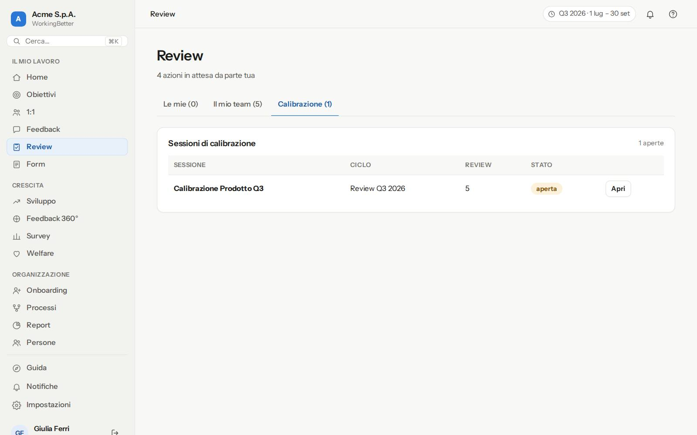

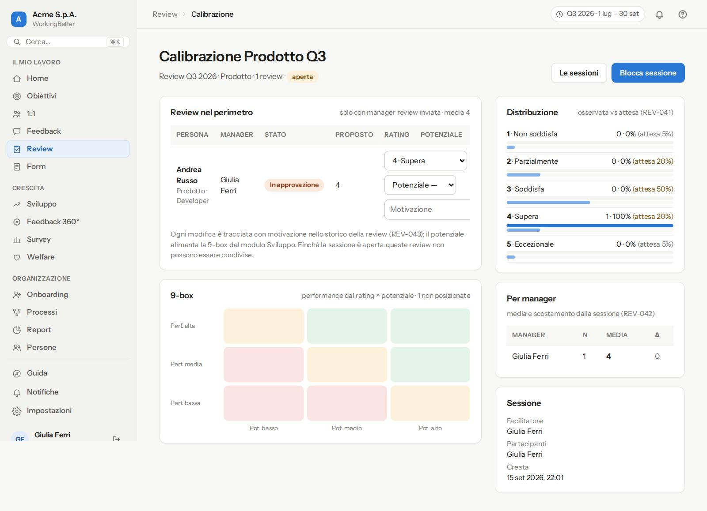

| Riquadro | Cosa fai |
|---|---|
| **Review nel perimetro** | Tutte le review del perimetro con manager review inviata: persona, manager, stato, rating **Proposto**, **Rating** attuale, **Potenziale** (1 basso · 2 medio · 3 alto), **Motivazione**. Cambia rating o potenziale e premi **Salva**: la modifica va nello storico della review con la tua motivazione. L'etichetta **calibrato** segnala un rating diverso dal proposto. |
| **Distribuzione** | Percentuale osservata per ogni valore della scala contro quella attesa dalla sessione. |
| **Per manager** | Media dei rating di ciascun manager, numero di review e scostamento **Δ** dalla media della sessione; **outlier** oltre 0,75 punti. |
| **9-box** | Performance (dal rating) × potenziale, con le persone posizionate. |
| **Sessione** | Facilitatore, partecipanti, note. |

> **Buono a sapersi.** Prepara due fatti concreti per ogni rating: la sessione confronta evidenze. Finché la sessione è aperta nessuna review del perimetro si condivide; il blocco lo fa HR o il facilitatore.

## 3.8 Sviluppo del team {#sviluppo}

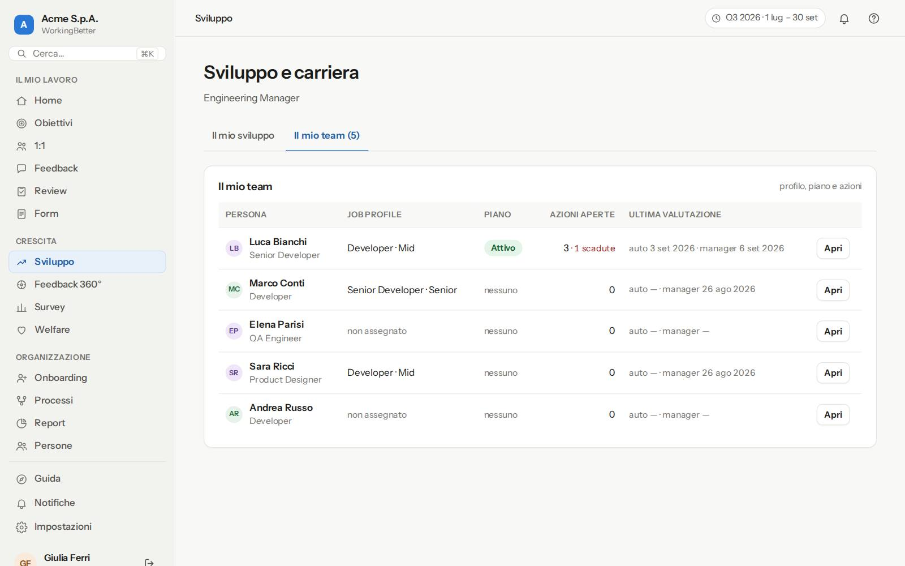

**Sviluppo → Il mio team** elenca i riporti con job profile, stato del piano, azioni aperte e data dell'ultima valutazione. **Apri** entra nella scheda della persona.

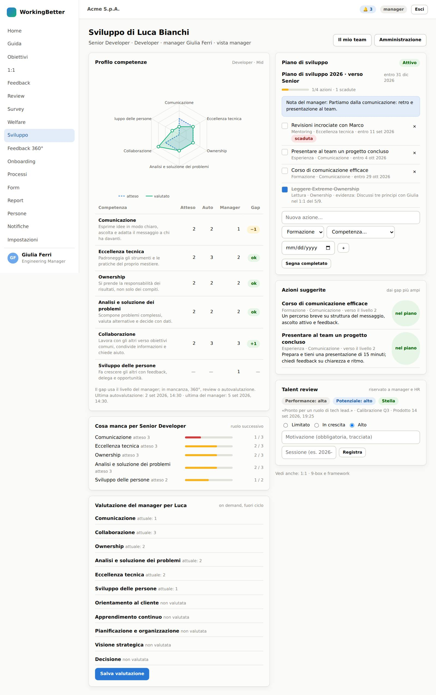

1. **Valutazione del manager**: per ogni competenza scegli il livello leggendo i descrittori e premi **Salva valutazione**. Il **Gap** rispetto al profilo si aggiorna.
2. **Piano di sviluppo**: aggiungi azioni (**＋** dalle azioni suggerite o nuove), approva il piano proposto dalla persona, aggiungi la tua nota, **Segna completato** le azioni chiuse.
3. **Talent review** (riservato a manager e HR): registra il **potenziale** (1–3) con una nota obbligatoria e **Registra**. La performance deriva dall'ultima review condivisa; insieme danno la casella della 9-box (nell'esempio «Stella»). **La persona non vede questa sezione.**

## 3.9 Feedback 360° del team {#360}

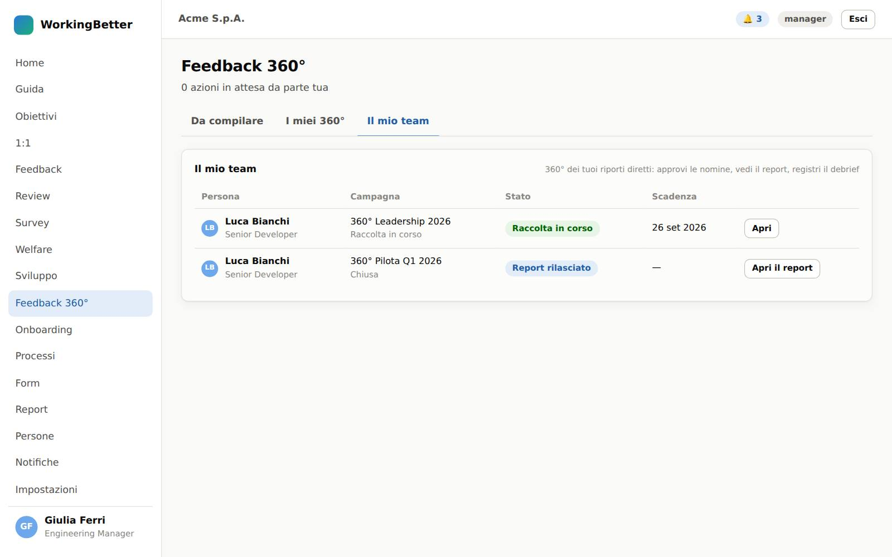

**Feedback 360° → Il mio team** elenca le campagne dei tuoi riporti. **Apri**: approvi le nomine dei valutatori proposte dalla persona (o le fai tu, se la campagna lo prevede), segui la raccolta, e a report pronto **registri il debrief**: nella regola predefinita il report viene rilasciato alla persona solo dopo il colloquio di restituzione. La nota di debrief non le arriva mai. Nelle categorie anonime vedi solo i conteggi, non chi ha risposto.

## 3.10 Onboarding di un nuovo ingresso {#onboarding}

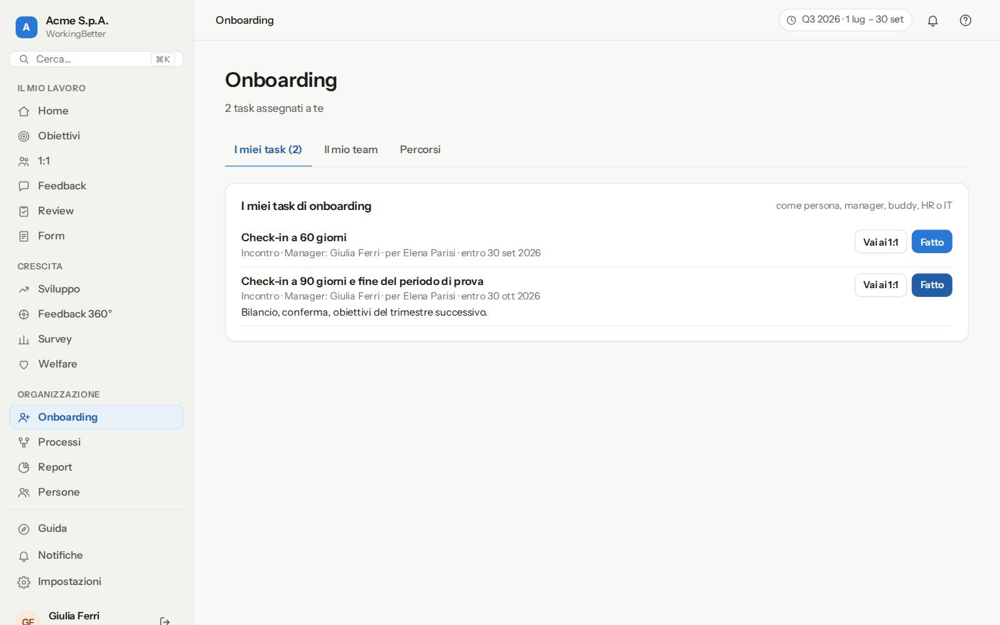

- **I miei task**: i compiti assegnati a te come manager (es. «Primo 1:1 con il manager» nella prima settimana) con scadenza: **Fatto** o **Vai ai 1:1**. Se non c'è un buddy, i suoi task arrivano a te.
- **Il mio team**: i percorsi dei riporti con giorno, avanzamento e punteggi delle survey (d7, d30); **Avvia un percorso** per un nuovo riporto (persona, percorso o «Automatico dalle regole», data di riferimento).

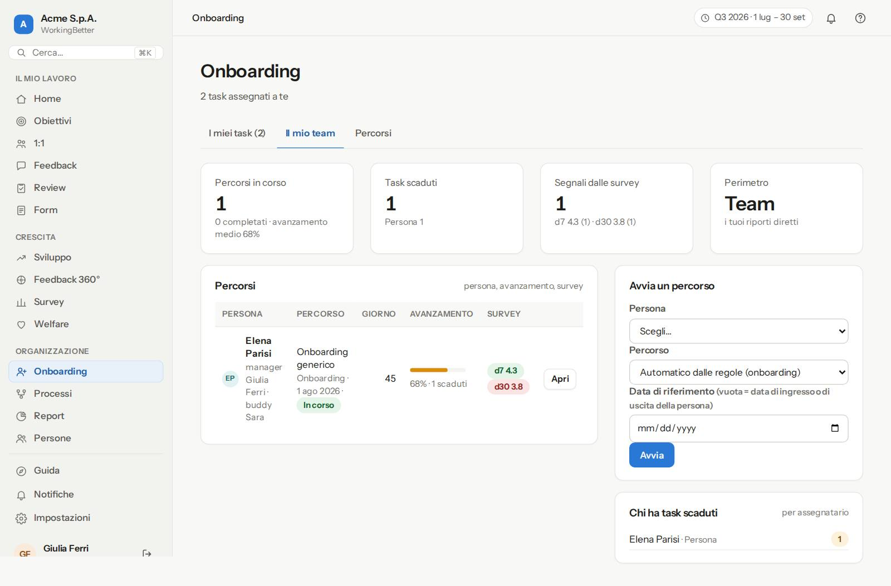

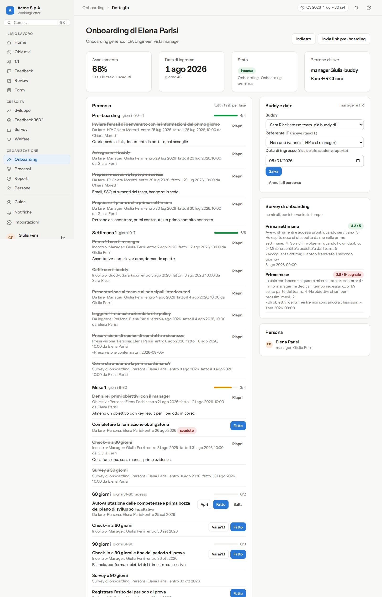

Nella pagina del percorso puoi impostare **Buddy** e **Referente IT**, correggere la **Data di ingresso** (ricalcola le scadenze aperte), segnare o saltare task, **Invia link pre-boarding** se la persona non ha ancora un account, e leggere le survey nominali: una media sotto 3 è evidenziata come segnale.

## 3.11 Processi da approvare {#processi}

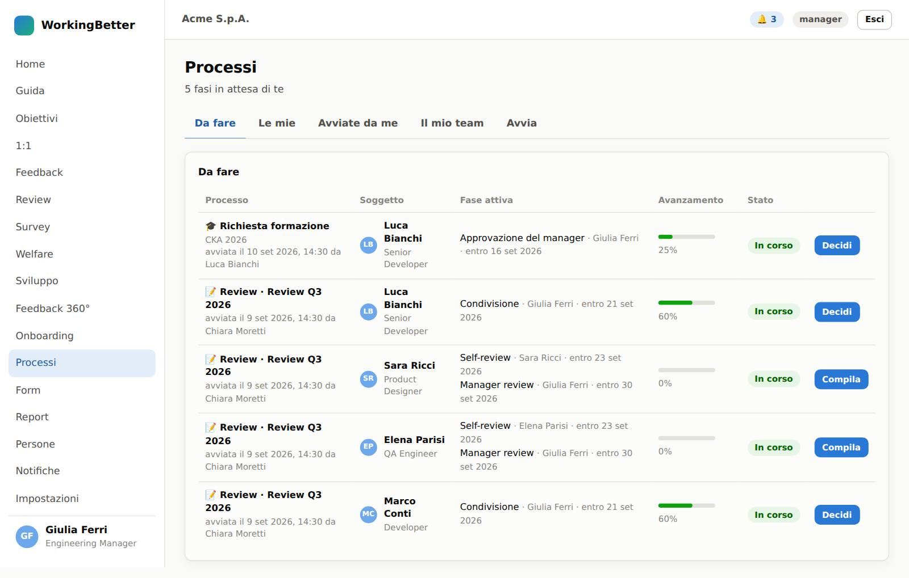

**Processi → Da fare** elenca le fasi assegnate a te: **Decidi** per un'approvazione, **Compila** per un form. La scheda **Il mio team** mostra i processi dei riporti.

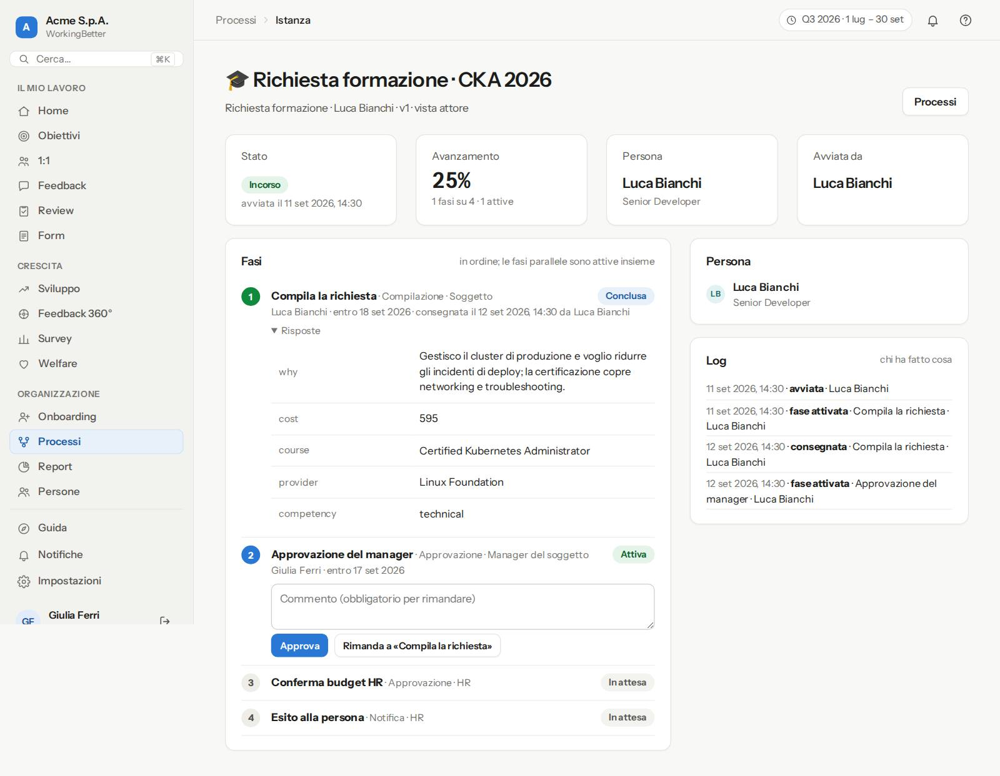

Nella pagina dell'istanza vedi le fasi in ordine (attive, concluse, in attesa), la persona, le risposte e il **Log**. Per approvare premi **Approva**; per rimandare a una fase precedente il pulsante **Rimanda a «…»** (commento obbligatorio se il processo lo prevede).

## 3.12 Report e survey del team {#report}

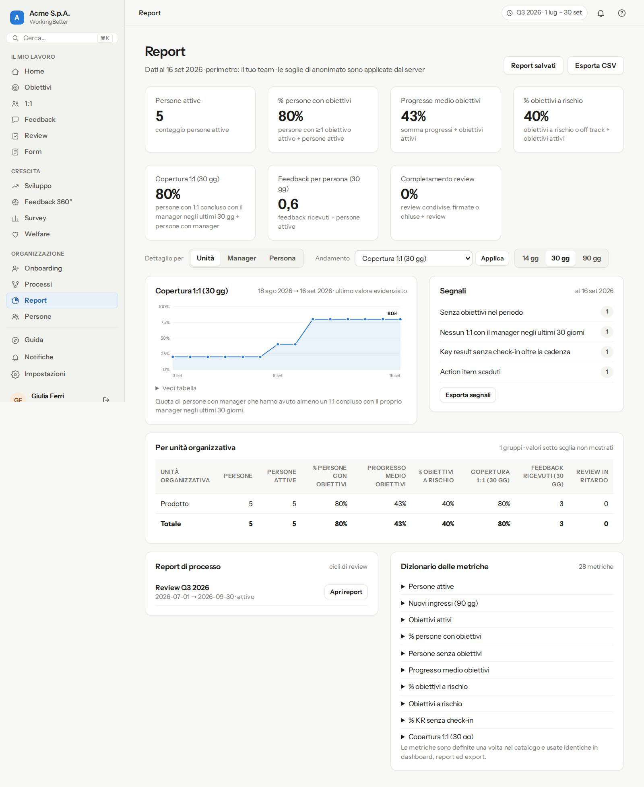

**Report** mostra i dati del tuo team: copertura 1:1 negli ultimi 30 giorni, **Segnali** (persone senza obiettivi, senza 1:1, review in ritardo), tabella per unità con le metriche principali, il **Dizionario delle metriche** e l'accesso ai **Report salvati** condivisi con te. I gruppi sotto le soglie di anonimato sono nascosti dal server. **Esporta CSV** scarica la tabella.

Delle **Survey** vedi solo l'aggregato dei tuoi riporti diretti, quando supera la soglia; mai le risposte individuali né i commenti.
