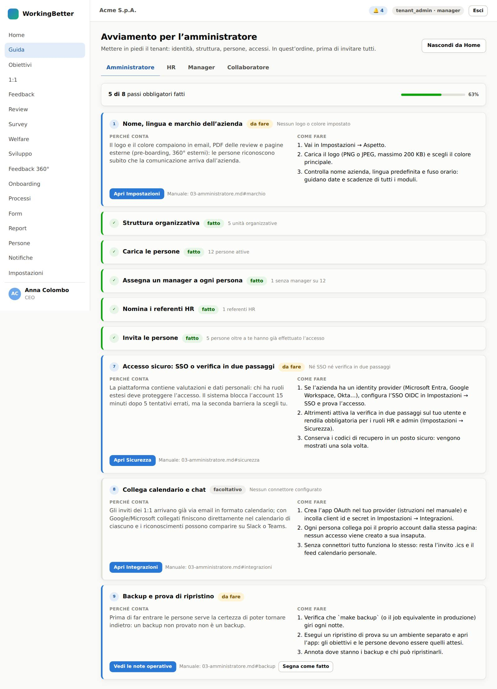
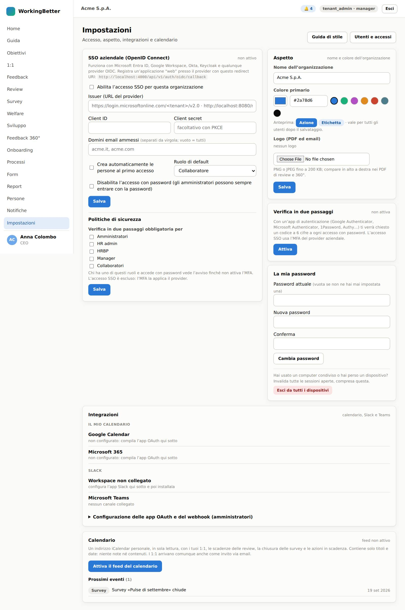
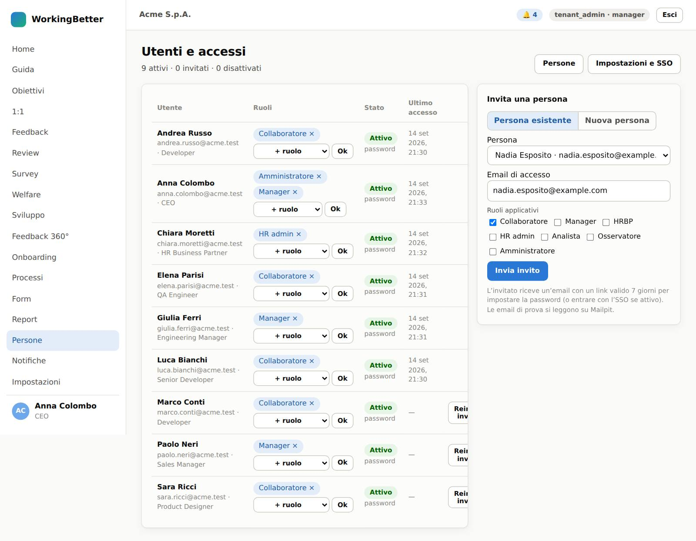

# 5 · Amministratore

L'amministratore del tenant (`tenant_admin`) configura identità, accessi e integrazioni. Fa anche tutto ciò che fa HR admin, ma la buona pratica è tenere i due ruoli su persone diverse.

## 5.1 La Guida dell'amministratore {#guida}

Nove passi nell'ordine giusto: marchio, struttura, persone, manager, referenti HR, inviti, accesso sicuro, integrazioni (facoltativo), backup. I controlli si spuntano da soli man mano che il tenant prende forma.

## 5.2 Impostazioni {#impostazioni}

| Riquadro | Cosa fai |
|---|---|
| **SSO aziendale (OpenID Connect)** | **Abilita l'accesso SSO**, **Issuer** (URL del provider), **Client ID**, **Client secret** (cifrato, mai rimostrato), **Domini email ammessi**, **Crea automaticamente le persone al primo accesso** con **Ruolo di default** (Collaboratore, Manager, Osservatore), **Disabilita l'accesso con password** (gli amministratori entrano comunque). **Salva** e prova l'accesso da una finestra anonima prima di disabilitare la password. |
| **Politiche di sicurezza** | Verifica in due passaggi obbligatoria per ruolo: **Amministratori**, **HR admin**, **HRBP**, **Manager**, **Collaboratori**. Chi ha quei ruoli dovrà attivarla al prossimo accesso. |
| **Aspetto** | **Nome dell'organizzazione**, **Colore primario** (con anteprima), logo PNG o JPEG fino a 200 KB. Vale per tutti dopo il salvataggio; compare in email, PDF e pagine esterne. **Guida di stile** apre la pagina con i componenti del design system. |
| **Verifica in due passaggi / La mia password** | Il tuo account, come per ogni utente. |
| **Integrazioni** | Credenziali delle app OAuth aziendali: Google (client id e secret), Microsoft 365 (più tenant id), Slack (bot token e canale dei riconoscimenti), Teams (webhook del canale). **Salva connettori**. Le persone collegano poi il proprio account dalle loro Impostazioni. Il manifest dell'app Slack è in `docs/integrazioni/`. |
| **Calendario** | Il tuo feed personale. |

## 5.3 Utenti, ruoli e accessi {#utenti}

Stessa pagina di HR ([4.1](04-hr.md#persone)) con in più il collegamento **Impostazioni e SSO**. Da qui: inviti con ruoli, revoca dei ruoli con **×**, **Reinvia invito**, **Disattiva** (chiude subito le sessioni). Tieni **Amministratore** su pochissime persone.

## 5.4 Cosa fare quando… {#quando}

| Situazione | Azione |
|---|---|
| Nuovo tenant | segui la Guida: aspetto → unità → import persone → manager → referenti HR → inviti → SSO o verifica in due passaggi → integrazioni → backup provato |
| Una persona lascia l'azienda | **Disattiva** l'utente (sessioni chiuse), HR imposta lo stato della persona e avvia l'offboarding |
| Sospetto accesso indebito | **Disattiva** l'utente, verifica l'audit dal database, ruota il feed calendario della persona, controlla le politiche MFA |
| Cambio del provider SSO | aggiorna issuer e credenziali, prova con un utente amministratore prima di disabilitare la password |
| Le email non arrivano | verifica con chi gestisce il deploy la configurazione SMTP del worker (`docs/13`) |

Le regole che il software applica da solo (isolamento dei dati, tracciabilità, riservatezza) sono nel [Manuale operativo, capitolo 7](../manuale/07-regole-hr.md).
