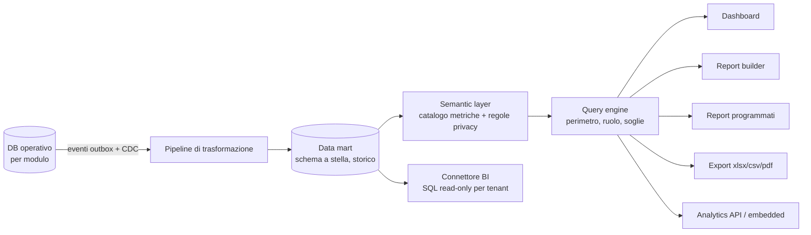

# Analytics & Reporting (`ANA`)

| | |
|---|---|
| **Priorità** | P0 (dashboard, export) / P1 (motore di reportistica) |
| **Stato** | In implementazione (sprint 4: fondamenta — catalogo metriche v1 con 24 metriche, fatti giornalieri a grana persona, query engine con perimetro e soglie, ANA-002/003 parziale via pagina Report, ANA-014 per i cicli di review, ANA-020 CSV, ANA-043 data dictionary, ANA-063 audit export, ANA-090; vedi ADR-0006) |
| **Dipendenze** | Tutti i moduli; ADR-0004 (architettura reportistica) |
| **Ultimo aggiornamento** | 2026-09-13 |

## 1. Scopo

La reportistica è un **sottosistema ingegnerizzato**, non una collezione di grafici per modulo. Ogni dato raccolto dalla piattaforma deve poter essere interrogato, combinato, segmentato, storicizzato, distribuito ed esportato, nel rispetto automatico di permessi, perimetri e soglie di anonimato. Serve a quattro pubblici: collaboratore (sé stesso), manager (team), HR (perimetro), leadership (azienda), più i sistemi esterni (BI).

## 2. Architettura logica (sintesi di ADR-0004)



Cinque strati:

1. **Data mart**: tabelle dei fatti (snapshot progresso obiettivi, rating review, eventi feedback, risposte survey anonimizzate, incontri 1:1, task onboarding, movimenti welfare, valutazioni competenze) e dimensioni storicizzate (persona, unità, job, manager, data, ciclo) con validità temporale, così che ogni report possa essere calcolato "alla data".
2. **Semantic layer**: catalogo di **metriche** (nome, definizione, formula, grana, dimensioni ammesse, ruoli ammessi, soglia di anonimato) e **dimensioni**. Le metriche sono definite una volta e riusate ovunque: dashboard, report builder, API. Nessun grafico calcola una metrica "a modo suo".
3. **Query engine**: riceve richieste (metriche × dimensioni × filtri × periodo), applica perimetro e ruolo del richiedente, applica le soglie di anonimato e la protezione per differenza, usa pre-aggregazioni quando disponibili.
4. **Presentazione**: dashboard di ruolo, report builder, report salvati e programmati, export, grafici embedded.
5. **Accesso esterno**: connettore BI in sola lettura sul data mart del tenant, Analytics API per integrazioni e mobile.

## 3. Attori e permessi

| Azione | Collaboratore | Manager | HR Admin / HRBP | Leadership | Analista (ruolo dedicato) |
|---|---|---|---|---|---|
| Dashboard di ruolo | ✅ (sé) | ✅ (team) | ✅ (perimetro) | ✅ (aggregato) | ✅ |
| Report standard | ❌ | ✅ (team) | ✅ | ✅ | ✅ |
| Report builder | ❌ | ✅ (limitato al team, se abilitato) | ✅ | ✅ (se abilitato) | ✅ |
| Salvare e condividere report | ❌ | ✅ | ✅ | ✅ | ✅ |
| Programmare invii | ❌ | ✅ | ✅ | ✅ | ✅ |
| Gestire il catalogo metriche (custom) | ❌ | ❌ | ✅ (Tenant Admin) | ❌ | ✅ |
| Connettore BI / Analytics API | ❌ | ❌ | ✅ (Tenant Admin) | ❌ | ✅ |

Il perimetro è sempre applicato dal query engine, mai dal client. Il ruolo **Analista** è un ruolo di sola lettura con accesso ampio ai dati aggregati, pensato per People Analytics o controllo di gestione.

## 4. Requisiti funzionali

### 4.1 Dashboard di ruolo

| ID | Requisito | Priorità |
|----|-----------|----------|
| ANA-001 | Dashboard collaboratore: miei obiettivi, prossimo 1:1, azioni, feedback recenti, cose da fare (review, survey), saldo welfare | P0 |
| ANA-002 | Dashboard manager: stato team (obiettivi a rischio, 1:1 in ritardo, review da fare, riconoscimenti dati), persone del team con "segnali" | P0 |
| ANA-003 | Dashboard HR: completamento processi in corso, adozione per modulo, alert (persone senza obiettivi, senza 1:1, review scadute) | P0 |
| ANA-004 | Dashboard leadership: progresso obiettivi aziendali, engagement/eNPS, distribuzione performance, headcount, take-up welfare | P1 |
| ANA-005 | Dashboard personalizzabili: widget da catalogo (metrica + visualizzazione), layout, dashboard multiple per ruolo, dashboard condivise dall'HR | P1 |

### 4.2 Report standard

| ID | Requisito | Priorità |
|----|-----------|----------|
| ANA-010 | Libreria di report standard per modulo (elenco nella sezione 8 di ogni specifica) con filtri, segmentazione, grafico + tabella | P0/P1 |
| ANA-011 | Confronti tra periodi/cicli e trend | P1 |
| ANA-012 | Report "Persona": storia completa (obiettivi, rating, feedback, 360°, IDP, welfare aggregato) per HR/manager | P1 |
| ANA-013 | Report "Manager effectiveness": adozione 1:1, feedback dati, tempi review, engagement del team | P1 |
| ANA-014 | Report "Processo": per ogni ciclo/campagna, completamento per fase, ritardatari, tempi | P0 |

### 4.3 Semantic layer e catalogo metriche

| ID | Requisito | Priorità |
|----|-----------|----------|
| ANA-040 | Catalogo metriche predefinite (≥ 60 al lancio) con definizione leggibile, formula, grana, dimensioni ammesse, ruoli ammessi, soglia di anonimato, modulo sorgente | P1 |
| ANA-041 | Dimensioni standard: data (giorno/settimana/mese/trimestre/anno fiscale), persona, manager, unità (a qualsiasi livello dell'albero), sede, job, job family, livello, anzianità (fasce), tipo contratto, ciclo, attributi custom abilitati | P1 |
| ANA-042 | Metriche calcolate custom (Tenant Admin/Analista): combinazione di metriche esistenti con operatori aritmetici, filtri fissi e rinominazione; validazione e anteprima | P2 |
| ANA-043 | Data dictionary consultabile in-app: per ogni metrica cosa misura, come si calcola, quando si aggiorna | P1 |
| ANA-044 | Storicizzazione: ogni metrica interrogabile "alla data X" con le appartenenze organizzative valide allora | P1 |

### 4.4 Report builder

| ID | Requisito | Priorità |
|----|-----------|----------|
| ANA-050 | Costruzione guidata: scegli metriche → dimensioni (righe/colonne) → filtri → periodo → visualizzazione (tabella, pivot, barre, linee, torta, heatmap, radar, funnel, scatter, KPI) | P1 |
| ANA-051 | Filtri dinamici sul report salvato (l'utente che apre il report può cambiare periodo/unità nei limiti del suo perimetro) | P1 |
| ANA-052 | Salvataggio, cartelle, condivisione con ruoli/persone (il destinatario vede solo i dati del proprio perimetro), duplicazione | P1 |
| ANA-053 | Drill-down da aggregato a dettaglio (fino al livello consentito dai permessi e dalle soglie) | P1 |
| ANA-054 | Confronto tra periodi e "variazione vs periodo precedente" come opzione di visualizzazione | P1 |
| ANA-055 | Report multi-modulo (es. rating review × eNPS del team × take-up welfare) grazie alle dimensioni comuni | P1 |
| ANA-056 | Annotazioni sui grafici (es. "riorganizzazione", "lancio nuovo piano welfare") visibili nel trend | P2 |

### 4.5 Distribuzione ed export

| ID | Requisito | Priorità |
|----|-----------|----------|
| ANA-020 | Export Excel/CSV da ogni tabella, nel rispetto di permessi e soglie; per Excel formattazione e più fogli (dati + definizioni metriche) | P0 |
| ANA-021 | Export PDF di dashboard e report con branding del tenant | P1 |
| ANA-060 | Report programmati: cadenza (giornaliera/settimanale/mensile/a chiusura processo), destinatari (persone, ruoli), formato (PDF, Excel, link), ognuno riceve i dati del proprio perimetro | P1 |
| ANA-061 | Report per evento: a chiusura di un ciclo/campagna, pacchetto di report inviato automaticamente a HR e manager | P1 |
| ANA-062 | Export PowerPoint di dashboard selezionate (per presentazioni a leadership) | P2 |
| ANA-063 | Registro degli export e degli invii in audit (chi, cosa, quando, filtri) | P0 |

### 4.6 Piattaforma dati e accesso esterno

| ID | Requisito | Priorità |
|----|-----------|----------|
| ANA-070 | Data mart per tenant aggiornato con latenza ≤ 15 minuti per fatti operativi (completamento, check-in) e ≤ 1 ora per aggregati pesanti; indicatore di freschezza in ogni report | P1 |
| ANA-071 | Connettore BI: accesso SQL in sola lettura al data mart del proprio tenant (credenziali dedicate, viste documentate, soglie applicate nelle viste) per Power BI, Tableau, Looker, Metabase | P1 |
| ANA-072 | Analytics API: endpoint che espone il semantic layer (metriche × dimensioni × filtri) con gli stessi permessi dell'interfaccia; usata anche dalla mobile app | P1 |
| ANA-073 | Estrazioni programmate verso storage del cliente (S3/SFTP) in formato Parquet/CSV | P2 |
| ANA-074 | Grafici embedded firmati per intranet/portali aziendali | P2 |
| ANA-075 | Pre-aggregazioni automatiche per le combinazioni metrica × dimensione più richieste; obiettivo p95 < 2 s per i report standard | P1 |

### 4.7 Segnali, alert e benchmark

| ID | Requisito | Priorità |
|----|-----------|----------|
| ANA-030 | Regole di alert configurabili su metriche del catalogo (soglia, variazione, assenza di dati) con destinatari e canali | P1 |
| ANA-031 | Indicatore di rischio persona (composito, spiegabile, opzionale, con DPIA) visibile a manager/HR | P2 |
| ANA-080 | Benchmark interno: ogni metrica confrontabile con la media azienda e con l'unità padre | P1 |
| ANA-081 | Benchmark esterno anonimo tra tenant aderenti (opt-in, solo metriche aggregate, soglia minima di tenant) | P2 |

### 4.8 Governance dei dati

| ID | Requisito | Priorità |
|----|-----------|----------|
| ANA-090 | Le soglie di anonimato e la protezione per differenza sono proprietà della metrica nel semantic layer e non possono essere disattivate per singolo report | P1 |
| ANA-091 | Le metriche su dati sensibili (survey, 360°, welfare per categoria) non espongono mai il livello persona, neanche via BI/API | P1 |
| ANA-092 | Test automatici di regressione sulle metriche (definizione → risultato atteso su dataset di prova) a ogni rilascio | P1 |
| ANA-093 | Versionamento delle definizioni di metrica con changelog visibile nel data dictionary | P2 |

## 5. Flussi principali

```mermaid
sequenceDiagram
    participant U as Utente (HRBP)
    participant RB as Report builder
    participant SL as Semantic layer
    participant Q as Query engine
    participant DM as Data mart
    U->>RB: metriche: eNPS, completamento review; dimensioni: unità × trimestre
    RB->>SL: risolvi definizioni e regole
    SL->>Q: piano di query + perimetro HRBP + soglie
    Q->>DM: query (pre-aggregati se disponibili)
    DM-->>Q: righe
    Q->>Q: sopprimi segmenti sotto soglia
    Q-->>RB: dataset + metadati (freschezza, soglie applicate)
    RB-->>U: heatmap + tabella + export
```

## 6. Regole di business

- Nessun report può aggirare le soglie di anonimato dei moduli sorgente; il semantic layer è l'unico punto in cui vengono definite.
- I dati storici usano le appartenenze organizzative valide alla data (dimensioni a validità temporale).
- Le metriche standard non sono modificabili dal tenant; le custom sono derivate e tracciate.
- Ogni report mostra freschezza dei dati, filtri applicati e note sulle soppressioni.
- Gli export e gli invii programmati sono tracciati in audit.

## 7. Notifiche

| Evento | Destinatari | Canali |
|---|---|---|
| Report programmato | Destinatari configurati | Email (allegato o link) |
| Alert su metrica | Destinatari della regola | In-app, email, Slack/Teams |
| Pacchetto di chiusura processo | HR, manager | Email, in-app |
| Export pronto (grandi volumi) | Richiedente | In-app, email |

## 8. Metriche iniziali del catalogo (estratto)

| Area | Metriche |
|---|---|
| Persone | headcount, ingressi, uscite, turnover %, anzianità media, span of control |
| Obiettivi | % persone con obiettivi, % allineati, progresso medio, % on/at risk/off track, obiettivi stale, tasso di raggiungimento |
| Review | completamento per fase, distribuzione rating, rating medio, gap self–manager, tempo medio compilazione, % dissenso |
| 360° | tasso di risposta per categoria, punteggio per competenza, gap self–altri |
| 1:1 | % riporti con 1:1 negli ultimi 30 gg, frequenza reale vs pianificata, action item aperti/chiusi |
| Feedback | feedback dati/ricevuti, % persone attive nel mese, riconoscimenti per valore, persone mai riconosciute |
| Engagement | eNPS, punteggio per driver, tasso di risposta, trend |
| Sviluppo | % con IDP attivo, gap medio per competenza, distribuzione 9-box |
| Onboarding | tempo completamento, task in ritardo, punteggi 30/60/90 |
| Welfare | take-up %, budget utilizzato %, spesa per categoria, tempo approvazione, % conversione premio |

## 9. Assunzioni / Domande aperte

- **Sprint 4 (v1 implementata)**: il catalogo è un modulo TypeScript versionato (`packages/shared/src/analytics`), i fatti sono snapshot giornalieri a grana persona nella tabella `mart_person_facts` (worker `mart-refresh` + aggiornamento manuale dall'interfaccia), il query engine è nell'API (`/analytics/*`). Perimetri v1: HR/analista/osservatore = tutto il tenant; manager = riporti diretti; il collaboratore usa la propria dashboard, non la pagina Report. Soglia minima di gruppo: 5 persone per le metriche sensibili (rating, dissenso), 3 per le altre metriche aggregate; sotto soglia il valore non viene restituito e, per le metriche sensibili, se un solo gruppo è soppresso viene soppresso anche il secondo più piccolo (protezione per differenza). Dettagli e alternative in ADR-0006.
- Le metriche "30 giorni" (1:1, feedback, riconoscimenti) sono finestre mobili calcolate alla data dello snapshot; il progresso degli obiettivi è quello corrente al momento dello snapshot (non ricostruibile per i giorni precedenti al primo snapshot).
- Scelta tecnologica del data mart e del semantic layer: vedi ADR-0004 (Postgres + semantic layer proprio all'inizio; motore colonnare quando i volumi lo richiedono).
- Il ruolo Analista è un ruolo nuovo rispetto a `docs/02`: da aggiungere alla matrice CORE se confermato.
- Benchmark esterno (ANA-081): richiede massa critica e base giuridica; P2.

## 10. Modifiche rispetto a PeopleGoal

- La reportistica è un **sottosistema ingegnerizzato** con semantic layer, data mart storicizzato, report builder, distribuzione programmata e connettore BI: risponde direttamente al punto debole "reportistica avanzata limitata" emerso dalle recensioni.
- **Privacy nel semantic layer**: le soglie sono proprietà della metrica, applicate ovunque (UI, API, BI).
- **Report multi-modulo** su dimensioni comuni, inclusa la correlazione con il welfare.
