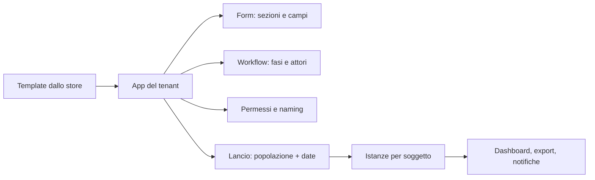

# App Studio — form & workflow no-code (`APP`)

| | |
|---|---|
| **Priorità** | P1 (il form engine è P0 perché usato da REV) |
| **Stato** | Proposto |
| **Dipendenze** | CORE, INT |
| **Ultimo aggiornamento** | 2026-09-12 |

## 1. Scopo

Dare all'HR uno strumento per costruire e adattare processi (form, fasi, assegnatari, approvazioni, notifiche) senza sviluppatori. È il motore comune sotto Performance Review, Survey, 360°, Onboarding e consente processi HR custom (richiesta formazione, proposta di promozione, valutazione di fine progetto, ecc.).

## 2. Concetti chiave

- **Form engine**: definizione di form con sezioni, campi tipizzati, validazioni, logica condizionale, calcoli. Le risposte sono salvate in modo strutturato e interrogabile.
- **Workflow engine**: definizione di processo come sequenza (e in seguito grafo) di **fasi**, ciascuna con attore (ruolo relativo: soggetto, manager del soggetto, HRBP, persona specifica, gruppo), form o azione, scadenza, condizioni di passaggio, notifiche.
- **App**: pacchetto = form + workflow + permessi + naming + viste. Le app di sistema (Review, Survey, 360°, Onboarding) sono app "native" con logica aggiuntiva; le app custom usano solo il motore generico.
- **Template / App Store**: libreria di app pronte (nostre) e di app salvate dal tenant.
- **Istanza**: esecuzione di un'app per un soggetto (es. una review di Maria nel ciclo 2026).

## 3. Attori e permessi

| Azione | Tenant Admin | HR Admin | Manager | Collaboratore |
|---|---|---|---|---|
| Creare/modificare app e template | ✅ | ✅ | ❌ | ❌ |
| Installare app dallo store | ✅ | ✅ | ❌ | ❌ |
| Lanciare istanze | – | ✅ | ✅ (se l'app lo consente) | ✅ (se l'app lo consente, es. "richiesta formazione") |
| Definire permessi dell'app | ✅ | ✅ | ❌ | ❌ |

## 4. Requisiti funzionali

### 4.1 Form engine

| ID | Requisito | Priorità |
|----|-----------|----------|
| APP-001 | Tipi di campo: testo breve/lungo, numero, data, scelta singola/multipla, scala (Likert, stelle, numerica con etichette), sì/no, persona (selettore), competenza (con livelli), obiettivo (selettore OKR), allegato, firma, sezione descrittiva | P0 |
| APP-002 | Obbligatorietà, help text, placeholder, valori di default, limiti (min/max, lunghezza) | P0 |
| APP-003 | Logica condizionale: mostra/nascondi campo o sezione in base a risposte o attributi del soggetto | P1 |
| APP-004 | Campi calcolati (media pesata, somma, punteggio finale con mapping su scala) | P1 |
| APP-005 | Scale riutilizzabili a livello tenant | P0 |
| APP-006 | Multilingua: etichette per lingua con fallback | P1 |
| APP-007 | Versionamento: le istanze restano legate alla versione usata | P0 |
| APP-008 | Anteprima nei panni di un attore | P1 |
| APP-009 | Salvataggio automatico delle risposte in bozza | P0 |

### 4.2 Workflow engine

| ID | Requisito | Priorità |
|----|-----------|----------|
| APP-020 | Fasi sequenziali con attore relativo, form (intero o sezioni), scadenza relativa/assoluta, visibilità delle risposte delle fasi precedenti | P0 (usato da REV) |
| APP-021 | Fasi parallele (es. self e manager) con regola di sblocco | P1 |
| APP-022 | Fasi di approvazione (approva / rimanda a fase X con commento) | P1 |
| APP-023 | Condizioni di instradamento (se rating < 2 → fase HRBP) | P2 |
| APP-024 | Azioni automatiche: invia notifica, crea action item, aggiorna attributo persona, chiama webhook | P2 |
| APP-025 | Riassegnazione, delega, proroga per singola istanza da parte dell'HR | P0 |
| APP-026 | Log completo per istanza (chi ha fatto cosa e quando) | P0 |
| APP-027 | Editor visuale del workflow (timeline/diagramma) | P1 |

### 4.3 App e store

| ID | Requisito | Priorità |
|----|-----------|----------|
| APP-030 | Libreria di template pronti: review annuale, mid-year, probation, 360°, pulse, engagement, onboarding, richiesta formazione, proposta promozione, valutazione fine progetto, exit interview | P1 |
| APP-031 | "Salva come template" e duplicazione | P1 |
| APP-032 | Naming per app (titolo, verbi, etichette) | P1 |
| APP-033 | Permessi per app: chi può lanciare, chi vede le istanze, chi vede i report | P1 |
| APP-034 | Viste dell'app: elenco istanze con filtri, dashboard di completamento, export | P1 |
| APP-035 | Import/export di app in formato JSON per condivisione tra tenant | P2 |
| APP-036 | App custom con entità proprie (nuovi tipi di record) | P2 — da valutare |

## 5. Flussi principali

## 6. Regole di business

- Un'app pubblicata non è modificabile "a caldo": le modifiche creano una nuova versione; le istanze in corso restano sulla versione originale (con possibilità di migrazione esplicita dell'HR).
- Gli attori relativi si risolvono al momento della creazione dell'istanza; i cambi organizzativi successivi seguono la policy dell'app (riassegna / mantieni).
- I campi calcolati non sono modificabili manualmente salvo override abilitato con motivazione.

## 7. Notifiche

Definite per app: per ogni fase, template di notifica (avvio, promemoria, scadenza) con variabili (nome soggetto, scadenza, link).

## 8. Analytics del modulo

- Completamento per fase e per attore; tempi medi; istanze bloccate.
- Le risposte strutturate sono disponibili per l'export e per il modulo ANA.

## 9. Assunzioni / Domande aperte

- Quanto spingere sulle app "completamente custom" (APP-036)? Rischio di costruire un low-code generico. Ipotesi: fermarsi a form + workflow su entità esistenti (persona) fino a evidenza di bisogno.

## 10. Modifiche rispetto a PeopleGoal

- **Motore unico** per tutte le app native e custom, con versionamento esplicito.
- **Percorso rapido** con template pronti e default sensati per ridurre la complessità percepita del no-code.
- **Import/export JSON** delle app (APP-035).
