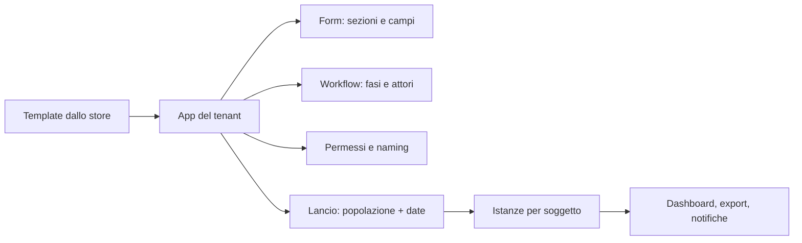

# App Studio — form & workflow no-code (`APP`)

| | |
|---|---|
| **Priorità** | P1 (il form engine è P0 perché usato da REV) |
| **Stato** | In implementazione (sprint 2–4b form engine: APP-001/003/004/005 parziale/007/009, APP-002 costruttore guidato; **sprint 15 workflow engine L2** (ADR-0011): APP-020 fasi sequenziali con attore relativo, form, scadenza relativa e visibilità delle precedenti, 021 fasi parallele per gruppo, 022 approvazione con rimando e commento, 023 instradamento su risposta o esito, 025 riassegnazione e proroga, 026 log per istanza, 027 editor a lista con anteprima (non grafico), 030 cinque template pronti, 031 duplica, 032 naming, 033 permessi di lancio e visibilità, 034 elenco istanze con filtri, dashboard e CSV, 035 import/export JSON; mancano APP-006 multilingua, 008 anteprima nei panni di un attore, 024 azioni automatiche, 036–040) |
| **Dipendenze** | CORE, INT |
| **Ultimo aggiornamento** | 2026-09-14 |

## 1. Scopo

Dare all'HR uno strumento per costruire e adattare processi (form, fasi, assegnatari, approvazioni, notifiche) senza sviluppatori. È il motore comune sotto Performance Review, Survey, 360°, Onboarding e consente processi HR custom (richiesta formazione, proposta di promozione, valutazione di fine progetto, ecc.).

## 2. Concetti chiave

- **Form engine**: definizione di form con sezioni, campi tipizzati, validazioni, logica condizionale, calcoli. Le risposte sono salvate in modo strutturato e interrogabile.
- **Workflow engine**: definizione di processo come sequenza (e in seguito grafo) di **fasi**, ciascuna con attore (ruolo relativo: soggetto, manager del soggetto, HRBP, persona specifica, gruppo), form o azione, scadenza, condizioni di passaggio, notifiche.
- **App**: pacchetto = form + workflow + permessi + naming + viste. Le app di sistema (Review, Survey, 360°, Onboarding) sono app "native" con logica aggiuntiva; le app custom usano solo il motore generico.
- **Template / App Store**: libreria di app pronte (nostre) e di app salvate dal tenant.
- **Istanza**: esecuzione di un'app per un soggetto (es. una review di Maria nel ciclo 2026).

## 3. Attori e permessi

| Azione | Tenant Admin | HR Admin | Manager | Collaboratore |
|---|---|---|---|---|
| Creare/modificare app e template | ✅ | ✅ | ❌ | ❌ |
| Installare app dallo store | ✅ | ✅ | ❌ | ❌ |
| Lanciare istanze | – | ✅ | ✅ (se l'app lo consente) | ✅ (se l'app lo consente, es. "richiesta formazione") |
| Definire permessi dell'app | ✅ | ✅ | ❌ | ❌ |

## 4. Requisiti funzionali

### 4.1 Form engine

| ID | Requisito | Priorità |
|----|-----------|----------|
| APP-001 | Tipi di campo: testo breve/lungo, numero, data, scelta singola/multipla, scala (Likert, stelle, numerica con etichette), sì/no, persona (selettore), competenza (con livelli), obiettivo (selettore OKR), allegato, firma, sezione descrittiva | P0 |
| APP-002 | Obbligatorietà, help text, placeholder, valori di default, limiti (min/max, lunghezza) | P0 |
| APP-003 | Logica condizionale: mostra/nascondi campo o sezione in base a risposte o attributi del soggetto | P1 |
| APP-004 | Campi calcolati (media pesata, somma, punteggio finale con mapping su scala) | P1 |
| APP-005 | Scale riutilizzabili a livello tenant | P0 |
| APP-006 | Multilingua: etichette per lingua con fallback | P1 |
| APP-007 | Versionamento: le istanze restano legate alla versione usata | P0 |
| APP-008 | Anteprima nei panni di un attore | P1 |
| APP-009 | Salvataggio automatico delle risposte in bozza | P0 |

### 4.2 Workflow engine

| ID | Requisito | Priorità |
|----|-----------|----------|
| APP-020 | Fasi sequenziali con attore relativo, form (intero o sezioni), scadenza relativa/assoluta, visibilità delle risposte delle fasi precedenti | P0 (usato da REV) |
| APP-021 | Fasi parallele (es. self e manager) con regola di sblocco | P1 |
| APP-022 | Fasi di approvazione (approva / rimanda a fase X con commento) | P1 |
| APP-023 | Condizioni di instradamento (se rating < 2 → fase HRBP) | P2 |
| APP-024 | Azioni automatiche: invia notifica, crea action item, aggiorna attributo persona, chiama webhook | P2 |
| APP-025 | Riassegnazione, delega, proroga per singola istanza da parte dell'HR | P0 |
| APP-026 | Log completo per istanza (chi ha fatto cosa e quando) | P0 |
| APP-027 | Editor visuale del workflow (timeline/diagramma) | P1 |

### 4.3 App e store

| ID | Requisito | Priorità |
|----|-----------|----------|
| APP-030 | Libreria di template pronti: review annuale, mid-year, probation, 360°, pulse, engagement, onboarding, richiesta formazione, proposta promozione, valutazione fine progetto, exit interview | P1 |
| APP-031 | "Salva come template" e duplicazione | P1 |
| APP-032 | Naming per app (titolo, verbi, etichette) | P1 |
| APP-033 | Permessi per app: chi può lanciare, chi vede le istanze, chi vede i report | P1 |
| APP-034 | Viste dell'app: elenco istanze con filtri, dashboard di completamento, export | P1 |
| APP-035 | Import/export di app in formato JSON per condivisione tra tenant | P2 |
| APP-036 | App custom con **entità proprie** (nuovi tipi di record con campi, relazioni a persona/unità/altre entità, viste elenco/dettaglio, permessi) | P2 |
| APP-037 | Automazioni no-code: regole "quando → se → allora" su eventi di piattaforma (es. "quando una persona compie 90 giorni → avvia app X", "quando un rating < 2 → crea action item per HRBP") | P2 |
| APP-038 | Connettori nelle automazioni: chiamata HTTP/webhook in uscita, invio email/Slack/Teams, aggiornamento attributi persona | P2 |
| APP-039 | Funzioni calcolate e script sandbox (espressioni sicure, poi eventualmente JavaScript in sandbox con limiti) per logiche non esprimibili a regole | P3 |
| APP-040 | Marketplace di app condivise tra tenant (curato da noi, con revisione) | P3 |

### 4.4 Livelli della piattaforma low-code / no-code

Il low-code non è un'aggiunta tardiva: **la piattaforma è metadata-driven dal primo giorno** (form, workflow, permessi, naming e viste sono dati, non codice), perché anche le app native (review, survey, 360°, onboarding, welfare-richieste) girano sullo stesso motore. Esporre progressivamente questo motore al tenant è quindi un costo marginale, non una riscrittura. I livelli:

| Livello | Cosa può fare l'HR | Priorità | Esempi |
|---|---|---|---|
| **L1 — Configurazione** | Adattare le app native: form, scale, fasi, scadenze, naming, notifiche, permessi | P0/P1 | Review annuale su misura, pulse con domande proprie |
| **L2 — Processi custom su entità esistenti** | Creare nuove app (form + workflow) il cui soggetto è una persona/unità | P1 | Richiesta formazione, proposta promozione, valutazione fine progetto, segnalazione, exit interview |
| **L3 — Entità custom** | Definire nuovi tipi di record con campi, relazioni, viste e permessi | P2 | Registro certificazioni, asset assegnati, mentoring program, progetti interni |
| **L4 — Automazioni** | Regole evento → condizione → azione, con connettori | P2 | Avvio automatico di processi, escalation, sincronizzazioni |
| **L5 — Estensione** | Espressioni/script in sandbox, marketplace app | P3 | Logiche di calcolo particolari, app condivise tra clienti |

Guardrail per non trasformarci in un low-code generico: le entità custom sono sempre ancorate al dominio HR (relazione obbligatoria con persona, unità o processo), i limiti per tenant (numero entità, record, automazioni) sono espliciti, e ogni livello ha template pronti così che il "percorso rapido" resti quello predefinito.

## 5. Flussi principali

## 6. Regole di business

- Un'app pubblicata non è modificabile "a caldo": le modifiche creano una nuova versione; le istanze in corso restano sulla versione originale (con possibilità di migrazione esplicita dell'HR).
- Gli attori relativi si risolvono al momento della creazione dell'istanza; i cambi organizzativi successivi seguono la policy dell'app (riassegna / mantieni).
- I campi calcolati non sono modificabili manualmente salvo override abilitato con motivazione.

## 7. Notifiche

Definite per app: per ogni fase, template di notifica (avvio, promemoria, scadenza) con variabili (nome soggetto, scadenza, link).

## 8. Analytics del modulo

- Completamento per fase e per attore; tempi medi; istanze bloccate.
- Le risposte strutturate sono disponibili per l'export e per il modulo ANA.

## 9. Assunzioni / Domande aperte

- Entità custom (L3) e automazioni (L4) sono confermate come direzione a P2: la scelta è progettare il motore metadata-driven fin dall'MVP e aprirlo per gradi. Da decidere i limiti per tenant e il modello di pricing (incluso vs add-on).
- **Modello del workflow** (ADR-0011, da validare): sequenza di fasi con gruppi paralleli, rimando all'indietro e instradamento in avanti, invece di un grafo libero o di un motore BPMN. Le app native restano su logica propria per ora.
- **Attore «HR»**: risolto in chi avvia se è HR, altrimenti nel primo utente con ruolo `hr_admin`/`tenant_admin`/`hrbp`; `role:<ruolo>` allo stesso modo. Da confermare se serve un referente HR per unità.
- **Cambi organizzativi** (§6): gli attori sono risolti al lancio; un cambio manager non riassegna automaticamente (l'HR riassegna la fase). Policy "riassegna/mantieni" per app rinviata.
- **Scadenze**: relative all'attivazione della fase (non al lancio); le fasi `notify` si chiudono da sole.
- **Editor**: lista di fasi con moduli strutturati (tipo, attore, form, scadenza, gruppo parallelo, rimando, una condizione di instradamento, una azione automatica) e anteprima; più azioni per fase si gestiscono via import JSON; l'editor grafico (APP-027) resta in roadmap.
- **Azioni automatiche** (APP-024, sprint 16): fase di tipo `action` con una lista di azioni eseguite in sequenza all'attivazione, senza assegnatario: `action_item` (crea un'azione per un attore, sorgente `app`), `person_field` (aggiorna titolo di ruolo, livello, sede o un campo custom della persona), `webhook` (POST JSON con app, istanza, fase e, a scelta, le risposte raccolte; timeout 5 s), `start_app` (avvia un'altra app pubblicata sulla stessa persona). Gli esiti (ok/errore per azione) sono salvati nel run e nel log; un'azione fallita non blocca il processo (l'HR li vede nel log). Da confermare se serve un ritentativo automatico per i webhook.
- **Convergenza delle review** (sprint 16): le review girano sul motore come app «silenziosa» per ciclo (nessuna notifica `app.*`, permessi e notifiche del modulo REV); le istanze compaiono tra «Tutte le istanze» dell'HR e dalla pagina della review («Processo»). Survey, 360° e onboarding restano su logica propria.

## 10. Modifiche rispetto a PeopleGoal

- **Motore unico** per tutte le app native e custom, con versionamento esplicito.
- **Percorso rapido** con template pronti e default sensati per ridurre la complessità percepita del no-code.
- **Import/export JSON** delle app (APP-035).
- **Piattaforma a livelli L1–L5** con guardrail di dominio: stessa ambizione low-code di PeopleGoal, ma con automazioni (L4) ed entità custom (L3) esplicitamente in roadmap.

## 11. Note di implementazione (sprint 15–16)

- Tabelle `apps` (definizione JSON versionata: bozza → pubblicata → archiviata), `app_instances` (snapshot della definizione, attori risolti, fasi correnti), `app_stage_runs` (un tentativo per riapertura, assegnatario, scadenza, esito, risposte), `app_instance_events` (log); RLS (migrazioni 0026/0027).
- Motore puro in `@wb/shared/apps`: `validateAppDefinition`, `initialStages`, `afterStageDone` (instradamento → attesa del gruppo → successiva → fine), `rejectPlan`, `instanceProgress`, `canLaunch`; template in `AppTemplates` con i loro form.
- Endpoint `/apps/*`: studio (template, installa, importa, crea, modifica bozza, pubblica, nuova versione, archivia, duplica, esporta, dashboard) e istanze (avvio secondo i permessi, elenco per casella, dettaglio con visibilità delle risposte per ruolo, decisione, riassegna, proroga, annulla, CSV). Permessi `apps:use` (tutti), `apps:manage` (HR). Le fasi `form` usano il form engine (contesto `app_stage`, kind `app`); notifiche `app.*`; promemoria del worker a 2 giorni e scaduti.
- Sprint 16: fasi `action` (`runAction` in `AppsService`: action item, attributo persona, webhook, avvio app), `silent` sulla definizione (nessuna notifica del motore), `launchInternal`/`decideInternal`/`reopenTo`/`completeInternal`/`currentRuns` e hook `onStageDone` per i moduli nativi; `reviewTemplateToApp` traduce un template di review in app; `app_instances.app_id` diventa facoltativo (migrazione 0028).
- Web: **Processi** con «Da fare», «Le mie», «Avviate da me», «Avvia» (app avviabili con soggetto e titolo), per l'HR «Studio» (app per stato, template da installare, import JSON, dashboard per app e fase) ed «Istanze» (filtri e CSV); editor dell'app (impostazioni, permessi, naming, fasi con moduli, anteprima, versioni, export); pagina dell'istanza (timeline delle fasi con risposte visibili, approva/rimanda, compila, riassegna/proroga per l'HR, log).
