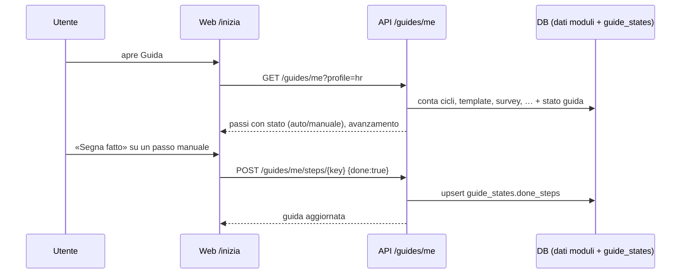

# Avviamento guidato e manuale operativo (`AVV`)

| | |
|---|---|
| **Priorità** | P0 (pilota) |
| **Stato** | In sviluppo — sprint 21 |
| **Dipendenze** | CORE (ruoli, tenant), tutti i moduli per i controlli automatici |
| **Ultimo aggiornamento** | 2026-09-14 |

## 1. Scopo

Chi entra per la prima volta nella piattaforma deve capire **cosa fare, in che ordine e perché**. Il modulo offre:

- un **wizard di avviamento per profilo** (amministratore, HR, manager, collaboratore) dentro l'app: una lista ordinata di passi con spiegazione, motivazione HR, istruzioni passo per passo e link diretto alla schermata; i passi si spuntano da soli quando il sistema rileva che l'azione è stata fatta;
- un **manuale operativo** (`docs/manuale/`) che descrive l'uso della piattaforma per ogni profilo e, soprattutto, le **regole HR incorporate nel prodotto** (anonimato, visibilità, approvazioni, calibrazione, soglie fiscali, audit), così che chi amministra sappia cosa il software garantisce e cosa resta una scelta organizzativa.

## 2. Concetti chiave

| Termine | Significato |
|---|---|
| **Profilo** | Vista del wizard: `admin`, `hr`, `manager`, `employee`. Deriva dai ruoli (`tenant_admin` → admin; `hr_admin`/`hrbp` → hr; `manager` → manager; altrimenti employee). Chi ha ruoli superiori può consultare anche le guide dei profili inferiori per accompagnare le proprie persone. |
| **Passo** | Unità del wizard: chiave stabile, titolo, «perché» (regola o pratica HR), «come» (istruzioni numerate), link alla schermata, riferimento al capitolo del manuale, tipo di controllo. |
| **Controllo automatico** | Regola valutata dall'API sui dati reali del tenant o della persona (es. «esiste almeno un ciclo OKR attivo», «hai fatto almeno un check-in»). |
| **Passo manuale** | Passo non rilevabile dai dati (es. «comunica le regole al personale»): l'utente lo segna fatto. |
| **Stato guida** | Riga per utente e profilo con i passi segnati a mano e l'eventuale data in cui l'utente ha nascosto il promemoria in Home. |

## 3. Attori e permessi

| Azione | Collaboratore | Manager | HRBP / HR admin | Tenant admin |
|---|---|---|---|---|
| Vedere la guida del proprio profilo | ✔ | ✔ | ✔ | ✔ |
| Vedere le guide dei profili «inferiori» | — | employee | manager, employee | tutte |
| Segnare/annullare un passo manuale, nascondere il promemoria | ✔ (solo per sé) | ✔ | ✔ | ✔ |

Non serve un permesso dedicato: l'endpoint richiede l'autenticazione (`notifications:read`, presente in tutti i ruoli) e ogni utente agisce solo sul proprio stato.

## 4. Requisiti funzionali

### 4.1 Wizard

| ID | Requisito | Priorità |
|----|-----------|----------|
| AVV-001 | La pagina **Guida** (`/inizia`) mostra i passi del profilo dell'utente in ordine, con stato `fatto` / `da fare`, avanzamento complessivo e, per ogni passo, «perché», «come», link «Vai» e riferimento al manuale. | P0 |
| AVV-002 | I passi con controllo automatico si aggiornano a ogni apertura in base ai dati; un passo automatico non si può segnare a mano. | P0 |
| AVV-003 | I passi manuali si segnano fatti e si annullano; lo stato è per utente e profilo. | P0 |
| AVV-004 | La Home mostra un promemoria con l'avanzamento finché la guida non è completa o l'utente non lo nasconde; il promemoria si può riattivare dalla pagina Guida. | P0 |
| AVV-005 | Chi ha ruoli superiori può cambiare profilo nella pagina Guida per vedere il percorso dei propri collaboratori (senza stato personale: i controlli automatici valgono sul tenant, quelli personali sono mostrati come «da verificare con la persona»). | P1 |
| AVV-006 | Il catalogo dei passi vive in `packages/shared` (`guides`) ed è testato: chiavi uniche, link validi verso rotte esistenti, ogni passo con «perché» e almeno due istruzioni. | P0 |
| AVV-007 | Se è configurato `NEXT_PUBLIC_MANUAL_URL`, ogni passo e la pagina Guida collegano il capitolo del manuale pubblicato; altrimenti il riferimento resta testuale. | P1 |

### 4.2 Manuale operativo

| ID | Requisito | Priorità |
|----|-----------|----------|
| AVV-010 | `docs/manuale/` contiene: indice, concetti e ruoli, avviamento, un capitolo per profilo (amministratore, HR, manager, collaboratore), il catalogo delle **regole HR applicate** e FAQ. | P0 |
| AVV-011 | Ogni regola HR del catalogo indica: cosa garantisce il software, dove si applica, il parametro (se configurabile) e il riferimento alla specifica. | P0 |
| AVV-012 | Il manuale descrive solo comportamenti implementati; ciò che è pianificato è marcato come tale con rimando alla roadmap. | P0 |

**User story**

- Come amministratore appena attivato voglio una lista ordinata di cose da fare, così da mettere in piedi il tenant senza leggere tutta la documentazione.
- Come HR voglio sapere quali regole (anonimato, visibilità della self-review, calibrazione) il sistema applica da solo, così da comunicarle correttamente alle persone.
- Come manager voglio capire in tre passi come partire con il mio team (obiettivi, 1:1, feedback), così da non arrivare impreparato alla review.
- Come collaboratore voglio sapere cosa vede il mio manager e cosa no, così da usare la piattaforma con fiducia.

**Criteri di accettazione**

- [ ] Un tenant appena creato mostra all'amministratore 0/N passi fatti; dopo l'import delle persone il passo relativo risulta fatto senza azione manuale.
- [ ] Un passo manuale segnato fatto resta tale al ricaricamento e si può annullare.
- [ ] Il promemoria in Home scompare dopo «Nascondi» e ricompare da «Mostra di nuovo».
- [ ] Ogni link «Vai» porta a una rotta esistente (test sul catalogo).

## 5. Flussi principali

## 6. Regole di business

- **Profilo predefinito**: il più alto tra i ruoli dell'utente (`admin` > `hr` > `manager` > `employee`). I profili consultabili sono quello predefinito e tutti gli inferiori.
- **Controlli automatici** (valutati nel tenant dell'utente; quelli personali sulla persona collegata all'utente):

| Profilo | Passo | Controllo |
|---|---|---|
| admin | Marchio e nome azienda | `tenants.settings.branding` presente |
| admin | Struttura organizzativa | almeno 2 unità organizzative |
| admin | Persone caricate | almeno 3 persone attive |
| admin | Manager assegnati | almeno l'80% delle persone attive ha un manager (esclusa una senza manager: il vertice) |
| admin | Referenti HR | almeno un utente con ruolo `hr_admin` o `hrbp` |
| admin | Inviti | almeno un utente oltre all'amministratore ha accettato l'invito o fatto login |
| admin | Accesso sicuro | MFA attiva sull'utente corrente **oppure** SSO configurato |
| admin | Integrazioni | almeno un connettore configurato (facoltativo: passo informativo, non blocca il completamento) |
| hr | Periodo OKR attivo | un `cycles` con data corrente compresa |
| hr | Valori aziendali | almeno un valore in `company_values` |
| hr | Questionari di review pubblicati | almeno un form `kind=review` pubblicato |
| hr | Template di review | almeno un `review_templates` non archiviato |
| hr | Ciclo di review lanciato | almeno un `review_cycles` attivo o chiuso |
| hr | Survey | almeno una survey lanciata |
| hr | Framework competenze | almeno una competenza e un job profile |
| hr | Percorso di onboarding | almeno un template di onboarding |
| hr | Piano welfare | almeno un piano welfare |
| hr | Processi | almeno un'app pubblicata |
| hr | Comunicazione delle regole | manuale |
| manager | Team collegato | ha almeno un riporto diretto |
| manager | Obiettivi del team | ogni riporto ha almeno un obiettivo attivo, oppure il manager ne ha uno di team |
| manager | Relazioni 1:1 | esiste una relazione 1:1 con ogni riporto |
| manager | Primo 1:1 | almeno un incontro concluso |
| manager | Feedback dato | almeno un feedback o riconoscimento inviato |
| manager | Review del team | informativo: review da scrivere nel ciclo attivo |
| manager | Prepararsi alla calibrazione | manuale |
| employee | Profilo verificato | manuale |
| employee | Primo obiettivo | almeno un obiettivo di cui è owner |
| employee | Check-in | almeno un check-in fatto |
| employee | Feedback | almeno un feedback o riconoscimento dato |
| employee | 1:1 | esiste una relazione 1:1 con il manager |
| employee | Notifiche | manuale |
| employee | Accesso sicuro | MFA attiva (facoltativo) |

- I passi **facoltativi** non concorrono al totale «passi obbligatori»; la guida è «completa» quando tutti gli obbligatori sono fatti.
- Le query dei controlli sono aggregate (conteggi) e non espongono dati di altre persone al collaboratore.

## 7. Notifiche

Nessuna notifica dedicata: il promemoria vive in Home. (Eventuale digest «avviamento fermo da 7 giorni» in roadmap.)

## 8. Analytics del modulo

Nessuna metrica nel semantic layer; l'avanzamento per tenant è consultabile dall'amministratore nella stessa pagina (profilo admin mostra il riepilogo degli altri profili in forma aggregata: numero di manager con team collegato, ecc. — P2).

## 9. Assunzioni / Domande aperte

- Il manuale non è servito dall'app: è pubblicato dal team (sito statico o PDF) e collegato via `NEXT_PUBLIC_MANUAL_URL`. Servirlo in-app richiederebbe un renderer Markdown e la copia dei file nel container web: rimandato.
- Le soglie dei controlli (80% con manager, 3 persone) sono valori ragionevoli per un pilota; si possono cambiare nel catalogo senza migrazioni.
- I testi dei passi sono in italiano nel catalogo condiviso; la localizzazione segue quella generale del prodotto.

## 10. Modifiche rispetto a PeopleGoal

PeopleGoal offre un onboarding del prodotto guidato dal customer success, non dentro il software. Qui il wizard è **parte del prodotto**, per profilo, con controlli automatici sui dati e un manuale che esplicita le regole HR: coerente con la visione (`docs/00`) di una piattaforma adottabile senza consulenza.
