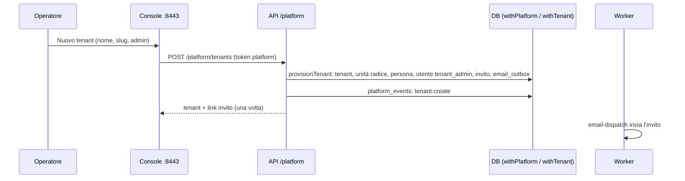

# Console di piattaforma (`PLT`)

| | |
|---|---|
| **Priorità** | P0 (esercizio multi-tenant) |
| **Stato** | In sviluppo — sprint 23 |
| **Dipendenze** | CORE (tenant, utenti, inviti), INT (code e job), ADR-0013 |
| **Ultimo aggiornamento** | 2026-09-14 |

## 1. Scopo

Dare a chi gestisce la piattaforma una **console trasversale a tutti i tenant** per: creare tenant e invitarne gli amministratori, vedere le statistiche d'uso, intervenire sugli account (reset password, sblocco, revoca sessioni, disattivazione), controllare lo stato di API, database, worker, code e certificati, consultare gli eventi rilevanti. È un'applicazione separata (porta 8443) con identità e permessi propri; **non accede ai contenuti** dei tenant (solo aggregati e azioni amministrative).

## 2. Concetti chiave

| Termine | Significato |
|---|---|
| **Operatore di piattaforma** | Utente della console (`platform_users`), estraneo ai tenant. Un solo ruolo (`platform_admin`) in questa fase. |
| **Token di piattaforma** | Sessione con claim `platform: true` e senza `tenant_id`: valida solo sulle rotte `/platform/*`. |
| **Evento di piattaforma** | Riga append-only di `platform_events`: chi, cosa, su quale tenant o utente, quando, da quale IP. |
| **Stato piattaforma** | Riepilogo di API (versione, uptime), database (latenza, dimensione, connessioni, migrazioni), worker (ultimo esito per job), code (email, chat, webhook, calendario: in attesa e in errore), certificati (scadenze). |
| **Provisioning** | Creazione di un tenant con unità radice, primo amministratore e invito; stessa logica dello script `bootstrap`. |

## 3. Attori e permessi

| Azione | Operatore di piattaforma | Utenti dei tenant |
|---|---|---|
| Accedere alla console | ✔ | — |
| Vedere stato, statistiche, tenant, log | ✔ | — |
| Creare tenant, invitare amministratori, sospendere/riattivare | ✔ | — |
| Reset password, sblocco, revoca sessioni, disattivazione di un utente tenant | ✔ | — (gli amministratori tenant fanno le stesse cose dalla web app per il proprio tenant) |
| Gestire gli operatori (creare, disattivare) e la propria password | ✔ | — |
| Chiamare le API dei moduli (`/objectives`, `/reviews`, …) | **✘** (token rifiutato) | ✔ secondo i ruoli |

## 4. Requisiti funzionali

### 4.1 Accesso e operatori

| ID | Requisito | Priorità |
|----|-----------|----------|
| PLT-001 | Login con email e password su `POST /platform/auth/login`; stessa policy password (≥ 10 caratteri, ≠ email), blocco 15 minuti dopo 5 tentativi, rate limit per IP. | P0 |
| PLT-002 | Il primo operatore nasce dal comando `platform-admin` oppure da `PLATFORM_BOOTSTRAP_EMAIL`/`PASSWORD` all'avvio dell'API se non esistono operatori; `mustChangePassword` finché non cambia la password. | P0 |
| PLT-003 | Gli operatori si creano (con password iniziale temporanea), disattivano e riattivano dalla console; ogni operatore cambia la propria password; la revoca delle sessioni segue il cambio password. | P0 |
| PLT-004 | Un token di piattaforma è accettato solo sulle rotte `@PlatformOnly()`; un token tenant è rifiutato su quelle rotte (403). | P0 |

### 4.2 Tenant

| ID | Requisito | Priorità |
|----|-----------|----------|
| PLT-010 | Elenco tenant con nome, slug, stato, persone attive, utenti, ultimo accesso, data di creazione; ricerca per nome/slug. | P0 |
| PLT-011 | Creazione tenant: nome, slug (unico, `^[a-z0-9][a-z0-9-]{1,40}$`), fuso orario, lingua, email e nome del primo amministratore → tenant + unità radice + persona + utente `tenant_admin` con invito (7 giorni) in coda email. Il link d'invito è mostrato all'operatore una sola volta (per ambienti senza email). | P0 |
| PLT-012 | Dettaglio tenant: statistiche per modulo (persone, utenti, obiettivi, review, survey, 1:1, feedback, processi, welfare), amministratori, SSO attivo, MFA obbligatoria per ruoli, integrazioni configurate, ultimi accessi, eventi di piattaforma del tenant. | P0 |
| PLT-013 | Invito di un ulteriore amministratore tenant (o reinvio dell'invito). | P0 |
| PLT-014 | Sospensione e riattivazione: un tenant `suspended` rifiuta login e token esistenti (l'`AuthGuard` verifica lo stato del tenant, con cache breve). | P0 |
| PLT-015 | Audit del tenant: ultime N azioni (quando, azione, tipo entità, utente) senza `before/after`; filtro per azione. | P1 |

### 4.3 Utenti dei tenant

| ID | Requisito | Priorità |
|----|-----------|----------|
| PLT-020 | Ricerca utenti per email su tutti i tenant (o in un tenant): stato, ruoli, ultimo accesso, blocco, MFA. | P0 |
| PLT-021 | Reset password: genera il token di reset (60 minuti) e accoda l'email; sblocca l'account e revoca le sessioni. | P0 |
| PLT-022 | Sblocco (azzera tentativi e blocco), revoca sessioni, disattivazione/riattivazione, disattivazione MFA (recupero) — ciascuna tracciata come evento. | P0 |

### 4.4 Stato, statistiche, certificati, log

| ID | Requisito | Priorità |
|----|-----------|----------|
| PLT-030 | `GET /platform/status`: API (versione, uptime, ambiente), DB (latenza, dimensione, connessioni attive/max, migrazioni applicate e ultima), worker (ultimo run per job: esito, quando, durata), code (email/chat/webhook/calendario: in attesa, in errore, più vecchio in attesa), Redis configurato sì/no. | P0 |
| PLT-031 | `GET /platform/stats`: tenant attivi/sospesi, utenti totali e attivi a 30 giorni, persone attive, conteggi per modulo su tutta la piattaforma; serie degli accessi per giorno (30 giorni). | P0 |
| PLT-032 | `GET /platform/certificates`: certificato TLS della console (se configurato) e verifica via TLS degli URL pubblici (web, API, console): emittente, soggetto, valido dal/al, giorni residui, stato `ok`/`warning` (≤ 30 giorni)/`critical` (≤ 7 o scaduto)/`error` (non raggiungibile o non TLS). | P0 |
| PLT-033 | `GET /platform/events`: eventi di piattaforma paginati con filtro per tenant e azione; `GET /platform/jobs`: ultimi run per job con errore; `GET /platform/queues/failures`: ultime consegne fallite (email, chat, webhook, calendario) con errore. | P0 |
| PLT-034 | Il pannello Log rimanda al sistema di log dell'infrastruttura per stdout di API e worker (non raccolti dalla piattaforma). | P0 |

### 4.5 Console (web)

| ID | Requisito | Priorità |
|----|-----------|----------|
| PLT-040 | App `apps/console` su porta 8443 (`CONSOLE_PORT`), TLS nativo opzionale con `CONSOLE_TLS_CERT_FILE`/`CONSOLE_TLS_KEY_FILE`, altrimenti HTTP dietro proxy. Cookie di sessione httpOnly separato (`wb_platform`). | P0 |
| PLT-041 | Pagine: Accesso; Stato (cruscotto con semafori); Tenant (elenco, nuovo, dettaglio con azioni); Utenti (ricerca e azioni); Log (eventi, job, code in errore); Operatori; Il mio account (cambio password). | P0 |
| PLT-042 | Target Docker `console`, servizio nel compose (profilo `app`), variabili in `.env.example`, sezione in `docs/13`. | P0 |

**Criteri di accettazione**

- [ ] Un token tenant su `/platform/status` riceve 403; un token di piattaforma su `/objectives` riceve 403.
- [ ] Creare un tenant dalla console produce tenant, unità radice, admin con invito; l'invito accettato porta alla web app con ruolo `tenant_admin`.
- [ ] Sospendere un tenant fa fallire il login dei suoi utenti e invalida i token entro 30 secondi.
- [ ] Il reset password da console genera un'email con link valido 60 minuti e azzera il blocco.
- [ ] Ogni azione della console compare in «Log → Eventi» con operatore, tenant e IP.
- [ ] Un certificato con meno di 30 giorni compare in stato `warning` nel cruscotto.

## 5. Flussi principali

## 6. Regole di business

- Slug immutabile dopo la creazione; nome, fuso e lingua modificabili.
- La sospensione non cancella nulla: blocca login e token; la riattivazione ripristina.
- Reset password e sblocco non rivelano mai la password: solo token monouso via email (e link mostrato all'operatore quando l'email non è configurata, tracciato come evento).
- Statistiche e stato sono calcolati al momento (query aggregate leggere) con cache di 30 secondi lato API.
- Le soglie certificati (30/7 giorni) sono costanti documentate; gli URL verificati derivano da `APP_BASE_URL`, `API_PUBLIC_URL`, `CONSOLE_PUBLIC_URL`.

## 7. Notifiche

Nessuna notifica in-app: gli eventi sono nel pannello Log. Email agli amministratori invitati (invito) e agli utenti (reset) attraverso la coda esistente.

## 8. Analytics del modulo

Le statistiche della console non entrano nel semantic layer dei tenant.

## 9. Assunzioni / Domande aperte

- MFA per gli operatori di piattaforma: rinviata (ADR-0013); la console va esposta su rete di gestione o VPN.
- Gestione dei certificati = monitoraggio scadenze; sostituzione manuale (docs/13). Un rinnovo automatico (ACME) è responsabilità dell'infrastruttura.
- Log applicativi centralizzati: fuori perimetro; la console mostra job, code, eventi e audit.

## 10. Modifiche rispetto a PeopleGoal

PeopleGoal non espone una console multi-tenant ai clienti (è gestita internamente dal vendor). Qui è parte del prodotto, per chi gestisce più tenant on-premise o in hosting dedicato.
