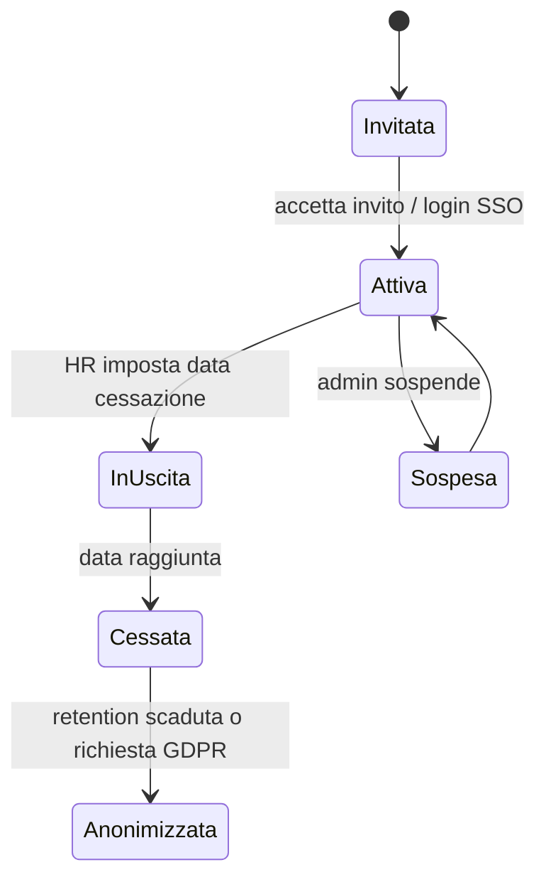

# Core & Amministrazione (`CORE`)

| | |
|---|---|
| **Priorità** | P0 |
| **Stato** | In implementazione (sprint 0–5: CORE-001/004 parziale, 010, 012, 014 inviti con link monouso e gestione utenti, 016, 017, 020–022, 030 password con policy, blocco brute force, reset, 031 OIDC per tenant con PKCE e provisioning automatico, 040, 042, 050, 060 parziale; sprint 12: sessioni revocabili, rate limiting, header di sicurezza, MFA TOTP opzionale con codici di recupero e obbligo per ruolo; mancano SAML, SCIM, magic link, WebAuthn; vedi ADR-0007; **sprint 26** (low-code, blocco 2): CORE-003 glossario aziendale, CORE-004 moduli attivi per tenant, CORE-011 catalogo dei campi custom della persona; **sprint 27**: CORE-041 ruoli custom, CORE-043 permessi per modulo) |
| **Dipendenze** | — |
| **Ultimo aggiornamento** | 2026-09-16 |

## 1. Scopo

Fornire le fondamenta condivise da tutti i moduli: tenant, utenti e autenticazione, struttura organizzativa, ruoli e permessi, impostazioni aziendali, naming personalizzato, audit.

## 2. Concetti chiave

- **Tenant**: un'azienda cliente. Tutti i dati sono isolati per tenant.
- **Persona (Employee)**: un dipendente/collaboratore, con o senza account di accesso (es. operai senza email possono esistere come persone valutabili).
- **Utente (User)**: identità di accesso collegata a una persona.
- **Unità organizzativa (Org Unit)**: nodo gerarchico (azienda → divisione → dipartimento → team). Una persona appartiene a una unità primaria e può avere appartenenze secondarie.
- **Manager**: relazione persona → manager diretto (linea gerarchica). Supportate linee secondarie (dotted line) per organizzazioni a matrice.
- **Perimetro (Scope)**: insieme di unità/persone su cui un ruolo ha effetto (es. HRBP della sede di Milano).
- **Ruolo**: insieme di permessi. Ruoli predefiniti + ruoli custom.
- **Job / Livello**: mansione e livello di carriera (usati da Sviluppo & Carriera).
- **Attributi custom**: campi aggiuntivi sulla persona (sede, contratto, costo…) usabili per segmentare analytics e destinatari.

## 3. Attori e permessi (estratto della matrice RBAC)

| Azione | Tenant Admin | HR Admin | HRBP (perimetro) | Manager | Collaboratore |
|---|---|---|---|---|---|
| Configurare tenant, SSO, integrazioni | ✅ | ❌ | ❌ | ❌ | ❌ |
| Gestire ruoli e assegnarli | ✅ | ✅ | ❌ | ❌ | ❌ |
| Creare/modificare persone e org | ✅ | ✅ | ✅ (perimetro) | ❌ | ❌ |
| Vedere profilo completo di una persona | ✅ | ✅ | ✅ (perimetro) | ✅ (team) | ✅ (sé) |
| Modificare attributi della propria scheda | – | – | – | – | ✅ (campi consentiti) |
| Vedere org chart | ✅ | ✅ | ✅ | ✅ | ✅ (configurabile) |
| Consultare audit log | ✅ | ✅ | ❌ | ❌ | ❌ |
| Impersonare utente (supporto) | ✅ (con log) | ❌ | ❌ | ❌ | ❌ |

## 4. Requisiti funzionali

### 4.1 Tenant e impostazioni

| ID | Requisito | Priorità |
|----|-----------|----------|
| CORE-001 | Creazione tenant con nome, dominio email, lingua predefinita, fuso orario, valuta | P0 |
| CORE-002 | Branding: logo, colore primario, nome visualizzato | P1 |
| CORE-003 | Naming personalizzato dei concetti principali (Obiettivo, OKR, Review, 1:1, Feedback, Riconoscimento, Competenza) con singolare/plurale per lingua | P1 |
| CORE-004 | Attivazione/disattivazione moduli per tenant | P0 |
| CORE-005 | Impostazioni di visibilità predefinite (org chart visibile a tutti, obiettivi pubblici di default, ecc.) | P1 |
| CORE-006 | Calendario aziendale: inizio anno fiscale, definizione trimestri, festività (usato per scadenze) | P1 |

**Criteri di accettazione (CORE-003)**
- [ ] Rinominando "OKR" in "Priorità", menu, titoli, notifiche ed export mostrano "Priorità".
- [ ] Il rename è per lingua: IT e EN possono avere nomi diversi.
- [ ] Le API mantengono i nomi tecnici originali.

### 4.2 Persone e utenti

| ID | Requisito | Priorità |
|----|-----------|----------|
| CORE-010 | Anagrafica persona: nome, cognome, email, matricola, foto, data assunzione, job, livello, sede, unità, manager, stato (attivo, in uscita, cessato) | P0 |
| CORE-011 | Attributi custom (testo, numero, data, scelta, booleano) definibili dall'HR | P1 |
| CORE-012 | Import massivo da CSV con validazione, anteprima e report errori | P0 |
| CORE-013 | Sincronizzazione da HRIS (vedi INT) con regole di precedenza campo per campo | P1 |
| CORE-014 | Inviti via email, con o senza SSO; stato invito (inviato, accettato, scaduto) | P0 |
| CORE-015 | Persone senza account (valutabili, non accedono) | P1 |
| CORE-016 | Offboarding: cessazione con data, anonimizzazione o conservazione dati secondo policy | P0 |
| CORE-017 | Storico cambi (manager, unità, job) con data di validità, per analytics storiche | P1 |

### 4.3 Struttura organizzativa

| ID | Requisito | Priorità |
|----|-----------|----------|
| CORE-020 | Albero di unità organizzative a profondità arbitraria | P0 |
| CORE-021 | Relazione manager diretto e linee secondarie (dotted line) | P0 (diretto) / P1 (secondarie) |
| CORE-022 | Org chart interattivo navigabile, ricerca persone | P0 |
| CORE-023 | Team trasversali (progetto, comitato) non gerarchici, con owner | P1 |
| CORE-024 | Deleghe temporanee (un manager delega un altro per un periodo) | P2 |

### 4.4 Autenticazione e accesso

| ID | Requisito | Priorità |
|----|-----------|----------|
| CORE-030 | Login email + password con policy (lunghezza, scadenza opzionale, MFA opzionale) | P0 |
| CORE-031 | SSO SAML 2.0 e OIDC (Microsoft Entra ID, Google Workspace, Okta) con JIT provisioning opzionale | P0 |
| CORE-032 | SCIM 2.0 per provisioning/deprovisioning | P2 |
| CORE-033 | Sessioni: durata, logout remoto, elenco dispositivi | P1 |
| CORE-034 | Accesso "magic link" per esterni (valutatori 360°) con scadenza | P1 |

### 4.5 Ruoli e permessi

| ID | Requisito | Priorità |
|----|-----------|----------|
| CORE-040 | Ruoli predefiniti (vedi `docs/02`) | P0 |
| CORE-041 | Ruoli custom componendo permessi atomici | P1 |
| CORE-042 | Assegnazione ruolo con perimetro (tutto il tenant, unità, elenco persone) | P0 |
| CORE-043 | Permessi per modulo (es. Manager può vedere le survey aggregate del team solo se abilitato) | P1 |
| CORE-044 | Vista "cosa vede X" per verificare i permessi di un utente | P2 |

### 4.6 Audit e conformità

| ID | Requisito | Priorità |
|----|-----------|----------|
| CORE-050 | Audit log immutabile: chi, cosa, quando, su quale entità, da quale IP, per tutte le azioni di scrittura e gli accessi a dati sensibili | P0 |
| CORE-051 | Ricerca e export dell'audit log | P1 |
| CORE-052 | Esportazione dati personali di una persona (GDPR art. 15/20) | P0 |
| CORE-053 | Cancellazione/anonimizzazione su richiesta con policy di retention | P0 |

### 4.7 Profilo persona ("fascicolo")

| ID | Requisito | Priorità |
|----|-----------|----------|
| CORE-060 | Pagina profilo con tab: Panoramica, Obiettivi, Review, Feedback, 1:1, Sviluppo, Survey, Documenti | P0 |
| CORE-061 | Timeline unificata degli eventi (obiettivo completato, feedback ricevuto, review chiusa…) | P1 |
| CORE-062 | Visibilità dei tab in base al ruolo del visitatore | P0 |

### 4.8 Navigazione e Home

| ID | Requisito | Priorità |
|----|-----------|----------|
| CORE-063 | **Home «Da fare»**: la Home elenca in un unico posto ciò che la persona ha in sospeso nei vari moduli, ordinato per urgenza: azioni dei 1:1 scadute o in scadenza, check-in dei KR oltre la cadenza, passi di processo assegnati (self/manager review, approvazioni, onboarding, richieste dell'App Studio), survey aperte non ancora compilate, richieste di feedback 360° da dare. Ogni voce porta all'azione con un clic e mostra il modulo, la scadenza e da dove nasce. Espone anche il prossimo 1:1 con l'agenda | P0 |
| CORE-064 | **Navigazione a sezioni con icone e ricerca rapida**: menu laterale raggruppato in «Il mio lavoro», «Crescita», «Organizzazione», con Guida e Impostazioni in fondo e icone per ogni voce; ricerca rapida (⌘K / Ctrl+K) che apre pagine e trova persone per nome o email; intestazione con percorso, notifiche e aiuto | P1 |

**Criteri di accettazione (CORE-063)**
- [ ] Un collaboratore con un'azione 1:1 scaduta, un KR senza check-in oltre la cadenza e una survey aperta vede tre voci nella Home, la prima con l'indicazione del ritardo.
- [ ] Le voci scompaiono appena l'azione è compiuta (azione chiusa, check-in fatto, survey inviata).
- [ ] Un manager vede in più le manager review e le approvazioni assegnate; l'HR non vede il lavoro degli altri (la lista è sempre personale).
- [ ] L'endpoint `GET /me/todo` restituisce le voci con `kind`, `title`, `href`, `dueDate`, `overdue` e non richiede permessi oltre l'autenticazione.

## 5. Flussi principali

## 6. Regole di business

- Una persona ha al massimo un manager diretto alla volta; il cambio genera uno storico.
- La cessazione non cancella i dati: le review e i feedback restano nello storico del tenant; l'account viene disabilitato immediatamente.
- Il perimetro di un HRBP include tutte le unità figlie di quelle assegnate.
- L'impersonazione è tracciata in audit e mostra un banner all'utente impersonante.

## 7. Notifiche

| Evento | Destinatari | Canali |
|---|---|---|
| Invito | Persona | Email |
| Cambio manager | Persona, nuovo manager, vecchio manager | In-app, email |
| Nuovo riporto assegnato | Manager | In-app |
| Import CSV completato/fallito | Chi ha lanciato l'import | In-app, email |

## 8. Analytics del modulo

- Headcount per unità, sede, job, livello; ingressi/uscite per periodo.
- Tasso di attivazione account, ultimo accesso.
- Copertura dati (persone senza manager, senza job, ecc.).

## 9. Assunzioni / Domande aperte

- Serve il supporto a più aziende legali nello stesso tenant (gruppo)? Ipotesi: sì tramite attributo "società", non tramite tenant separati.
- Le persone senza email (CORE-015) sono un caso rilevante per il target? Da validare con i primi clienti.
- **Glossario aziendale** (CORE-003, sprint 26): la tabella `naming_overrides` (concetto, lingua, singolare, plurale) è esposta da `GET /naming` (tutti gli autenticati) e `PUT /naming` (amministratore del tenant); la web app applica i nomi al menu, ai titoli e ai sottotitoli delle pagine dei moduli (obiettivi, review, 1:1, feedback, riconoscimenti, competenze) e al vocabolario dell'App Studio. Restano con il nome tecnico: le API, i template email già inviati, i PDF generati prima del cambio. La lingua è quella del tenant (`defaultLocale`); l'inglese è predisposto ma l'interfaccia è solo in italiano.
- **Moduli attivi per tenant** (CORE-004, sprint 26): `settings.modules` sul tenant (`{ okr, one_on_ones, feedback, reviews, surveys, welfare, development, f360, onboarding, apps, analytics }`, tutti attivi per default); un modulo disattivato sparisce dal menu, dalla Home e dalla Guida e le sue pagine reindirizzano alla Home. **Assunzione**: l'API non blocca le chiamate dirette al modulo disattivato (i permessi restano la barriera di sicurezza); è una scelta di semplicità per il pilota, da rivedere se i tenant chiederanno la disattivazione «forte».
- **Ruoli custom e permessi per modulo** (CORE-041/043, sprint 27): tabella `role_definitions` (chiave, nome, descrizione, ruolo base, elenco di permessi atomici). Una definizione con la chiave di un ruolo predefinito ne **personalizza** i permessi (es. togliere al manager «risultati aggregati delle survey del team», CORE-043); una chiave nuova crea un **ruolo custom** che eredita dal ruolo base il perimetro (team del manager, perimetro HR, profilo della Guida) ma ha solo i permessi selezionati. I permessi effettivi sono risolti dall'API a ogni richiesta (cache 30 s per tenant) e restituiti da `GET /me`; il token continua a portare le chiavi dei ruoli. **Vincoli**: l'amministratore del tenant conserva sempre `tenant:settings` e `roles:manage`; `super_admin` non è modificabile; un ruolo custom assegnato a qualcuno non si elimina, si archivia. API: `GET /roles`, `POST /roles`, `PATCH /roles/:key`, `POST /roles/:key/reset` (`roles:manage`). Non in questo sprint: perimetri per elenco persone (CORE-042 resta a tenant/unità) e la vista «cosa vede X» (CORE-044).
- **Campi custom della persona** (CORE-011, sprint 26): catalogo `person_field_defs` (chiave, etichetta, tipo testo/numero/data/booleano/scelta, opzioni, sezione, obbligatorietà, visibilità `hr` | `manager` | `all`, ordine); i valori restano in `persons.custom_fields` e sono validati contro il catalogo al salvataggio; l'import CSV accetta colonne `custom:<chiave>`; l'azione `person_field` dell'App Studio propone le chiavi del catalogo. Visibilità: `hr` = solo HR e amministratori, `manager` = anche il manager della persona, `all` = anche la persona stessa e chi vede la scheda. La segmentazione analytics per campo custom (P1 in ANA) non è ancora disponibile.

## 10. Modifiche rispetto a PeopleGoal

- Introduciamo il concetto esplicito di **perimetro** per HRBP, che in PeopleGoal è meno evidente.
- **Storico organizzativo con validità temporale** (CORE-017) per analytics affidabili nel tempo.
- **Vista "cosa vede X"** (CORE-044) per rendere verificabile la privacy.
