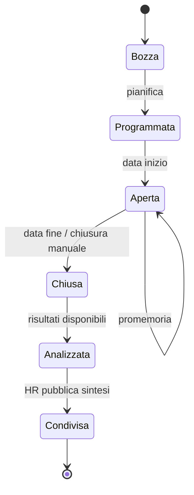

# Engagement & Survey (`ENG`)

| | |
|---|---|
| **Priorità** | P1 |
| **Stato** | In implementazione (sprint 6: ENG-001 libreria IT con 7 driver e 4 template, 002 parziale via form engine, 003, 004 rotazione pulse, 005, 007, 010 web, 011, 012, 013, 020, 021, 022, 025, 027; mancano editor domande custom da UI, Slack/Teams, analisi AI commenti, export Excel/PDF, piani d'azione) |
| **Dipendenze** | CORE, APP (form engine), INT, ANA |
| **Ultimo aggiornamento** | 2026-09-13 |

## 1. Scopo

Misurare regolarmente il clima e l'engagement (survey annuali, pulse, eNPS, wellbeing) garantendo anonimato, restituire risultati leggibili a HR e manager e trasformarli in piani d'azione.

## 2. Concetti chiave

- **Survey**: questionario inviato a una popolazione con finestra di risposta. Tipi: clima/engagement (lunga, annuale o semestrale), pulse (breve, ricorrente), eNPS, wellbeing, ad hoc (es. post-evento), onboarding/exit (usati da ONB).
- **Driver**: dimensione tematica (es. Leadership, Crescita, Riconoscimento, Benessere, Chiarezza) a cui le domande sono associate; consente heatmap per driver.
- **Libreria domande**: domande validate per driver, con scala Likert, eNPS (0–10), scelta multipla, testo libero.
- **Segmento**: raggruppamento dei rispondenti per attributo (unità, sede, job, anzianità, manager) per l'analisi.
- **Soglia di anonimato**: minimo rispondenti per mostrare un segmento (default 5).
- **Piano d'azione**: azioni concrete collegate ai risultati, con owner e scadenza.

## 3. Attori e permessi

| Azione | HR Admin | Manager | Collaboratore | Leadership |
|---|---|---|---|---|
| Creare e lanciare survey | ✅ | ❌ (salvo survey di team abilitate) | ❌ | ❌ |
| Rispondere | ✅ (se in popolazione) | ✅ | ✅ | ✅ |
| Vedere risultati aggregati azienda | ✅ | ❌ | ❌ (salvo condivisione HR) | ✅ |
| Vedere risultati del proprio team | ✅ | ✅ (sopra soglia) | ❌ | – |
| Vedere risposte individuali | ❌ mai | ❌ mai | ❌ | ❌ |
| Creare piani d'azione | ✅ | ✅ (team) | ❌ | ✅ |

## 4. Requisiti funzionali

### 4.1 Progettazione

| ID | Requisito | Priorità |
|----|-----------|----------|
| ENG-001 | Libreria domande per driver (IT/EN) e template survey (engagement completa, pulse, eNPS, wellbeing, onboarding, exit) | P1 |
| ENG-002 | Editor survey: domande da libreria o custom, tipi (Likert 5/7, eNPS, scelta, testo), obbligatorietà, logica condizionale, pagine | P1 |
| ENG-003 | Popolazione per filtro; esclusioni; anonima o nominale (dichiarato ai rispondenti) | P1 |
| ENG-004 | Ricorrenza per pulse (settimanale, mensile) con rotazione domande dalla libreria | P1 |
| ENG-005 | Soglia di anonimato per segmento configurabile (min 3, default 5) | P1 |
| ENG-006 | Anteprima e test invio | P1 |
| ENG-007 | Domande "sempre presenti" (es. eNPS) per il trend nel tempo | P1 |

### 4.2 Raccolta

| ID | Requisito | Priorità |
|----|-----------|----------|
| ENG-010 | Compilazione da web (mobile-first), Slack/Teams, link email; salvataggio parziale | P1 |
| ENG-011 | Promemoria automatici ai non rispondenti senza rivelare chi ha risposto (in survey anonime i promemoria vanno a tutti o usano token cieco) | P1 |
| ENG-012 | Tasso di risposta in tempo reale per segmento (senza scendere sotto soglia) | P1 |
| ENG-013 | Proroga e chiusura anticipata | P1 |
| ENG-014 | Accesso via QR/kiosk per popolazioni senza email | P2 |

### 4.3 Analisi

| ID | Requisito | Priorità |
|----|-----------|----------|
| ENG-020 | Dashboard risultati: punteggio per driver, per domanda, distribuzione risposte, eNPS calcolato, tasso di risposta | P1 |
| ENG-021 | Heatmap segmenti × driver con soglia di anonimato | P1 |
| ENG-022 | Trend nel tempo (survey ricorrenti, pulse) e confronto con survey precedente | P1 |
| ENG-023 | Analisi commenti: raggruppamento per tema e sentiment (assistito da AI, con opt-in del tenant) | P2 |
| ENG-024 | Benchmark interno (unità vs azienda) e, in futuro, esterno anonimo tra tenant che aderiscono | P2 |
| ENG-025 | Vista manager limitata al proprio team con confronto vs azienda | P1 |
| ENG-026 | Export Excel aggregato (mai per rispondente in survey anonime) e PDF di sintesi | P1 |
| ENG-027 | Condivisione risultati con i dipendenti (pagina di sintesi pubblicabile dall'HR) | P1 |

### 4.4 Piani d'azione

| ID | Requisito | Priorità |
|----|-----------|----------|
| ENG-030 | Creare piano d'azione da un driver/segmento con azioni, owner, scadenza, stato | P2 |
| ENG-031 | Le azioni compaiono nei 1:1 e nelle dashboard; follow-up nella survey successiva ("Hai notato miglioramenti su X?") | P2 |

## 5. Flussi principali

## 6. Regole di business

- In survey anonime nessun ruolo, inclusi Tenant Admin e Super Admin, può accedere alle risposte individuali; il sistema separa identità di invito e risposta.
- Un segmento sotto soglia non è mostrato né combinabile per differenza (es. unità di 6 persone meno sottogruppo di 5).
- eNPS = % promotori (9–10) − % detrattori (0–6).
- I commenti liberi in survey anonime sono mostrati senza attributi di segmento se il segmento è sotto soglia.

## 7. Notifiche

| Evento | Destinatari | Canali |
|---|---|---|
| Survey aperta + promemoria | Popolazione | Email, in-app, Slack/Teams |
| Survey chiusa, risultati pronti | HR, Leadership | In-app, email |
| Risultati del team disponibili | Manager (sopra soglia) | In-app |
| Sintesi pubblicata | Popolazione | In-app |

## 8. Analytics del modulo

- Tasso di risposta, eNPS, punteggio engagement per driver, trend, heatmap, correlazione con turnover (da CORE).

## 9. Assunzioni / Domande aperte

- **Implementazione v1 (sprint 6)**: anonimato architetturale con due tabelle separate (`survey_invitations` porta solo il flag "ha risposto", `survey_responses` porta risposte e attributi di segmento fotografati all'invio: unità, manager, fascia di anzianità) e nessuna chiave comune né riga di audit per la risposta nelle survey anonime. Il lancio è rifiutato se la popolazione è sotto la soglia. La soglia si applica al totale (sotto soglia: nessun risultato), ai segmenti della heatmap (con soppressione complementare) e alla vista manager (solo il proprio team, senza commenti né heatmap). I commenti sono mostrati solo all'HR, in ordine casuale e senza attributi. La chiusura automatica e i promemoria (a 3 e a 1 giorno) sono a carico del worker.

- Serve una survey "sempre aperta" (suggestion box)? Ipotesi: P2, come tipo ad hoc senza scadenza.
- Analisi AI dei commenti: definire policy privacy (vedi `docs/06`, `docs/10`).

## 10. Modifiche rispetto a PeopleGoal

- **Anonimato architetturale** (separazione identità/risposta) e protezione dalla ricostruzione per differenza.
- **Follow-up delle azioni nella survey successiva** (ENG-031) per chiudere il cerchio.
- **Pagina di sintesi pubblicabile** per i dipendenti (ENG-027).
