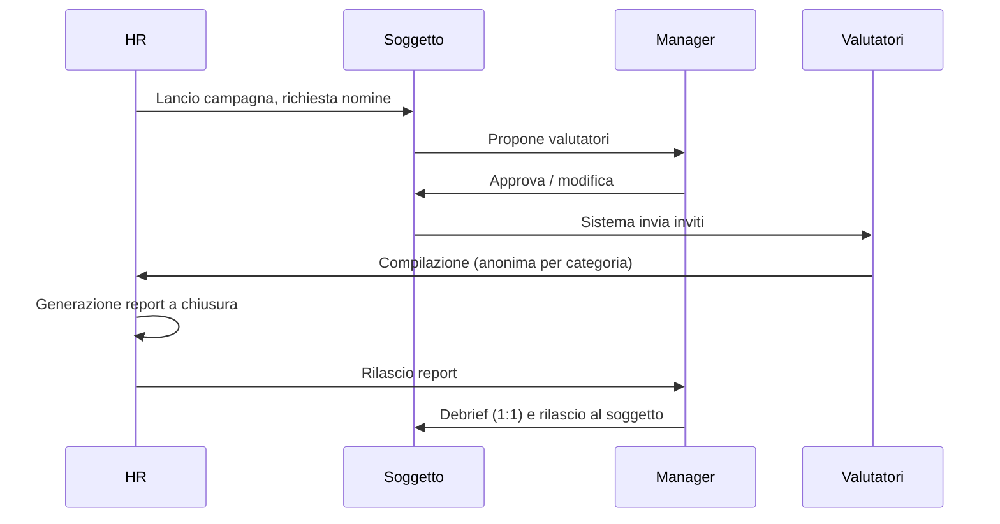

# Feedback 360° (`F360`)

| | |
|---|---|
| **Priorità** | P1 |
| **Stato** | In implementazione (sprint 13: F360-001 template inline su competenze del framework con scala e commento per competenza, 002 categorie con min/max/anonimato e soglia unica di campagna, 003 regole di nomina (soggetto/manager/HR) con approvazione, 004 popolazione per unità o elenco, 005 fasi nomina → raccolta → chiusura con scadenze, 006 domande aperte standard e custom, 010 suggerimenti dall'org e dai 1:1, 011 esterni via magic link, 012 elenco richieste con declino motivato, 013 bozze, 020 report con radar/gap/forze/aree/commenti, 021 soglia con accorpamento in «Altri», 023 heatmap per unità o manager, 024 solo CSV aggregato (PDF: pagina stampabile), 025 tre regole di rilascio, 026 azione nel piano di sviluppo; mancano F360-007 pesi, 014 limite di carico, 022 trend) |
| **Dipendenze** | CORE, DEV (competenze), APP (form engine), INT |
| **Ultimo aggiornamento** | 2026-09-14 |

## 1. Scopo

Raccogliere feedback strutturato su una persona da più fonti (sé, manager, pari, riporti, esterni) rispetto a competenze e comportamenti, restituendo un report utile allo sviluppo, con anonimato garantito.

## 2. Concetti chiave

- **Campagna 360°**: processo con popolazione di **soggetti** (persone valutate), template, regole di nomina, scadenze.
- **Categoria di valutatore**: Self, Manager, Pari, Riporti diretti, Altri interni, Esterni (clienti, fornitori).
- **Nomina**: scelta dei valutatori per un soggetto, con eventuale approvazione del manager e min/max per categoria.
- **Questionario**: domande per competenza/comportamento con scala e commento; domande aperte (continua / smetti / inizia).
- **Report 360°**: sintesi per soggetto con punteggi per competenza e categoria, gap self vs altri, punti di forza e aree di sviluppo, commenti.
- **Soglia di anonimato**: numero minimo di risposte per mostrare una categoria in modo aggregato.

## 3. Attori e permessi

| Azione | HR Admin | Manager | Soggetto | Valutatore | Esterno |
|---|---|---|---|---|---|
| Creare/lanciare campagne | ✅ | ❌ | ❌ | ❌ | ❌ |
| Nominare valutatori | ✅ | ✅ (per i riporti, se previsto) | ✅ (se previsto) | ❌ | ❌ |
| Approvare nomine | ✅ | ✅ | ❌ | ❌ | ❌ |
| Compilare questionario | – | ✅ | ✅ (self) | ✅ | ✅ (magic link) |
| Vedere report | ✅ | ✅ (configurabile) | ✅ (configurabile: subito / dopo debrief) | ❌ | ❌ |
| Vedere identità dei rispondenti | ❌ (solo Self e Manager) | ❌ | ❌ | – | – |

## 4. Requisiti funzionali

### 4.1 Configurazione campagna

| ID | Requisito | Priorità |
|----|-----------|----------|
| F360-001 | Template questionario: competenze dal framework (per job/livello) o domande libere; scala configurabile; commento per domanda o per competenza | P1 |
| F360-002 | Categorie di valutatore attive e per ciascuna: min/max, anonimato (sì/no), soglia aggregazione | P1 |
| F360-003 | Regole di nomina: chi nomina (soggetto / manager / HR / automatico dall'org), approvazione richiesta | P1 |
| F360-004 | Popolazione soggetti per filtro o elenco | P1 |
| F360-005 | Fasi con scadenze: nomina, approvazione, compilazione, generazione report, debrief | P1 |
| F360-006 | Domande aperte standard e custom | P1 |
| F360-007 | Pesi per categoria di valutatore e per competenza (per ruolo) nel punteggio complessivo | P2 |

### 4.2 Nomina e raccolta

| ID | Requisito | Priorità |
|----|-----------|----------|
| F360-010 | Interfaccia di nomina con suggerimenti dall'org (pari dello stesso team, riporti, collaboratori frequenti nei 1:1) | P1 |
| F360-011 | Invito a valutatori esterni via email con magic link e scadenza | P1 |
| F360-012 | Valutatore vede l'elenco delle richieste ricevute con stato e scadenza; può declinare con motivo | P1 |
| F360-013 | Salvataggio bozze; compilazione in più sessioni | P1 |
| F360-014 | Limite di richieste per valutatore con avviso all'HR (carico eccessivo) | P2 |

### 4.3 Report

| ID | Requisito | Priorità |
|----|-----------|----------|
| F360-020 | Report per soggetto: punteggio per competenza per categoria; radar chart; gap self vs altri; top forze / aree di sviluppo; commenti aggregati per categoria | P1 |
| F360-021 | Applicazione della soglia di anonimato: categorie sotto soglia accorpate in "Altri" o nascoste | P1 |
| F360-022 | Confronto con campagna precedente (trend) | P2 |
| F360-023 | Report aggregato per unità/azienda (heatmap competenze) | P1 |
| F360-024 | Export PDF (soggetto) e Excel (aggregato, senza dati identificativi sotto soglia) | P1 |
| F360-025 | Regole di rilascio: report visibile al soggetto subito, dopo approvazione del manager, o dopo debrief registrato | P1 |
| F360-026 | Collegamento diretto: da un'area di sviluppo creare un'azione nel piano di sviluppo (DEV) | P1 |

## 5. Flussi principali

## 6. Regole di business

- L'anonimato è per categoria: sotto soglia (default 3) le risposte confluiscono in "Altri"; se anche "Altri" è sotto soglia, i punteggi non vengono mostrati e i commenti vengono omessi.
- Self e Manager non sono mai anonimi.
- I commenti non sono mai attribuiti; l'ordine è randomizzato.
- Gli export rispettano le stesse soglie dell'interfaccia.
- Un valutatore esterno non vede nulla oltre il proprio questionario.

## 7. Notifiche

| Evento | Destinatari | Canali |
|---|---|---|
| Richiesta nomina / approvazione | Soggetto / Manager | Email, in-app |
| Invito a compilare + promemoria | Valutatori | Email, in-app, Slack/Teams (interni) |
| Report disponibile | Manager / Soggetto (secondo regole) | Email, in-app |

## 8. Analytics del modulo

- Tasso di risposta per categoria; tempo medio di compilazione.
- Heatmap competenze per unità; gap self vs altri medio.
- Competenze più deboli ricorrenti (input per formazione).

## 9. Assunzioni / Domande aperte

- Il debrief obbligatorio prima del rilascio al soggetto è default? **Implementato**: regola per campagna (`releaseRule`: subito alla chiusura / quando il manager rilascia / dopo debrief registrato), default "dopo debrief"; registrare il debrief con quella regola rilascia il report.
- **Soglia unica per campagna** (default 3) invece che per categoria (F360-002): semplifica la configurazione e la spiegazione alla persona. Da confermare se serve la soglia per categoria.
- **Stato individuale nelle categorie anonime**: chi nomina vede l'elenco dei nominati ma, dopo l'invito, lo stato mostra solo «invitato» (mai «ha risposto»); il declino invece è visibile con il motivo, perché chi nomina deve poter sostituire il valutatore. Da confermare.
- **Autovalutazione e manager** sono inclusi automaticamente al lancio e non si possono declinare; il manager è quello della persona al momento del lancio.
- **Avvio raccolta**: le nomine non ancora inviate/approvate vengono approvate d'ufficio dall'HR che avvia la fase (tracciato in audit), per non bloccare la campagna.
- **Export PDF** (F360-024): implementato nello sprint 16 (`GET /f360/subjects/{id}/report.pdf`, pdfkit): stesso contenuto e stessa visibilità del report web (radar, tabella per categoria, forze e aree, commenti, domande aperte, debrief per manager/HR), tracciato nell'audit; disponibile solo a chi può vedere il report; dallo sprint 17 con logo, colore e nome del tenant. L'export aggregato resta CSV con le stesse soglie dell'interfaccia (Excel rinviato).
- **Fonte DEV**: alla chiusura la media «altri» arrotondata diventa una valutazione di competenza con fonte `360` (DEV-005 parziale), così il gap con policy 360° funziona senza passaggi manuali.

## 10. Modifiche rispetto a PeopleGoal

- **Suggerimenti di nomina** basati su org e interazioni (F360-010).
- **Regole di rilascio esplicite** (F360-025) e collegamento diretto alle azioni di sviluppo (F360-026).
- Anonimato applicato anche agli export, con verifica automatica.

## 11. Note di implementazione (sprint 13)

- Tabelle `f360_campaigns`, `f360_subjects`, `f360_requests`, `f360_responses` (RLS, migrazioni 0022/0023). Le risposte delle categorie anonime non hanno `request_id`: il legame chi→cosa non esiste nel database (stesso principio delle survey, ADR-0008). Gli esterni ricevono un token casuale di cui è salvato solo l'hash; il token si consuma all'invio e viene rigenerato a ogni sollecito.
- Il report è calcolato dalla funzione pura `buildF360Report` in `@wb/shared` (testata) e salvato come snapshot nel soggetto alla chiusura: le regole del §6 sono applicate una volta sola e valgono per interfaccia, aggregato e CSV. «Altri» (media dei non-self) usa solo le risposte delle categorie visibili, così la differenza con il manager non rivela mai un gruppo sotto soglia.
- Endpoint `/f360/*` (campagne, soggetti, nomine, richieste, esterni pubblici con rate limit); permessi `f360:participate` (tutti), `f360:team` (manager: approva, vede il report dei riporti, registra il debrief), `f360:manage` (HR). Notifiche `f360.*`; promemoria del worker a 3 e 1 giorno dalla scadenza della raccolta; metrica «Tasso di risposta 360° (90 gg)» nel catalogo.
- Web: **Feedback 360°** con richieste da compilare, i miei 360° (nomine con suggerimenti, esterni, report), il mio team (approvazione, rilascio, debrief), campagne HR (creazione guidata, avanzamento per soggetto, heatmap e CSV); questionario con descrittori dei livelli e bozza; pagina pubblica `/f360/external/:token` per gli esterni.
