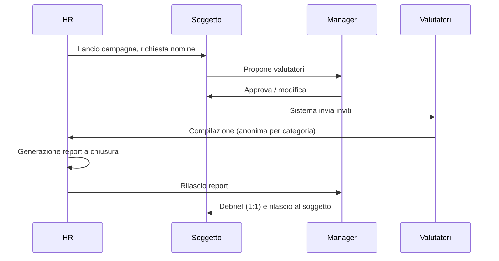

# Feedback 360° (`F360`)

| | |
|---|---|
| **Priorità** | P1 |
| **Stato** | Proposto |
| **Dipendenze** | CORE, DEV (competenze), APP (form engine), INT |
| **Ultimo aggiornamento** | 2026-09-12 |

## 1. Scopo

Raccogliere feedback strutturato su una persona da più fonti (sé, manager, pari, riporti, esterni) rispetto a competenze e comportamenti, restituendo un report utile allo sviluppo, con anonimato garantito.

## 2. Concetti chiave

- **Campagna 360°**: processo con popolazione di **soggetti** (persone valutate), template, regole di nomina, scadenze.
- **Categoria di valutatore**: Self, Manager, Pari, Riporti diretti, Altri interni, Esterni (clienti, fornitori).
- **Nomina**: scelta dei valutatori per un soggetto, con eventuale approvazione del manager e min/max per categoria.
- **Questionario**: domande per competenza/comportamento con scala e commento; domande aperte (continua / smetti / inizia).
- **Report 360°**: sintesi per soggetto con punteggi per competenza e categoria, gap self vs altri, punti di forza e aree di sviluppo, commenti.
- **Soglia di anonimato**: numero minimo di risposte per mostrare una categoria in modo aggregato.

## 3. Attori e permessi

| Azione | HR Admin | Manager | Soggetto | Valutatore | Esterno |
|---|---|---|---|---|---|
| Creare/lanciare campagne | ✅ | ❌ | ❌ | ❌ | ❌ |
| Nominare valutatori | ✅ | ✅ (per i riporti, se previsto) | ✅ (se previsto) | ❌ | ❌ |
| Approvare nomine | ✅ | ✅ | ❌ | ❌ | ❌ |
| Compilare questionario | – | ✅ | ✅ (self) | ✅ | ✅ (magic link) |
| Vedere report | ✅ | ✅ (configurabile) | ✅ (configurabile: subito / dopo debrief) | ❌ | ❌ |
| Vedere identità dei rispondenti | ❌ (solo Self e Manager) | ❌ | ❌ | – | – |

## 4. Requisiti funzionali

### 4.1 Configurazione campagna

| ID | Requisito | Priorità |
|----|-----------|----------|
| F360-001 | Template questionario: competenze dal framework (per job/livello) o domande libere; scala configurabile; commento per domanda o per competenza | P1 |
| F360-002 | Categorie di valutatore attive e per ciascuna: min/max, anonimato (sì/no), soglia aggregazione | P1 |
| F360-003 | Regole di nomina: chi nomina (soggetto / manager / HR / automatico dall'org), approvazione richiesta | P1 |
| F360-004 | Popolazione soggetti per filtro o elenco | P1 |
| F360-005 | Fasi con scadenze: nomina, approvazione, compilazione, generazione report, debrief | P1 |
| F360-006 | Domande aperte standard e custom | P1 |
| F360-007 | Pesi per categoria di valutatore e per competenza (per ruolo) nel punteggio complessivo | P2 |

### 4.2 Nomina e raccolta

| ID | Requisito | Priorità |
|----|-----------|----------|
| F360-010 | Interfaccia di nomina con suggerimenti dall'org (pari dello stesso team, riporti, collaboratori frequenti nei 1:1) | P1 |
| F360-011 | Invito a valutatori esterni via email con magic link e scadenza | P1 |
| F360-012 | Valutatore vede l'elenco delle richieste ricevute con stato e scadenza; può declinare con motivo | P1 |
| F360-013 | Salvataggio bozze; compilazione in più sessioni | P1 |
| F360-014 | Limite di richieste per valutatore con avviso all'HR (carico eccessivo) | P2 |

### 4.3 Report

| ID | Requisito | Priorità |
|----|-----------|----------|
| F360-020 | Report per soggetto: punteggio per competenza per categoria; radar chart; gap self vs altri; top forze / aree di sviluppo; commenti aggregati per categoria | P1 |
| F360-021 | Applicazione della soglia di anonimato: categorie sotto soglia accorpate in "Altri" o nascoste | P1 |
| F360-022 | Confronto con campagna precedente (trend) | P2 |
| F360-023 | Report aggregato per unità/azienda (heatmap competenze) | P1 |
| F360-024 | Export PDF (soggetto) e Excel (aggregato, senza dati identificativi sotto soglia) | P1 |
| F360-025 | Regole di rilascio: report visibile al soggetto subito, dopo approvazione del manager, o dopo debrief registrato | P1 |
| F360-026 | Collegamento diretto: da un'area di sviluppo creare un'azione nel piano di sviluppo (DEV) | P1 |

## 5. Flussi principali

## 6. Regole di business

- L'anonimato è per categoria: sotto soglia (default 3) le risposte confluiscono in "Altri"; se anche "Altri" è sotto soglia, i punteggi non vengono mostrati e i commenti vengono omessi.
- Self e Manager non sono mai anonimi.
- I commenti non sono mai attribuiti; l'ordine è randomizzato.
- Gli export rispettano le stesse soglie dell'interfaccia.
- Un valutatore esterno non vede nulla oltre il proprio questionario.

## 7. Notifiche

| Evento | Destinatari | Canali |
|---|---|---|
| Richiesta nomina / approvazione | Soggetto / Manager | Email, in-app |
| Invito a compilare + promemoria | Valutatori | Email, in-app, Slack/Teams (interni) |
| Report disponibile | Manager / Soggetto (secondo regole) | Email, in-app |

## 8. Analytics del modulo

- Tasso di risposta per categoria; tempo medio di compilazione.
- Heatmap competenze per unità; gap self vs altri medio.
- Competenze più deboli ricorrenti (input per formazione).

## 9. Assunzioni / Domande aperte

- Il debrief obbligatorio prima del rilascio al soggetto è default? Ipotesi: configurabile, default "dopo debrief".

## 10. Modifiche rispetto a PeopleGoal

- **Suggerimenti di nomina** basati su org e interazioni (F360-010).
- **Regole di rilascio esplicite** (F360-025) e collegamento diretto alle azioni di sviluppo (F360-026).
- Anonimato applicato anche agli export, con verifica automatica.
