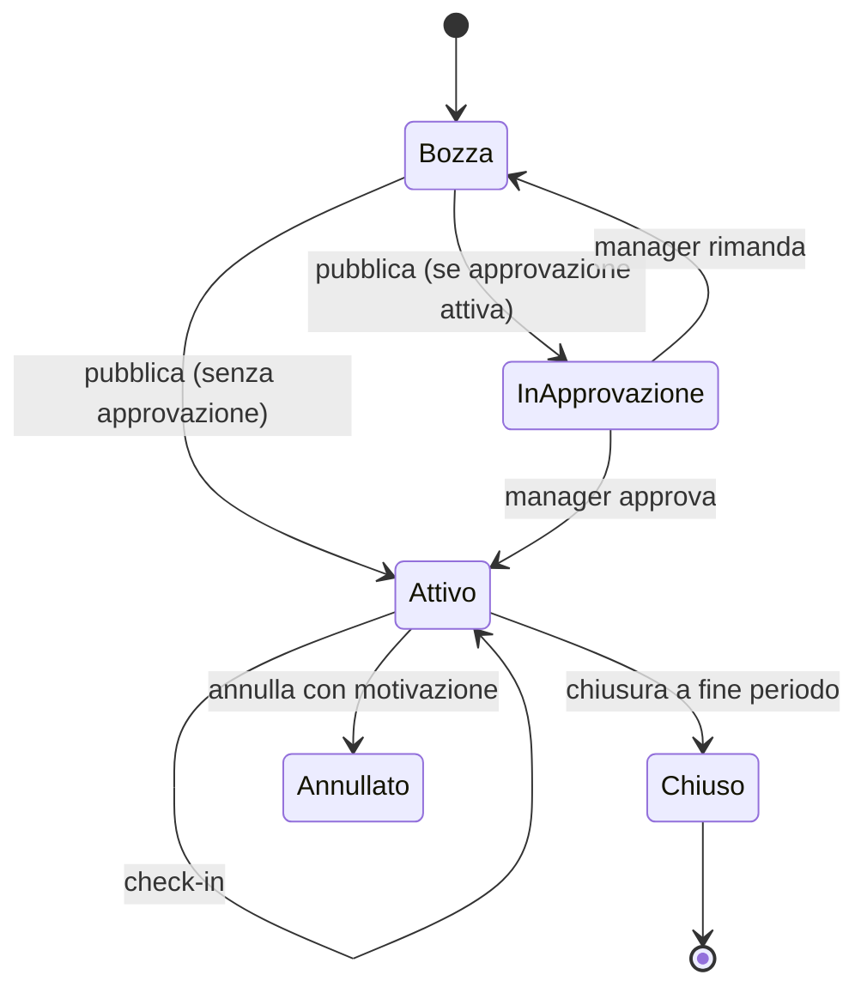
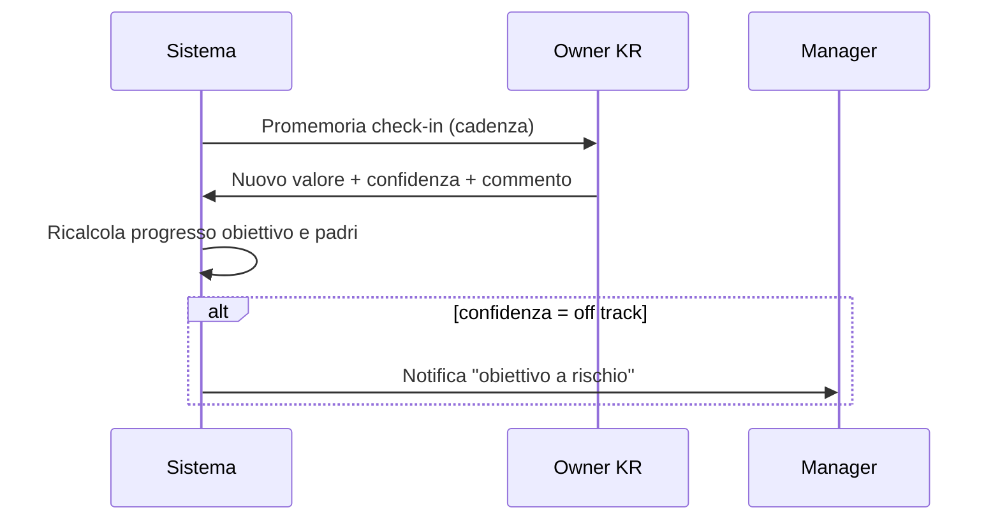

# Obiettivi & OKR (`OKR`)

| | |
|---|---|
| **Priorità** | P0 |
| **Stato** | In implementazione (sprint 0: OKR-001/002/003/004 parziale/006/009/021 parziale/030/031/032/033 promemoria/040/041/050–055/060; mancano approvazioni, template, roll-over, integrazioni) |
| **Dipendenze** | CORE, INT (notifiche) |
| **Ultimo aggiornamento** | 2026-09-12 |

## 1. Scopo

Permettere ad azienda, team e persone di definire obiettivi chiari, allinearli tra loro, aggiornarne il progresso con regolarità e usarli come base oggettiva nelle review e nei 1:1.

## 2. Concetti chiave

- **Obiettivo (Objective)**: risultato qualitativo da raggiungere in un periodo. Ha owner, livello (azienda / unità / team / individuale), periodo, visibilità, stato.
- **Key Result (KR)**: misura quantitativa del raggiungimento di un obiettivo. Tipi: numerico (da → a), percentuale, valuta, booleano (fatto/non fatto), milestone (elenco tappe).
- **Iniziativa / Task**: azione concreta collegata a un KR (opzionale, leggera; non sostituisce un project tool).
- **Periodo (Cycle)**: intervallo temporale (trimestre, semestre, anno, custom) definito dall'HR nel calendario aziendale.
- **Allineamento**: relazione "contribuisce a" tra obiettivi (figlio → padre). Forma un albero.
- **Check-in**: aggiornamento periodico di un KR: valore attuale, livello di confidenza (on track / a rischio / off track), commento.
- **Peso**: importanza relativa di un obiettivo nel computo del punteggio (usato nelle review).
- **Template obiettivo**: obiettivo/KR predefiniti riutilizzabili (es. per ruolo).

Il tenant può usare il modulo in modalità **OKR** (Objective + KR), **Goal semplice** (solo obiettivo con % di progresso), o entrambe. Il naming è personalizzabile (CORE-003).

## 3. Attori e permessi

| Azione | HR Admin | Manager | Collaboratore | Leadership |
|---|---|---|---|---|
| Creare obiettivi aziendali | ✅ | ❌ | ❌ | ✅ (se abilitato) |
| Creare obiettivi di team/unità | ✅ | ✅ (proprio team) | ❌ | ❌ |
| Creare obiettivi individuali | ✅ (per chiunque) | ✅ (per il team) | ✅ (per sé) | ❌ |
| Approvare obiettivi individuali (se flusso di approvazione attivo) | ✅ | ✅ (diretti) | ❌ | ❌ |
| Fare check-in su un KR | owner / contributori | owner / contributori | owner / contributori | ❌ |
| Vedere obiettivi pubblici | ✅ | ✅ | ✅ | ✅ |
| Vedere obiettivi privati | ✅ | ✅ (diretti) | ✅ (propri) | ❌ |
| Chiudere/valutare obiettivi | ✅ | ✅ (team) | ✅ (propri, se consentito) | ❌ |
| Configurare periodi, pesi, regole | ✅ | ❌ | ❌ | ❌ |

## 4. Requisiti funzionali

### 4.1 Creazione e struttura

| ID | Requisito | Priorità |
|----|-----------|----------|
| OKR-001 | Creare un obiettivo con titolo, descrizione, owner (persona, team o unità), livello, periodo, data inizio/fine, visibilità (pubblico / team / privato), tag | P0 |
| OKR-002 | Aggiungere da 0 a N key result con tipo, valore iniziale, target, unità di misura, direzione (crescente/decrescente), owner del KR (può differire dall'owner dell'obiettivo) | P0 |
| OKR-003 | Collegare un obiettivo a un obiettivo padre ("contribuisce a"), anche di livello superiore (individuale → team → azienda) | P0 |
| OKR-004 | Contributori multipli su un obiettivo/KR (persone che possono aggiornarlo) | P1 |
| OKR-005 | Iniziative/task collegati a un KR con stato fatto/non fatto | P1 |
| OKR-006 | Modalità "Goal semplice": obiettivo con % di progresso manuale, senza KR | P0 |
| OKR-007 | Template di obiettivi/KR con libreria HR e "salva come template" | P1 |
| OKR-008 | Duplicare/clonare obiettivi nel periodo successivo (roll-over) mantenendo l'allineamento | P1 |
| OKR-009 | Bozza: l'obiettivo è visibile solo all'owner finché non viene pubblicato | P0 |
| OKR-010 | Allegati e link su obiettivi e KR | P2 |

**User story**
- Come collaboratore voglio creare i miei obiettivi trimestrali collegandoli a quelli del team, così da vedere come il mio lavoro contribuisce.
- Come manager voglio definire gli obiettivi di team e proporli ai miei riporti, così da allineare tutti in poche ore.
- Come HR voglio template per ruolo, così da ridurre il tempo di scrittura e alzare la qualità degli obiettivi.

**Criteri di accettazione**
- [ ] Un obiettivo senza KR in modalità OKR mostra un avviso ma può essere salvato come bozza.
- [ ] Non è possibile creare cicli nell'albero di allineamento (A → B → A).
- [ ] Il cambio di owner mantiene lo storico dei check-in.

### 4.2 Approvazione e pubblicazione

| ID | Requisito | Priorità |
|----|-----------|----------|
| OKR-020 | Flusso di approvazione opzionale per obiettivi individuali (manager approva/rimanda con commento) | P1 |
| OKR-021 | Finestra di definizione obiettivi per periodo (apertura/chiusura) con promemoria a chi non ha ancora obiettivi | P0 |
| OKR-022 | Blocco modifiche a target e pesi dopo la data di lock (modificabile solo da HR con motivazione) | P1 |

### 4.3 Check-in e progresso

| ID | Requisito | Priorità |
|----|-----------|----------|
| OKR-030 | Check-in su KR: nuovo valore, confidenza (on track / a rischio / off track), commento; storico consultabile | P0 |
| OKR-031 | Progresso dell'obiettivo calcolato dalla media (semplice o pesata) dei KR; override manuale opzionale con motivazione | P0 |
| OKR-032 | Progresso degli obiettivi padre calcolato dai figli allineati (configurabile: automatico / manuale) | P1 |
| OKR-033 | Cadenza di check-in configurabile (settimanale, quindicinale, mensile) con promemoria all'owner | P0 |
| OKR-034 | Check-in rapido da notifica / Slack / Teams senza aprire l'app | P1 |
| OKR-035 | Aggiornamento automatico di KR da fonti esterne (Jira, fogli di calcolo, API) | P2 |
| OKR-036 | Grafico di andamento del KR nel tempo con linea attesa | P1 |

**Criteri di accettazione**
- [ ] Un KR numerico "da 100 a 150" con valore 125 mostra progresso 50%.
- [ ] Un KR decrescente "da 10 a 5" con valore 7 mostra progresso 60%.
- [ ] Il progresso non supera il 100% salvo abilitazione "overachievement" nelle impostazioni.
- [ ] Un check-in mancato oltre la cadenza rende l'obiettivo "stale" nelle viste manager/HR.

### 4.4 Chiusura e valutazione

| ID | Requisito | Priorità |
|----|-----------|----------|
| OKR-040 | Chiusura obiettivo a fine periodo con stato finale (raggiunto, parzialmente, non raggiunto, annullato) e commento | P0 |
| OKR-041 | Punteggio finale (0–1 stile OKR o scala custom) con peso per calcolo del punteggio complessivo della persona nel periodo | P1 |
| OKR-042 | Valutazione del manager sull'obiettivo (rating + commento) distinta dall'autovalutazione | P1 |
| OKR-043 | Chiusura massiva del periodo da parte dell'HR con obiettivi aperti evidenziati | P1 |

### 4.5 Viste e navigazione

| ID | Requisito | Priorità |
|----|-----------|----------|
| OKR-050 | "I miei obiettivi": elenco con progresso, confidenza, prossimo check-in | P0 |
| OKR-051 | Vista team per manager: obiettivi dei riporti, stale, a rischio | P0 |
| OKR-052 | Albero di allineamento navigabile (azienda → unità → team → persone) con filtri | P0 |
| OKR-053 | Vista azienda / "strategy board": obiettivi aziendali con progresso aggregato | P1 |
| OKR-054 | Ricerca e filtri: periodo, owner, unità, tag, stato, confidenza | P0 |
| OKR-055 | Esportazione elenco obiettivi in Excel/CSV | P0 |

### 4.6 Integrazione con altri moduli

| ID | Requisito | Priorità |
|----|-----------|----------|
| OKR-060 | Gli obiettivi del periodo compaiono automaticamente nella sezione "Obiettivi" del form di review, con progresso e punteggio | P0 |
| OKR-061 | Gli obiettivi a rischio e i check-in recenti sono suggeriti come punti di agenda nel 1:1 | P1 |
| OKR-062 | Un obiettivo può essere marcato come "di sviluppo" e collegato al piano di sviluppo (DEV) | P1 |

## 5. Flussi principali

## 6. Regole di business

- Progresso KR numerico = (valore − iniziale) / (target − iniziale), limitato a [0, 1] salvo overachievement.
- Progresso obiettivo = media dei KR (pesata se abilitato); se nessun KR, progresso manuale.
- Un obiettivo privato non compare negli aggregati pubblici ma conta nel punteggio della persona.
- Obiettivi annullati sono esclusi dai calcoli di punteggio.
- Il periodo di un obiettivo figlio deve essere contenuto in quello del padre (avviso, non blocco).

## 7. Notifiche

| Evento | Destinatari | Canali |
|---|---|---|
| Apertura finestra definizione obiettivi | Tutti gli interessati | Email, in-app |
| Promemoria check-in | Owner KR | In-app, Slack/Teams, email (digest) |
| Obiettivo off track | Manager dell'owner | In-app |
| Richiesta approvazione / esito | Manager / Owner | In-app, email |
| Obiettivo padre modificato o annullato | Owner dei figli | In-app |
| Chiusura periodo imminente | Owner con obiettivi aperti | Email, in-app |

## 8. Analytics del modulo

- % persone con obiettivi pubblicati nel periodo; % obiettivi allineati.
- Distribuzione confidenza per unità; obiettivi stale.
- Progresso medio per livello e nel tempo; tasso di raggiungimento a chiusura.
- Heatmap unità × obiettivi aziendali (contributo).

## 9. Assunzioni / Domande aperte

- Il punteggio OKR 0–1 è sufficiente o serve una scala configurabile anche qui? Ipotesi: scala configurabile a livello tenant.
- Gestiamo obiettivi "condivisi" tra più persone come un solo oggetto con più owner o come copie? Ipotesi: un solo oggetto con contributori.

## 10. Modifiche rispetto a PeopleGoal

- **Modalità doppia** OKR / Goal semplice selezionabile per tenant (PeopleGoal tende a un unico modello configurato).
- **Stale detection** esplicita e vista "a rischio" per manager.
- **Suggerimento automatico dei punti di agenda nel 1:1** dagli obiettivi (OKR-061).
