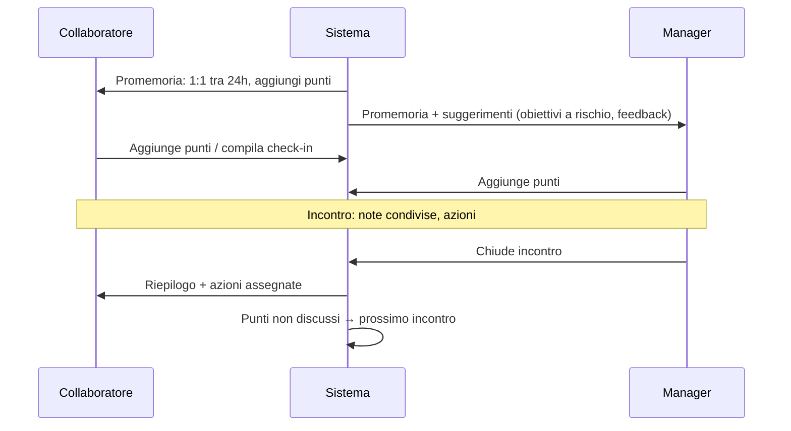

# 1:1 & Check-in (`ONE`)

| | |
|---|---|
| **Priorità** | P0 |
| **Stato** | In implementazione (sprint 1: ONE-001/002/004 parziale, 010–018, 030–032; mancano calendario, template agenda, check-in strutturati, riepilogo email) |
| **Dipendenze** | CORE, OKR, FBK, INT (calendario) |
| **Ultimo aggiornamento** | 2026-09-12 |

## 1. Scopo

Rendere i 1:1 tra manager e collaboratore regolari, preparati e utili: agenda condivisa, note, decisioni e azioni tracciate nel tempo, con il contesto (obiettivi, feedback, sviluppo) a portata di mano.

## 2. Concetti chiave

- **Relazione 1:1**: coppia di persone (tipicamente manager–riporto, ma anche mentor–mentee, skip-level, pari) con ricorrenza.
- **Incontro (Meeting)**: singola occorrenza con data, agenda, note, action item.
- **Punto di agenda (Talking point)**: voce proposta da uno dei due, con stato discusso/non discusso; i non discussi passano all'incontro successivo.
- **Nota privata / condivisa**: le private sono visibili solo all'autore.
- **Action item**: attività con owner, scadenza, stato; riportata finché non chiusa.
- **Template di agenda**: elenco di punti predefiniti (primo 1:1, onboarding 30/60/90, carriera, retrospettiva trimestrale, post-review).
- **Check-in strutturato**: breve questionario ricorrente (es. settimanale: "Come è andata? Cosa ti blocca? Umore 1–5") compilato dal collaboratore prima del 1:1.

## 3. Attori e permessi

| Azione | Partecipanti | Manager del manager | HR Admin |
|---|---|---|---|
| Creare relazione e incontri | ✅ | ❌ | ✅ (creare, non leggere) |
| Aggiungere punti, note condivise, azioni | ✅ | ❌ | ❌ |
| Leggere note condivise | ✅ | ❌ | ❌ (solo metadati: frequenza, esistenza) |
| Leggere note private | solo autore | ❌ | ❌ |
| Vedere statistiche di frequenza | ✅ | ✅ (aggregato team) | ✅ (aggregato) |

**Principio**: il contenuto dei 1:1 è riservato ai partecipanti. HR e leadership vedono solo metriche di adozione.

## 4. Requisiti funzionali

### 4.1 Relazioni e pianificazione

| ID | Requisito | Priorità |
|----|-----------|----------|
| ONE-001 | Creazione automatica della relazione manager–riporto; creazione manuale di altre relazioni | P0 |
| ONE-002 | Ricorrenza (settimanale, quindicinale, mensile, custom) e durata; prossimo incontro sempre visibile | P0 |
| ONE-003 | Integrazione calendario (Google, Microsoft 365): creazione evento, sincronizzazione data, link videocall | P1 |
| ONE-004 | Riprogrammazione e annullamento con storico; segnalazione di 1:1 saltati consecutivi | P1 |

### 4.2 Agenda e svolgimento

| ID | Requisito | Priorità |
|----|-----------|----------|
| ONE-010 | Punti di agenda aggiunti da entrambi prima e durante; ordinamento; spunta "discusso" | P0 |
| ONE-011 | Punti non discussi riportati automaticamente all'incontro successivo | P0 |
| ONE-012 | Suggerimenti automatici di punti: obiettivi a rischio, feedback recenti, riconoscimenti, action item scaduti, azioni del piano di sviluppo, risposte al check-in | P1 |
| ONE-013 | Template di agenda applicabili a un incontro o a tutta la relazione | P1 |
| ONE-014 | Note condivise con editor ricco (elenchi, menzioni, link a obiettivi/feedback) | P0 |
| ONE-015 | Note private per ciascun partecipante | P0 |
| ONE-016 | Action item con owner, scadenza, stato; vista "le mie azioni" trasversale ai 1:1 | P0 |
| ONE-017 | Vista storica della relazione: cronologia incontri, azioni chiuse, temi ricorrenti | P1 |
| ONE-018 | Dare un feedback o un riconoscimento direttamente dal 1:1 (crea entità FBK collegata) | P1 |
| ONE-019 | Chiusura incontro con riepilogo inviato a entrambi | P1 |

### 4.3 Check-in strutturati

| ID | Requisito | Priorità |
|----|-----------|----------|
| ONE-020 | HR o manager definisce un check-in ricorrente (domande, cadenza, destinatari) | P1 |
| ONE-021 | Il collaboratore compila in < 2 minuti da web o Slack/Teams | P1 |
| ONE-022 | Le risposte compaiono nell'agenda del 1:1 successivo e nel trend personale | P1 |
| ONE-023 | Il manager vede il trend del team (umore, blocchi) nel rispetto della visibilità configurata | P1 |

### 4.4 Viste

| ID | Requisito | Priorità |
|----|-----------|----------|
| ONE-030 | Dashboard manager: prossimi 1:1, riporti senza 1:1 da > N giorni, azioni aperte | P0 |
| ONE-031 | Vista collaboratore: prossimo 1:1, punti da proporre, azioni | P0 |
| ONE-032 | Vista HR: tasso di adozione per unità/manager (solo metriche) | P0 |

## 5. Flussi principali

## 6. Regole di business

- Le note private non compaiono mai in export, ricerche altrui o audit di contenuto.
- Se la relazione manager–riporto cessa, lo storico resta visibile a entrambi i partecipanti; il nuovo manager non eredita le note (configurabile: eredita solo le action item aperte).
- Un 1:1 è "saltato" se la data passa senza chiusura né riprogrammazione.

## 7. Notifiche

| Evento | Destinatari | Canali |
|---|---|---|
| Promemoria pre-incontro (24h) | Entrambi | In-app, Slack/Teams, email |
| Nuovo punto aggiunto dall'altro | Altro partecipante | In-app |
| Action item assegnato / in scadenza | Owner | In-app, digest |
| Riepilogo post-incontro | Entrambi | Email |
| Check-in da compilare | Collaboratore | Slack/Teams, in-app |

## 8. Analytics del modulo

- Frequenza reale vs pianificata per manager; % riporti con 1:1 negli ultimi 30 giorni.
- Action item aperti/chiusi; tempo medio di chiusura.
- Trend check-in (umore, blocchi) per team, con soglie di anonimato se il team è piccolo.

## 9. Assunzioni / Domande aperte

- Per team < 3 persone il trend umore del check-in è mostrato al manager? Ipotesi: sì, perché il check-in non è anonimo per design (è una comunicazione manager–riporto), ma va dichiarato chiaramente nell'interfaccia.

## 10. Modifiche rispetto a PeopleGoal

- **Suggerimenti di agenda cross-modulo** (ONE-012) come cuore del modulo.
- **Riservatezza forte**: HR vede solo metriche di adozione, mai contenuti.
- **Check-in strutturati** integrati nel 1:1 anziché come survey separata.
