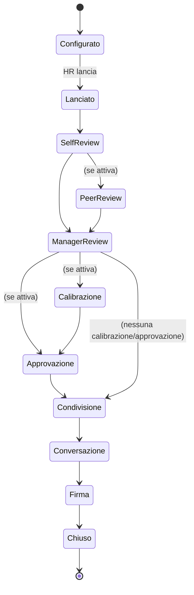

# Performance Review (`REV`)

| | |
|---|---|
| **Priorità** | P0 |
| **Stato** | In implementazione (sprint 3: REV-002 via form engine, 005, 006, 008, 010 snapshot, 020, 021 parziale, 022, 031, 034, 051, 052, 053, 055, 060, 061; sprint 16: 054 PDF; sprint 20: 040/041/043/045 calibrazione e 050 catena di approvazione, 042 come griglia con potenziale senza drag & drop, 044 outlier per manager; mancano libreria template, peer/skip-level, cicli continui) |
| **Dipendenze** | CORE, OKR, DEV (competenze), APP (form engine), INT |
| **Ultimo aggiornamento** | 2026-09-13 |

## 1. Scopo

Consentire all'HR di disegnare e far girare cicli di valutazione della performance (annuali, semestrali, trimestrali, di fine prova, continui) con form configurabili, fasi ordinabili, calibrazione e approvazioni, riducendo al minimo il lavoro manuale e garantendo equità e tracciabilità.

## 2. Concetti chiave

- **Ciclo di review (Review Cycle)**: istanza di un processo di valutazione con periodo di riferimento, popolazione, template, fasi e scadenze.
- **Template di review**: definizione riutilizzabile di form + fasi + regole.
- **Form**: insieme di sezioni e domande (costruito con il form engine di APP). Sezioni tipiche: Obiettivi, Competenze, Valori, Domande aperte, Rating complessivo, Piano di sviluppo.
- **Fase (Stage)**: passo del processo con attore, form (o parte di form), scadenza, visibilità. Fasi disponibili: Nomina peer, Self-review, Peer review, Manager review, Skip-level review, Calibrazione, Approvazione, Condivisione con il collaboratore, Conversazione di review, Firma/accettazione.
- **Valutazione (Review)**: l'insieme delle risposte relative a una persona nel ciclo.
- **Scala di rating**: insieme ordinato di valori con etichetta, descrizione e valore numerico (es. 1–5, "Non soddisfa / Soddisfa / Supera").
- **Calibrazione**: sessione in cui manager e HR confrontano i rating per allinearli, con eventuale distribuzione attesa.
- **Rating finale**: valore consolidato dopo calibrazione/approvazione.

## 3. Attori e permessi

| Azione | HR Admin | HRBP | Manager | Collaboratore | Skip-level |
|---|---|---|---|---|---|
| Creare template e cicli | ✅ | ❌ | ❌ | ❌ | ❌ |
| Lanciare/chiudere cicli, gestire popolazione | ✅ | ✅ (perimetro) | ❌ | ❌ | ❌ |
| Compilare self-review | – | – | – | ✅ | – |
| Compilare manager review | – | – | ✅ (diretti) | – | – |
| Compilare skip-level | – | – | – | – | ✅ |
| Vedere self-review del riporto | ✅ | ✅ | ✅ (se configurato: subito / dopo invio propria) | – | ✅ |
| Partecipare a calibrazione | ✅ | ✅ | ✅ (invitato) | ❌ | ✅ |
| Modificare rating in calibrazione | ✅ | ✅ | ❌ (propone) | ❌ | ❌ |
| Approvare review | ✅ | ✅ | ✅ (livello superiore) | ❌ | ✅ |
| Vedere review condivisa | ✅ | ✅ | ✅ | ✅ (propria) | ✅ |
| Riaprire una review chiusa | ✅ | ❌ | ❌ | ❌ | ❌ |

## 4. Requisiti funzionali

### 4.1 Template e configurazione

| ID | Requisito | Priorità |
|----|-----------|----------|
| REV-001 | Libreria di template predefiniti: review annuale, mid-year, trimestrale leggera, fine periodo di prova, review continua (project-based), review di manager (upward) | P0 |
| REV-002 | Editor di template: sezioni, domande (scala, testo, sì/no, scelta, competenza, obiettivo), obbligatorietà, help text, visibilità per fase | P0 |
| REV-003 | Sezione "Obiettivi" auto-popolata da OKR con progresso, punteggio e possibilità di rating per obiettivo | P0 |
| REV-004 | Sezione "Competenze" auto-popolata dal competency framework in base a job/livello, con pesi | P1 |
| REV-005 | Scale di rating personalizzate (numero valori, etichette, descrittori, valori numerici, N/A) riutilizzabili | P0 |
| REV-006 | Rating complessivo: calcolato (media pesata sezioni) e/o assegnato manualmente; regola configurabile | P0 |
| REV-007 | Fasi ordinabili, attivabili/disattivabili, con scadenze relative (es. +14 giorni dal lancio) o assolute | P0 |
| REV-008 | Regole di visibilità tra fasi (il manager vede la self-review subito / dopo aver inviato la propria / mai) | P0 |
| REV-009 | Domande differenziate per popolazione (es. sezione "Leadership" solo per manager) tramite condizioni su attributi | P1 |
| REV-010 | Versionamento template: modifiche non impattano cicli già lanciati | P0 |
| REV-011 | Anteprima del form nei panni di ciascun attore | P1 |

### 4.2 Ciclo: lancio e popolazione

| ID | Requisito | Priorità |
|----|-----------|----------|
| REV-020 | Creare un ciclo da template: nome, periodo di riferimento, date fasi, popolazione | P0 |
| REV-021 | Popolazione per filtro (unità, sede, job, data assunzione, attributi custom) con anteprima e esclusioni manuali | P0 |
| REV-022 | Determinazione automatica del valutatore (manager diretto al lancio) con override manuale per singolo | P0 |
| REV-023 | Gestione cambi organizzativi in corso di ciclo (cambio manager: riassegna, mantieni, doppia review) | P1 |
| REV-024 | Aggiunta/rimozione persone a ciclo in corso | P0 |
| REV-025 | Lancio programmato e comunicazione di avvio personalizzabile | P1 |
| REV-026 | Ciclo "continuo": review innescate da eventi (fine progetto, 90 giorni dall'assunzione) senza data unica | P2 |

### 4.3 Compilazione

| ID | Requisito | Priorità |
|----|-----------|----------|
| REV-030 | Salvataggio automatico delle bozze; indicatore di completamento per sezione | P0 |
| REV-031 | Pannello laterale di contesto: obiettivi del periodo, feedback ricevuti, riconoscimenti, note 1:1, review precedenti | P0 |
| REV-032 | Richiesta feedback a colleghi direttamente dalla review (mini-360 leggero) | P1 |
| REV-033 | Commenti obbligatori sotto una certa soglia di rating (configurabile) | P1 |
| REV-034 | Invio con conferma; dopo l'invio il form è in sola lettura salvo riapertura HR | P0 |
| REV-035 | Delega/riassegnazione della compilazione (manager assente) con log | P1 |
| REV-036 | Suggerimenti di scrittura: esempi di commenti efficaci, controllo lunghezza minima, avviso bias linguistico | P2 |

### 4.4 Calibrazione

| ID | Requisito | Priorità |
|----|-----------|----------|
| REV-040 | Sessione di calibrazione: perimetro (unità), partecipanti, facilitatore, stato | P1 |
| REV-041 | Vista calibrazione: tabella persone × rating proposti con filtri; distribuzione per manager/unità vs distribuzione attesa (opzionale) | P1 |
| REV-042 | Griglia 9-box interattiva (performance × potenziale) con drag & drop | P1 |
| REV-043 | Modifica del rating in sessione con motivazione obbligatoria e storico | P1 |
| REV-044 | Evidenza di outlier (manager troppo generosi/severi rispetto alla media) | P2 |
| REV-045 | Blocco della calibrazione: i rating diventano finali e passano alla fase successiva | P1 |

### 4.5 Approvazione, condivisione, firma

| ID | Requisito | Priorità |
|----|-----------|----------|
| REV-050 | Catena di approvazione configurabile (nessuna, manager del manager, HRBP, custom) con approva/rimanda | P1 |
| REV-051 | Condivisione della review con il collaboratore: cosa mostrare (rating, commenti, per sezione) | P0 |
| REV-052 | Fase "Conversazione": il manager registra data e note del colloquio (collegabile a un 1:1) | P1 |
| REV-053 | Accettazione/firma del collaboratore con commento facoltativo e possibilità di dissenso | P1 |
| REV-054 | Export PDF della review con branding del tenant | P1 |
| REV-055 | Chiusura del ciclo; review consultabili nello storico del profilo | P0 |

### 4.6 Monitoraggio

| ID | Requisito | Priorità |
|----|-----------|----------|
| REV-060 | Dashboard HR di completamento per fase, unità, manager; elenco ritardatari | P0 |
| REV-061 | Solleciti manuali e automatici (X giorni prima/dopo scadenza) | P0 |
| REV-062 | Proroga scadenze per singoli o per fase | P0 |
| REV-063 | Vista manager: stato delle review del team | P0 |

## 5. Flussi principali

## 6. Regole di business

- Le fasi possono essere sequenziali o parallele (self e manager in parallelo, con regola di visibilità REV-008).
- Il rating finale è l'ultimo tra: manager → calibrato → approvato. Ogni modifica è tracciata con autore e motivazione.
- Una review riaperta dall'HR torna alla fase indicata; le fasi successive vengono invalidate e notificate.
- Le persone assunte dopo una data soglia (configurabile) sono escluse automaticamente dalla popolazione (ma includibili manualmente).
- Le review chiuse sono immutabili; correzioni avvengono tramite "addendum" visibile.

## 7. Notifiche

| Evento | Destinatari | Canali |
|---|---|---|
| Lancio ciclo | Popolazione e manager | Email, in-app |
| Fase disponibile per me | Attore della fase | Email, in-app, Slack/Teams |
| Scadenza tra X giorni / scaduta | Attore, manager, HR (digest) | Email, in-app |
| Review condivisa | Collaboratore | Email, in-app |
| Review rimandata in approvazione | Manager | In-app, email |
| Ciclo chiuso | HR | In-app |

## 8. Analytics del modulo

- Completamento per fase/unità; tempo medio di compilazione.
- Distribuzione rating per unità, manager, job, livello; confronto tra cicli.
- Gap self vs manager; correlazione rating ↔ progresso obiettivi.
- Percentuale di review con dissenso; tempo tra condivisione e firma.

## 9. Assunzioni / Domande aperte

- Le review "upward" (collaboratore valuta il manager) sono un template di REV o un caso di F360? Ipotesi: template REV con anonimato aggregato se ≥ 3 riporti.
- Serve la distribuzione forzata? La supportiamo come "distribuzione attesa" indicativa, mai come blocco.
- **Convergenza sul motore dei processi** (sprint 16, ADR-0011): al lancio il ciclo diventa un'app «silenziosa» del motore (`review_<ciclo>`) e ogni review è un'istanza con fasi self e manager in parallelo, condivisione (approvazione del manager) e presa visione (approvazione della persona). La review nativa resta la vista di dominio: rating, visibilità della self, contesto, firma con dissenso e notifiche `review.*` restano qui; il motore fornisce tentativi, log e la pagina «Processo» per l'HR. La riapertura crea un nuovo tentativo e ricopia le risposte precedenti come bozza (la persona non ricompila da zero). Le review lanciate prima della convergenza continuano a funzionare con l'hook legacy `review_stage`.
- **Catena di approvazione** (REV-050, sprint 20): configurata nel template come lista ordinata di approvatori tra `manager_of_manager`, `hrbp` (primo utente con quel ruolo) e `hr`; ogni passo è una fase di approvazione dell'istanza sul motore, attivata dopo la manager review. L'approvatore approva o **rimanda al manager** con commento: il rimando riapre la sola manager review (nuovo tentativo con le risposte precedenti come bozza) senza toccare la self-review; le approvazioni ripartono dal primo passo. Se il manager di secondo livello non esiste, il passo va all'HR. Stato `pending_approval`; la condivisione è possibile solo dopo l'ultimo passo. Assunzione: la catena è per template, non per singola persona; una catena «custom» per unità è rinviata.
- **Calibrazione** (REV-040/041/043/045, sprint 20): sessione per ciclo con perimetro (unità, con discendenti) e partecipanti; i partecipanti vedono tutte le review del perimetro con rating proposto dal manager e rating corrente, la distribuzione per rating (con distribuzione attesa facoltativa) e la media per manager con segnalazione degli **outlier** (scostamento ≥ 0,75 dalla media di sessione, REV-044); ogni modifica di rating richiede una motivazione e finisce nello storico (`review_rating_changes`), visibile all'HR nel dettaglio della review. Finché la sessione è aperta le review del perimetro non si possono condividere; il **blocco** rende i rating finali (`calibratedAt`), lo sblocco è riservato all'HR. La 9-box (REV-042) è una griglia performance × potenziale in cui il potenziale si imposta dalla sessione (niente drag & drop per ora) e alimenta le valutazioni talento del modulo DEV con sessione = nome della calibrazione. Assunzione: un rating può appartenere a una sola sessione aperta per ciclo.
- **Export PDF** (REV-054): contenuti secondo la visibilità di chi chiede (la persona non vede la manager review prima della condivisione; il manager non vede la self prima della propria consegna, se la regola lo prevede); con il branding del tenant (sprint 17: nome nel piè di pagina, colore primario per linee e barre, logo PNG/JPEG caricato in Impostazioni → Aspetto, fino a 200 KB, in alto a destra). Ogni export è tracciato nell'audit.

## 11. Note di implementazione (sprint 16 e 20)

- `reviews.app_instance_id` collega la review all'istanza del motore (migrazione 0028); `reviewTemplateToApp` in `@wb/shared/apps` traduce il template in definizione di app. `ReviewsService` avvia le istanze con `AppsService.launchInternal`, ascolta la conclusione delle fasi form con `onStageDone`, approva `share`/`sign` con `decideInternal`, riapre con `reopenTo` e chiude le istanze alla chiusura del ciclo.
- `GET /reviews/{id}/pdf` (pdfkit, `apps/api/src/common/pdf.ts`): intestazione, rating, fasi visibili, obiettivi del periodo se il template li include, presa visione. Web: «Esporta PDF» nella pagina della review tramite il proxy `/api/export?report=review-pdf`.

## 10. Modifiche rispetto a PeopleGoal

- **Pannello di contesto** (REV-031) sempre presente durante la compilazione: PeopleGoal collega i dati ma li mostra in aree separate.
- **Addendum** su review chiuse invece della riapertura silenziosa.
- **Gestione esplicita dei cambi organizzativi in corso di ciclo** (REV-023).
- **Suggerimenti di scrittura e controllo bias** (REV-036) come funzionalità nativa in roadmap.
- Sprint 20: `review_templates.approval_chain` (jsonb), `reviews.proposed_rating`, `potential`, `calibrated_at`, `calibration_session_id`, stato `pending_approval`; tabelle `calibration_sessions` e `review_rating_changes` (migrazioni 0033/0034). `reviewTemplateToApp` aggiunge le fasi `approve_1..n` (rimando gestito dal modulo con `rejectRunInternal` + `reopenStage('manager')`); il motore espone anche un hook di **attivazione** delle fasi (`onStageActivated`) con cui la review passa a `pending_approval`/`pending_share` e avvisa approvatori e manager. Endpoint: `POST /reviews/{id}/approve` (approva o rimanda), casella `GET /reviews?box=approvals`, `GET/POST /review-cycles/{id}/calibration-sessions`, `GET/PATCH /calibration-sessions/{id}`, `POST /calibration-sessions/{id}/ratings`, `POST /calibration-sessions/{id}/lock|unlock`. Web: approvazioni nella pagina della review, tab «Da approvare», sessioni nella pagina del ciclo, pagina della sessione con tabella, distribuzione, manager, 9-box e blocco.
