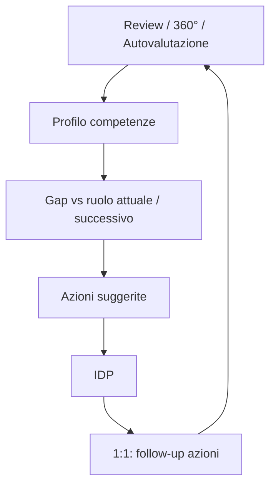

# Sviluppo & Carriera (`DEV`)

| | |
|---|---|
| **Priorità** | P1 |
| **Stato** | In implementazione (sprint 11: DEV-001 libreria IT con 11 competenze × 4 livelli, 002 job profile con competenze attese e ruolo successivo, 010 profilo atteso vs valutato per fonte con radar, 011 gap con azioni suggerite, 012 autovalutazione on demand, 013 confronto con il ruolo successivo, 020 IDP con azioni, 021 azioni da gap, 023 azioni nei suggerimenti 1:1 e promemoria, 024 approvazione del manager, 032 9-box (performance dall’ultima review, potenziale del manager, nota tracciata, senza drag & drop); 005 parziale (sprint 13: la chiusura di una campagna 360° scrive la media «altri» come valutazione con fonte 360 e le aree di sviluppo diventano azioni del piano con origine 360°); mancano DEV-003 import/export, 004 versionamento, 005 lato REV, 022, 025, 030/031, 033–035) |
| **Dipendenze** | CORE, REV, F360, ONE, OKR |
| **Ultimo aggiornamento** | 2026-09-13 |

## 1. Scopo

Dare a ogni persona un percorso di crescita visibile: competenze attese per il ruolo, gap rilevati da review e 360°, piano di sviluppo con azioni concrete, percorsi di carriera e strumenti per HR e leadership (9-box, skills matrix, succession).

## 2. Concetti chiave

- **Competenza**: capacità o comportamento osservabile (es. "Comunicazione", "Ownership"), con livelli (es. 1–4) e descrittori comportamentali per livello. Tipi: core (tutti), di ruolo, di leadership.
- **Competency framework**: insieme di competenze e livelli attesi per **job** e **livello di carriera** (job profile).
- **Job / Job family / Livello**: mansione, famiglia professionale, livello (es. Junior, Mid, Senior, Lead).
- **Percorso di carriera**: sequenza o grafo di job profile (verticale, orizzontale) con requisiti.
- **Piano di sviluppo individuale (IDP)**: insieme di obiettivi di sviluppo e azioni (formazione, mentoring, esperienze sul campo, letture) con scadenze e stato.
- **Valutazione competenze**: punteggio per competenza da review, 360°, autovalutazione; genera il **gap** rispetto al profilo atteso.
- **9-box**: griglia performance × potenziale.
- **Skills matrix**: tabella persone × competenze di un team.
- **Succession**: per posizioni chiave, elenco successori con readiness.

## 3. Attori e permessi

| Azione | HR Admin | Manager | Collaboratore | Leadership |
|---|---|---|---|---|
| Gestire framework, job, percorsi | ✅ | ❌ | ❌ | ❌ |
| Vedere profilo atteso del proprio ruolo e del ruolo successivo | ✅ | ✅ | ✅ | ✅ |
| Creare/modificare IDP | ✅ | ✅ (riporti) | ✅ (proprio) | ❌ |
| Vedere gap competenze | ✅ | ✅ (riporti) | ✅ (proprio) | ❌ |
| 9-box, skills matrix, succession | ✅ | ✅ (team, se abilitato) | ❌ | ✅ (aggregato) |

## 4. Requisiti funzionali

### 4.1 Competency framework

| ID | Requisito | Priorità |
|----|-----------|----------|
| DEV-001 | Libreria di competenze predefinite (IT/EN) con livelli e descrittori, modificabile | P1 |
| DEV-002 | Job, job family, livelli; job profile = competenze + livello atteso | P1 |
| DEV-003 | Import/export framework in Excel | P1 |
| DEV-004 | Versionamento del framework (le review passate restano coerenti) | P1 |
| DEV-005 | Il framework alimenta automaticamente le sezioni competenze di REV e F360 | P1 |

### 4.2 Valutazione e gap

| ID | Requisito | Priorità |
|----|-----------|----------|
| DEV-010 | Profilo competenze della persona: livello atteso vs valutato (per fonte: self, manager, 360°) con radar | P1 |
| DEV-011 | Gap analysis con suggerimenti di azioni collegate alla competenza (libreria azioni) | P1 |
| DEV-012 | Autovalutazione competenze on demand (fuori ciclo) | P2 |
| DEV-013 | Confronto con il profilo del ruolo successivo ("cosa mi manca per…") | P1 |

### 4.3 Piano di sviluppo individuale

| ID | Requisito | Priorità |
|----|-----------|----------|
| DEV-020 | IDP con obiettivi di sviluppo, azioni (tipo, descrizione, scadenza, stato, evidenze), competenza collegata | P1 |
| DEV-021 | Creazione azioni da: review (sezione sviluppo), report 360°, 1:1, gap analysis | P1 |
| DEV-022 | Modello 70-20-10 opzionale come guida (esperienza / relazioni / formazione) | P2 |
| DEV-023 | Le azioni compaiono nei 1:1 e nel profilo; promemoria scadenze | P1 |
| DEV-024 | Approvazione del piano da parte del manager (opzionale) | P1 |
| DEV-025 | Collegamento a corsi esterni (link, LMS via integrazione) | P2 |

### 4.4 Carriera e talent review

| ID | Requisito | Priorità |
|----|-----------|----------|
| DEV-030 | Percorsi di carriera pubblicati: la persona vede i possibili ruoli successivi e i requisiti | P2 |
| DEV-031 | Aspirazioni di carriera dichiarate dalla persona (mobilità, interessi) visibili a manager/HR | P2 |
| DEV-032 | 9-box: posizionamento da review (performance) e valutazione potenziale del manager; sessioni di talent review con drag & drop e storico | P1 |
| DEV-033 | Skills matrix di team con filtri e gap complessivo | P2 |
| DEV-034 | Succession planning per posizioni chiave: candidati, readiness (ora / 1–2 anni / 3+), rischio di uscita | P2 |
| DEV-035 | Promozioni: richiesta con motivazione, evidenze (review, obiettivi), approvazione; aggiornamento job/livello con storico | P2 |

## 5. Flussi principali

## 6. Regole di business

- Il livello valutato usato nel gap è configurabile: manager, media fonti, o 360° se disponibile.
- La valutazione di potenziale è visibile solo a manager, HR e leadership (mai al collaboratore, salvo policy diversa).
- Le modifiche al 9-box in sessione sono tracciate con autore e motivazione.

## 7. Notifiche

| Evento | Destinatari | Canali |
|---|---|---|
| Azione IDP in scadenza / scaduta | Owner, manager (digest) | In-app, email |
| Nuovo piano da approvare | Manager | In-app |
| Framework aggiornato per il tuo ruolo | Persone del ruolo | In-app |

## 8. Analytics del modulo

- Copertura: % persone con IDP attivo, con job profile assegnato.
- Gap medi per competenza/unità (input per formazione).
- Distribuzione 9-box; movimenti tra sessioni.
- Posizioni chiave senza successori pronti.

## 9. Assunzioni / Domande aperte

- **Assegnazione del profilo (sprint 11)**: la persona è collegata a un job profile con un campo esplicito (`persons.job_profile_id`), assegnato dall'HR; `job_title`/`job_level` restano testo libero per l'anagrafica e l'import. Assunzione: la corrispondenza automatica per titolo è troppo fragile nei dati reali.
- **Policy del gap**: di default si usa la valutazione del manager; in mancanza, nell'ordine 360°, review, autovalutazione. La policy "media delle fonti" e "360 se disponibile" sono già calcolate e selezionabili via API; la configurazione per tenant arriva con DEV-005.
- **Versionamento del framework (DEV-004)**: rimandato; le valutazioni memorizzano la chiave della competenza e il livello, non il descrittore, quindi una modifica del descrittore non altera i dati storici. Livelli attesi modificati cambiano il gap "da oggi".
- **9-box**: la performance deriva dal rating finale dell'ultima review condivisa o firmata, normalizzato in 3 fasce sulla scala del template; il potenziale è una valutazione del manager (1–3) con nota obbligatoria, mai visibile al collaboratore.

- Le competenze hanno sempre livelli o anche solo "presente/assente" per le skill tecniche? Ipotesi: entrambi i tipi (competenza a livelli, skill binaria/tag).

## 10. Modifiche rispetto a PeopleGoal

- **Gap analysis con azioni suggerite** (DEV-011) e confronto con il ruolo successivo (DEV-013).
- **Aspirazioni dichiarate** (DEV-031) come input alla talent review.
- Framework **versionato** (DEV-004).
