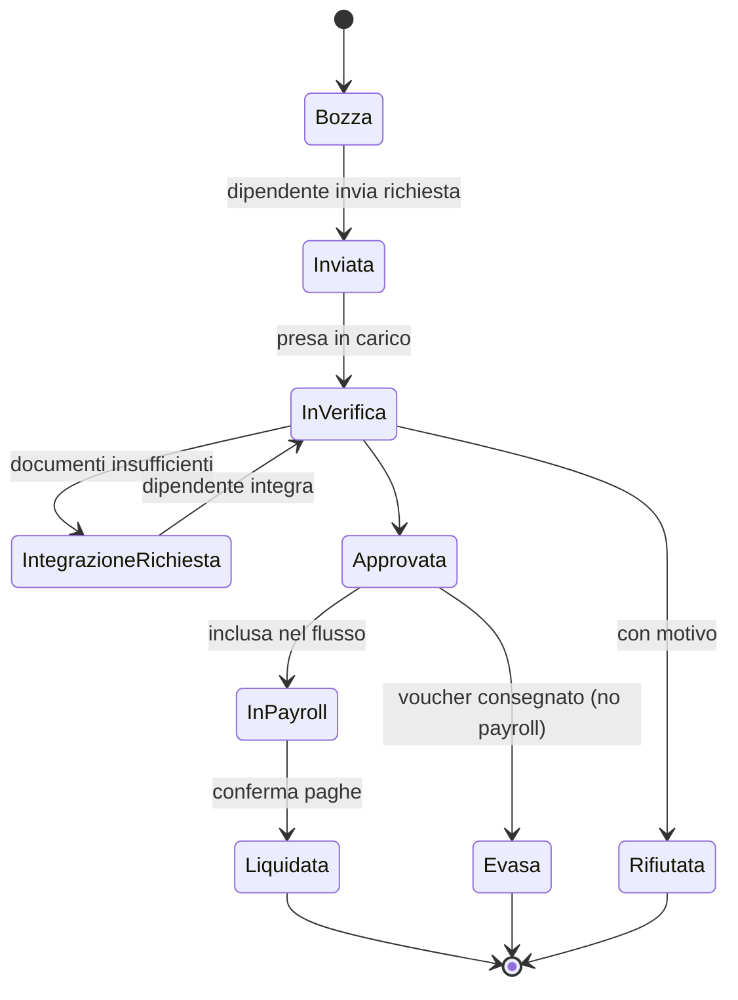
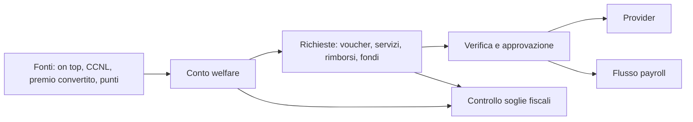

# Welfare aziendale (`WEL`)

| | |
|---|---|
| **Priorità** | P1 |
| **Stato** | In implementazione (sprint 7: WEL-001 parziale (popolazione = tutti o per unità), 002, 003, 005, 007 senza estratto scaricabile, 010, 011, 012 senza immagini, 014 parziale, 020 con nome del giustificativo al posto dell'upload, 021 senza SLA, 022 codice voucher, 024, 025 annullamento, 026, 030, 031 posti, 040 CSV, 041, 050, 051, 052; mancano provider esterni WEL-013/042, punti FBK 004, pro-rata 006, previdenza/sanità 023, upload file, mobile 053; vedi ADR-0008) |
| **Dipendenze** | CORE, INT (payroll, provider), FBK (punti), ENG (wellbeing), ANA |
| **Ultimo aggiornamento** | 2026-09-13 |

> **Nota**: questo modulo **non esiste in PeopleGoal**. È una nostra aggiunta pensata per il mercato italiano ed europeo, dove il welfare aziendale (flexible benefit, conversione del premio di risultato, fringe benefit, convenzioni) è una leva HR centrale e oggi gestita con portali separati dal resto del ciclo di performance.

## 1. Scopo

Permettere all'azienda di progettare piani welfare, assegnare budget alle persone, offrire un catalogo di beni e servizi (proprio o di provider esterni), gestire richieste e rimborsi con la documentazione necessaria, rispettare i vincoli fiscali e alimentare payroll, il tutto collegato al resto della piattaforma (riconoscimenti, engagement, performance) per misurarne l'impatto.

## 2. Concetti chiave

- **Piano welfare**: insieme di regole per un periodo (di solito l'anno): popolazione (categorie omogenee di dipendenti), fonti di budget, catalogo abilitato, regolamento, finestre di scelta.
- **Fonte di budget**: da dove arriva il credito. Tipi: *on top* (erogazione liberale dell'azienda), *da CCNL* (importo previsto dal contratto collettivo), *conversione del premio di risultato* (il dipendente sceglie di trasformare tutto o parte del premio in welfare), *punti riconoscimento* (da FBK, se abilitato), *ricarica manuale*.
- **Conto welfare**: saldo per persona con movimenti (accrediti, spese, storni, scadenze), regole di scadenza e roll-over.
- **Categoria fiscale**: classificazione di un bene/servizio secondo il regime applicabile (es. istruzione e educazione dei figli, assistenza a familiari, sanità integrativa, previdenza complementare, trasporto pubblico, cultura/sport/tempo libero, fringe benefit/buoni acquisto, interessi su mutui). Ogni categoria ha regole: esenzione totale o soglia annua, documentazione richiesta, beneficiari ammessi (dipendente, familiari).
- **Soglie fiscali**: limiti annui configurabili per anno e per categoria (es. la soglia dei fringe benefit, ordinariamente 258,23 € e innalzata da norme temporanee negli ultimi anni, con valori diversi per chi ha figli a carico). Il sistema non "conosce" la legge: l'HR configura le soglie per anno con l'aiuto di preset aggiornati.
- **Catalogo**: elenco di beni/servizi acquistabili con il conto welfare. Tre origini: *provider esterno* (integrazione), *catalogo interno* (convenzioni, servizi aziendali), *rimborso* (il dipendente anticipa e chiede rimborso con giustificativo).
- **Richiesta**: operazione del dipendente sul conto: acquisto voucher, prenotazione servizio, richiesta di rimborso, versamento a fondo previdenza/sanità. Ha un flusso di verifica e approvazione.
- **Provider**: fornitore esterno di catalogo/voucher (es. Edenred, Pluxee, DoubleYou, Eudaimon, Jointly, Welfarebit, TreCuori). Integrazione via API o file.
- **Iniziative di benessere**: benefit non monetari e programmi (convenzioni, giornate di volontariato, permessi extra, programmi wellbeing, eventi) con adesione e partecipazione tracciate.
- **Flusso payroll**: estrazione periodica verso paghe (rimborsi da liquidare in cedolino, superamento soglie da assoggettare, conversioni premio) e ritorno di conferma.

## 3. Attori e permessi

| Azione | Welfare Admin (HR) | Approvatore | Payroll | Manager | Dipendente |
|---|---|---|---|---|---|
| Configurare piani, soglie, catalogo, provider | ✅ | ❌ | ❌ | ❌ | ❌ |
| Assegnare/ricaricare budget | ✅ | ❌ | ❌ | ❌ | ❌ |
| Vedere saldo e movimenti | ✅ (tutti) | ✅ (in coda) | ✅ (aggregati e flussi) | ❌ | ✅ (proprio) |
| Fare richieste | – | – | – | – | ✅ |
| Verificare giustificativi e approvare | ✅ | ✅ | ❌ | ❌ | ❌ |
| Generare/confermare flussi payroll | ✅ | ❌ | ✅ | ❌ | ❌ |
| Vedere report welfare | ✅ | ❌ | ✅ | ✅ (solo take-up aggregato del team, se abilitato) | ❌ |
| Vedere dati sanitari o familiari nelle richieste | ✅ (minimo necessario, con log) | ✅ (solo quelle assegnate) | ❌ | ❌ | ✅ (propri) |

Il ruolo Manager **non** vede le scelte welfare dei riporti: sono dati personali, spesso sensibili.

## 4. Requisiti funzionali

### 4.1 Piani e budget

| ID | Requisito | Priorità |
|----|-----------|----------|
| WEL-001 | Creare un piano welfare con periodo, popolazione (categorie omogenee via filtri su attributi: CCNL, inquadramento, sede, tipo contratto), regolamento allegato con presa visione | P1 |
| WEL-002 | Fonti di budget multiple per piano con importo per persona o per categoria, data di accredito, scadenza, regola di roll-over (nessuno / parziale / totale) | P1 |
| WEL-003 | Conversione del premio di risultato: finestra di scelta, percentuali ammesse, simulatore netto cash vs welfare (parametri fiscali configurabili), registrazione della scelta con firma | P1 |
| WEL-004 | Accredito da punti riconoscimento (FBK) con tasso di conversione e tetto | P2 |
| WEL-005 | Ricariche e storni manuali con motivazione e log | P1 |
| WEL-006 | Pro-rata automatico per ingressi/uscite in corso d'anno | P1 |
| WEL-007 | Conto welfare per persona: saldo, disponibile, impegnato, speso, in scadenza; estratto conto scaricabile | P1 |

### 4.2 Catalogo, categorie e soglie

| ID | Requisito | Priorità |
|----|-----------|----------|
| WEL-010 | Categorie fiscali configurabili con: regime (esente / soglia annua / imponibile), beneficiari ammessi, documenti richiesti, testo informativo | P1 |
| WEL-011 | Soglie per anno fiscale con preset aggiornabili e differenziazione per condizione (es. figli a carico dichiarati) | P1 |
| WEL-012 | Catalogo interno: voci con nome, descrizione, categoria fiscale, prezzo o importo libero, disponibilità, immagini, convenzione collegata | P1 |
| WEL-013 | Catalogo da provider: sincronizzazione voci e prezzi; acquisto voucher via API; riconciliazione ordini | P1 (primo provider) / P2 (altri) |
| WEL-014 | Regole di abilitazione: quali categorie/voci sono disponibili per quale piano/popolazione | P1 |
| WEL-015 | Ricerca e filtri nel catalogo per categoria, importo, beneficiario | P1 |

### 4.3 Richieste e rimborsi

| ID | Requisito | Priorità |
|----|-----------|----------|
| WEL-020 | Richiesta di rimborso: categoria, importo, beneficiario, data spesa, upload giustificativo, dichiarazioni richieste; controllo saldo e soglia in tempo reale | P1 |
| WEL-021 | Flusso di verifica: coda approvatori, approvazione/rifiuto con motivo, richiesta di integrazione documenti, SLA e promemoria | P1 |
| WEL-022 | Acquisto voucher / prenotazione servizio dal catalogo con conferma e consegna (codice, PDF, email) | P1 |
| WEL-023 | Versamenti a previdenza complementare e sanità integrativa con dati del fondo e periodicità | P2 |
| WEL-024 | Controllo automatico del cumulo sulle soglie annue con avviso al dipendente prima del superamento e all'HR dopo | P1 |
| WEL-025 | Annullamento/storno richiesta entro finestra; gestione resi voucher | P2 |
| WEL-026 | Storico richieste con stato e documenti; conservazione dei giustificativi per il periodo di legge | P1 |

### 4.4 Iniziative di benessere e convenzioni

| ID | Requisito | Priorità |
|----|-----------|----------|
| WEL-030 | Bacheca convenzioni e iniziative (descrizione, condizioni, come aderire) con adesione tracciata | P1 |
| WEL-031 | Programmi wellbeing (es. sportello psicologico, palestra, volontariato) con iscrizione, posti e partecipazione | P2 |
| WEL-032 | Sondaggio di gradimento sulle iniziative (usa ENG) | P2 |

### 4.5 Payroll e provider

| ID | Requisito | Priorità |
|----|-----------|----------|
| WEL-040 | Flusso payroll periodico: rimborsi approvati da liquidare, importi eccedenti soglia da assoggettare, conversioni premio; formato tracciato configurabile (CSV/Excel) e connettori (Zucchetti, TeamSystem, ADP) | P1 (tracciato) / P2 (connettori) |
| WEL-041 | Ritorno di conferma liquidazione e chiusura movimenti | P1 |
| WEL-042 | Integrazione provider: ordini voucher, saldo presso provider, riconciliazione fatture | P1 |
| WEL-043 | Registro delle comunicazioni obbligatorie e degli accordi (regolamento, accordo sindacale per il premio) con versioni | P2 |

### 4.6 Esperienza dipendente

| ID | Requisito | Priorità |
|----|-----------|----------|
| WEL-050 | Pagina "Il mio welfare": saldo, scadenze, richieste in corso, catalogo, guide per categoria | P1 |
| WEL-051 | Dichiarazioni annuali del dipendente rilevanti per le soglie (es. figli a carico) con validità e promemoria | P1 |
| WEL-052 | Notifiche di accredito, scadenza budget, esito richieste, finestre di scelta | P1 |
| WEL-053 | Esperienza mobile completa (richiesta di rimborso con foto dello scontrino) | P1 |

## 5. Flussi principali

## 6. Regole di business

- Il disponibile = saldo − impegnato (richieste in verifica). Una richiesta non può superare il disponibile né portare il cumulo annuo della categoria oltre la soglia, salvo categorie "imponibili" dove l'eccedenza viene segnalata a payroll.
- Le soglie si calcolano per anno fiscale e per persona, sommando tutte le fonti (inclusi fringe benefit erogati fuori piattaforma se registrati dall'HR).
- I giustificativi sono obbligatori per i rimborsi; la verifica è umana (approvatore) con supporto di controlli automatici (importo leggibile, data nel periodo, duplicati).
- I dati potenzialmente sensibili (spese sanitarie, familiari) sono visibili solo a chi verifica la specifica richiesta e sono esclusi da export e report; i report usano solo categoria e importo aggregati.
- A fine periodo il credito non speso segue la regola di roll-over del piano; gli importi persi vengono comunicati in anticipo (60/30/7 giorni).
- La scelta di conversione del premio è irrevocabile dopo la chiusura della finestra e conservata con evidenza della presa visione del regolamento.

## 7. Notifiche

| Evento | Destinatari | Canali |
|---|---|---|
| Accredito budget / apertura finestra di scelta | Dipendente | Email, in-app, push |
| Budget in scadenza (60/30/7 gg) | Dipendente | Email, in-app, push |
| Richiesta in coda / SLA in scadenza | Approvatore | In-app, email |
| Esito richiesta / integrazione richiesta | Dipendente | In-app, email, push |
| Flusso payroll pronto | Payroll | Email, in-app |
| Soglia annua vicina o superata | Dipendente / HR | In-app, email |

## 8. Analytics del modulo

- Take-up: % persone con almeno una richiesta; % budget utilizzato; residuo in scadenza.
- Distribuzione spesa per categoria fiscale, unità, sede, fascia d'età (con soglie di anonimato).
- Tempo medio di approvazione; tasso di rifiuto e motivi.
- Conversione premio: % aderenti, importi, risparmio contributivo stimato azienda/dipendente.
- Correlazione take-up ↔ engagement (ENG) e retention (CORE), solo a livello aggregato.

## 9. Assunzioni / Domande aperte

- Il target iniziale è l'Italia: normativa e provider sono italiani; il modello (categorie, soglie per anno) è però generico e adattabile ad altri paesi.
- Build vs buy del catalogo: ipotesi **integrazione con provider** per voucher e servizi, **catalogo interno** per convenzioni e rimborsi. Da validare il primo provider partner.
- Il simulatore fiscale (WEL-003) dà stime indicative e va dichiarato come tale; i parametri sono configurabili dall'HR/consulente del lavoro.
- Buoni pasto: fuori scope iniziale (di solito gestiti da payroll/provider dedicati); valutare come categoria in seguito.

## 10. Rapporto con PeopleGoal

Modulo interamente nostro. Il collegamento con il resto della piattaforma (punti riconoscimento → credito welfare, take-up ↔ engagement, welfare nel profilo persona e nel 1:1 di onboarding) è ciò che lo distingue da un portale welfare standalone.
